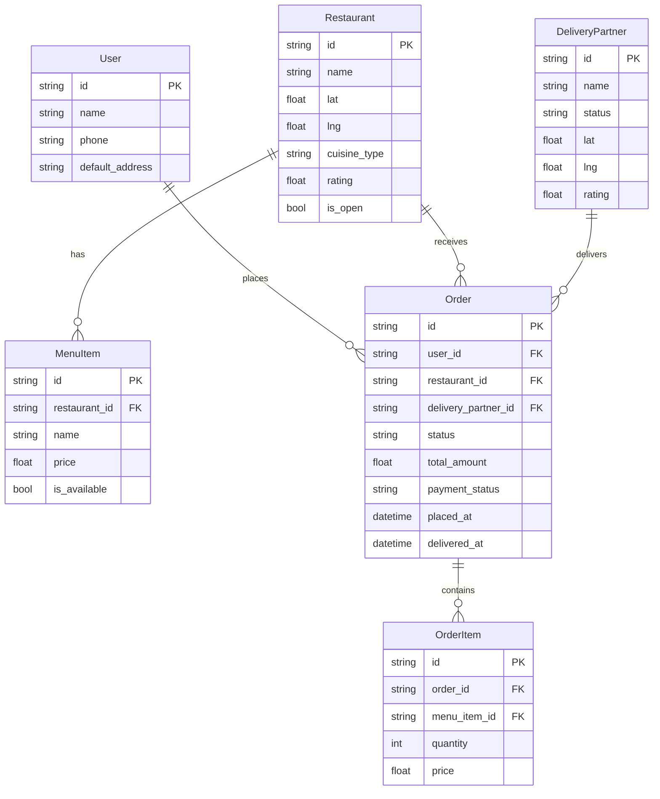
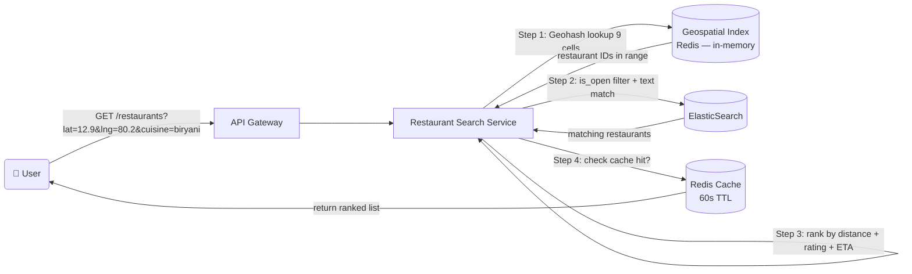
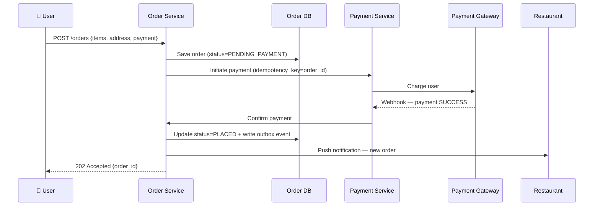
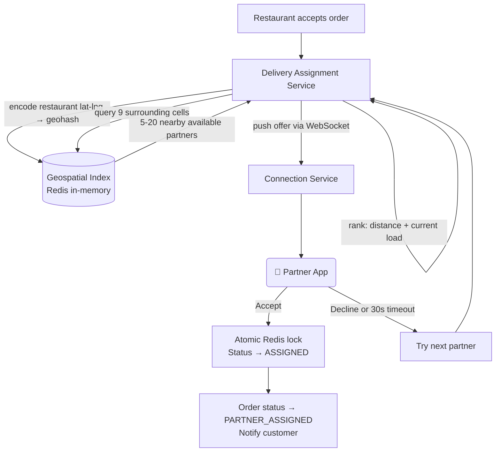
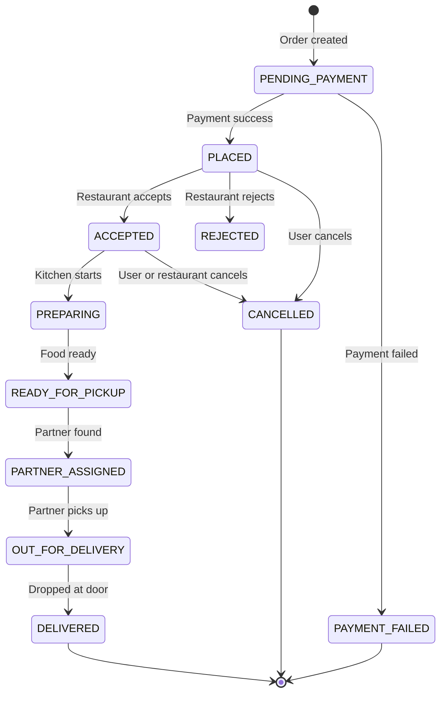
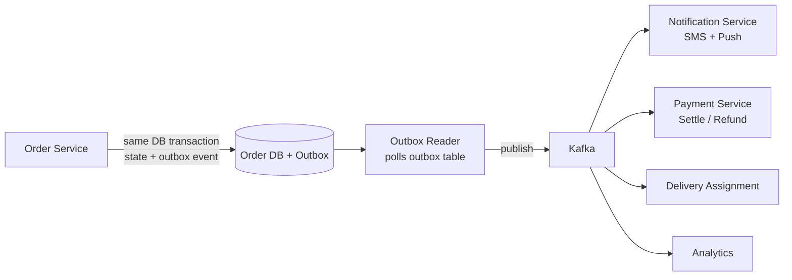
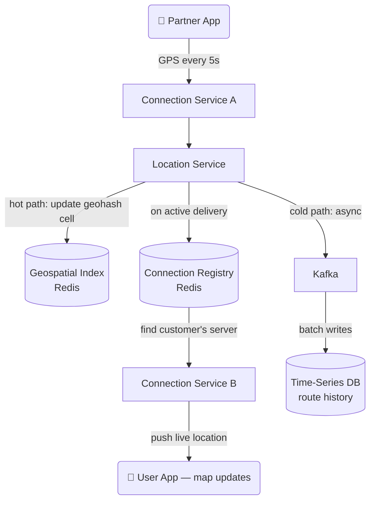
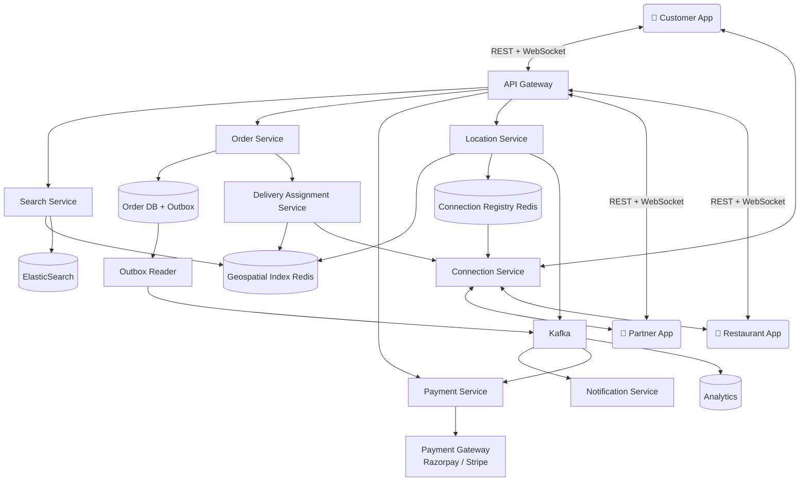

# 🍔 Food Delivery (Swiggy / Zomato) – System Design

> Covers: **theoretical explanation of every component**, architecture diagrams, interview questions an interviewer will actually ask, and tradeoffs behind every major decision.

---

## 📌 What Is This System?

A food delivery platform coordinates three parties — **customer**, **restaurant**, and **delivery partner** — through restaurant discovery, order placement, payment, real-time assignment of delivery partners, and live order tracking. The system must stay reliable under high peak-hour load, handle partial failures gracefully (payment gateway down, no partners available), and keep all three parties in sync throughout the order lifecycle.

---

## ✅ Functional Requirements

| # | Requirement |
|---|---|
| 1 | User searches nearby restaurants and browses menus |
| 2 | User places an order and pays online |
| 3 | Restaurant accepts the order and prepares food |
| 4 | System assigns a nearby delivery partner to pick up the order |
| 5 | User tracks order status and delivery partner location in real time |
| 6 | User rates restaurant and delivery partner after delivery |

### Scale
| Parameter | Value |
|---|---|
| Daily Active Users | ~10M |
| Restaurants | ~500K |
| Active Delivery Partners (peak) | ~200K |
| Orders/day | ~5M |
| Peak orders/sec | ~500–1000 |
| Partner GPS update frequency | Every ~5 seconds |
| Peak location writes | ~40K writes/sec |

---

## ⚙️ Non-Functional Requirements

| Requirement | Target | Why It Matters |
|---|---|---|
| Low Latency | Search < 200ms; order placement < 500ms | Users abandon slow apps |
| High Availability | Order service 99.99% uptime | Downtime = lost orders = lost revenue |
| Strong Consistency | Payment + order creation atomic | No ghost orders (charged but not created) |
| Real-Time Tracking | Location update reaches user in < 3s | Core product experience |
| Fault Tolerance | Payment gateway down ≠ data corruption | Partial failures must not corrupt state |

---

## 🗃️ Data Model

---

## 🏗️ High-Level Design — Theoretical Explanation

> This section explains **what each component does, why it exists, and how it connects** to the rest of the system. Read this before looking at the diagrams.

---

### 1. Restaurant Search — How "Biryani Near Me" Returns Results in 200ms

**What happens theoretically:**

When a user opens the app, they see a list of nearby restaurants. This seems simple but has two hard sub-problems: finding restaurants within a geographic radius *fast*, and ranking them meaningfully.

**Geographic filtering** works exactly like Uber's driver search — using a **Geohash-based in-memory index in Redis**. Every restaurant's coordinates are encoded to a geohash prefix. Searching "restaurants within 5km" becomes a lookup of 9 geohash cells in Redis memory — no database scan, no SQL `WHERE distance < 5km`. This is why the response comes back in milliseconds.

**Full-text search** (searching by name or cuisine like "biryani" or "chinese") is handled by **ElasticSearch**, which maintains an inverted index over restaurant names, cuisines, and menu items. Geospatial pre-filtering narrows the candidate set to a few hundred nearby restaurants; ElasticSearch does text matching over that smaller set.

**Ranking** combines multiple signals: distance (closer is better), rating, estimated delivery time (based on current partner availability and distance), and paid promotions. Promoted restaurants are labelled and shown separately to maintain trust.

**Caching** is important here because restaurant data changes slowly. Search results for a given geohash cell + cuisine combination are cached in Redis with a 60-second TTL. This means 95% of searches never touch ElasticSearch or the database at all.

---

### 2. Order Placement & Payment — How an Order Is Created Safely

**What happens theoretically:**

When a user confirms their cart and pays, two things must happen together atomically: the payment must succeed AND the order must be created. If either fails in isolation, the system is in a bad state — either the user is charged but no order exists (worst case), or an order exists but payment failed (gives free food).

The safe sequence is: first save the order with status `PENDING_PAYMENT`, then initiate payment. If payment succeeds, update the order to `PLACED` and trigger downstream steps. If payment fails, mark the order `PAYMENT_FAILED` and notify the user. By saving the order first, we always have a record to reconcile against — no silent data loss.

**Idempotency** is critical for payment. Payment gateway webhooks can fire multiple times (network retries, timeouts). The Payment Service uses the order ID as an **idempotency key** — if it has already processed a successful payment for this order ID, it ignores duplicate webhooks. This ensures the user is never double-charged.

The response to the user is sent immediately (HTTP 202 Accepted) with an order ID. The restaurant notification, partner assignment, and downstream steps all happen asynchronously via Kafka events. This keeps the user's perceived response time fast even though many things happen after their confirmation.

---

### 3. Delivery Partner Assignment — How a Partner Is Found and Assigned

**What happens theoretically:**

After the restaurant accepts the order, the system needs to find a nearby available delivery partner and get their commitment to pick up the order. This is nearly identical to Uber's driver matching — same geohash search, same offer/accept loop, same atomic lock.

The **Geospatial Index** in Redis stores each online partner's current location as a geohash. When assignment starts, the system encodes the restaurant's coordinates to a geohash, queries 9 surrounding cells, and gets a list of nearby available partners — typically 5–20 candidates in a dense city.

Candidates are **ranked** by a score combining distance from the restaurant and their current active order count (to distribute load fairly — don't send all orders to one partner).

The top-ranked partner receives an **offer notification** via WebSocket. They have 30 seconds to accept on their app. If they decline or time out, the system moves to the next candidate. This loop continues until someone accepts.

**The atomic lock** prevents double-assignment. Two orders whose restaurants are near the same partner might both try to assign the same person simultaneously. A Redis Lua script performs the check-and-assign as one atomic operation — exactly one order wins.

---

### 4. Order Lifecycle — How the Trip Moves from Placement to Delivery

**What happens theoretically:**

An order is not a single event — it's a sequence of states, each with its own side effects that must be triggered reliably. The **Order Service** owns this state machine. Every state transition is written to the database with an **outbox event** in the same transaction.

The outbox pattern solves the **dual-write problem**. Without it, the flow would be: update state in DB, then publish event to Kafka. If the service crashes between those two steps, the state updates but the downstream consumers (notifications, payment settlement, partner payout) never hear about it. Orders get stuck.

With the outbox pattern, the event is written to an `outbox` table inside the same database transaction as the state change. A separate **Outbox Reader** process reads the outbox table and publishes to Kafka. If Kafka is temporarily down, events accumulate in the table and drain when Kafka recovers. State and side effects are always consistent.

---

### 5. Real-Time Order Tracking — How the Customer Sees the Partner Moving

**What happens theoretically:**

Every 5 seconds, the partner's phone sends a GPS coordinate to the Location Service. With 200K active partners, that's ~40K writes/second. This is handled with a hot/cold path split identical to Uber's approach.

The **hot path** writes directly to Redis in-memory — the geospatial index updates and, if the partner is on an active delivery, the Location Service relays the position to the customer's phone. The relay works via the **Connection Registry** in Redis: a map from `user_id → WebSocket server instance`. Since customers and partners may be connected to different server instances, the registry is what allows any server to push to any client.

The **cold path** writes to Kafka asynchronously. A consumer batch-writes to a Time-Series Database for route history (useful in disputes: "the partner took a longer route") and analytics for improving ETA models.

---

### 6. Full System — How All Pieces Connect

**What happens theoretically:**

The **API Gateway** is the single entry point. All three apps (customer, restaurant, partner) connect here. REST requests handle one-time actions (place order, update menu). WebSocket connections handle everything real-time (location updates, order offers, status pushes). All services are stateless and scale horizontally. State lives in databases and Redis.

---

## ⚖️ Key Tradeoffs

### Restaurant Search: ElasticSearch vs Postgres Full-Text vs Algolia

| Approach | Pros | Cons | Choose When |
|---|---|---|---|
| **ElasticSearch** ✅ | Powerful text search + geo filtering together | Operationally complex, eventual consistency | Most food delivery platforms |
| Postgres Full-Text | Simple, same DB | Slower at scale, limited geo | Small scale, < 50K restaurants |
| Algolia | Hosted, fast, simple API | Expensive at volume, less control | Startups who want zero infra |

---

### Payment Confirmation: Save-Before-Pay vs Pay-Before-Save

| Approach | Risk | Choose When |
|---|---|---|
| **Save PENDING first, then pay** ✅ | Order record exists even if payment fails — easy to reconcile | Always — safer |
| Pay first, then save order | If save fails after successful payment, user is charged with no order | Never — silent data loss |

> **Real failure scenario:** Payment succeeds, DB write crashes. Without save-first, no order record exists. With save-first (PENDING_PAYMENT status), the reconciliation job can find all PENDING_PAYMENT orders older than 5 minutes and check payment status to resolve them.

---

### Delivery Assignment: Push Offer vs Pull Assignment

| Approach | How | Pros | Cons |
|---|---|---|---|
| **Push Offer** ✅ | System sends offer to partner → partner accepts/declines | Partner has agency, reduces unwanted trips | Slower (need timeout + retry loop) |
| Pull (auto-assign) | System directly assigns without asking | Faster matching | Partners resent forced assignments, higher cancellations |

---

### Outbox vs Direct Kafka Publish

| Approach | Pros | Cons |
|---|---|---|
| **Outbox** ✅ | DB state + event always consistent, survives Kafka downtime | Extra complexity — outbox reader process needed |
| Direct publish | Simpler code | Dual-write risk — crash between DB write and Kafka publish corrupts state |

---

## ❓ Interview Questions & Model Answers

---

**Q1: "How do you find nearby restaurants efficiently?"**

> Same principle as Uber driver search — **Geohash-based in-memory index in Redis**. Each restaurant's coordinates are encoded to a prefix string. Searching "restaurants within 5km" queries 9 geohash cells in Redis memory — no database scan. Then ElasticSearch handles text matching (cuisine, name) over the narrowed candidate set. Results are cached for 60 seconds per geohash-cell + cuisine combination, so peak traffic barely touches the search backend.

---

**Q2: "How do you ensure a user isn't charged but left without an order?"**

> Save the order with status `PENDING_PAYMENT` *before* initiating payment. If payment succeeds, update to `PLACED`. If payment fails, update to `PAYMENT_FAILED`. This way there's always a database record we can reconcile against. Payment webhooks use the order ID as an idempotency key — duplicate webhooks are silently ignored. A background job also scans for orders stuck in `PENDING_PAYMENT` beyond a timeout and resolves them by checking payment gateway status directly.

---

**Q3: "Two orders try to assign the same delivery partner simultaneously. What happens?"**

> Race condition. Without protection both orders could see the partner as `ONLINE` and both assign — partner gets two simultaneous deliveries. We handle it with a **Redis Lua script** that checks the partner's status and sets it to `ASSIGNED` in a single atomic operation. Exactly one order wins. The other gets a "partner unavailable" response and moves to the next candidate in the ranked list.

---

**Q4: "How does the customer see the delivery partner moving on the map?"**

> Partners send GPS every 5 seconds to the Location Service. For partners on active deliveries, the Location Service looks up the **Connection Registry** in Redis (which maps `customer_id → WebSocket server instance`), routes the location update to the right server, and that server pushes it down to the customer's WebSocket. The customer's map re-renders. The customer may be on a completely different server instance from the partner — the registry is what bridges them.

---

**Q5: "What happens if the restaurant rejects the order after the user has paid?"**

> The order transitions to `REJECTED`. An event fires through the outbox to Kafka. The Payment Service consumer picks it up and initiates a full refund automatically. The Notification Service pushes a message to the user explaining the rejection with the refund timeline. The user is never left in limbo — the state machine and outbox pattern guarantee the refund fires even if the Notification Service is temporarily down (it retries from Kafka).

---

**Q6: "How do you handle 40K location writes per second?"**

> Hot/cold split. The **hot path** writes directly to an in-memory Redis geospatial index sharded by city (coarse geohash prefix). Sub-millisecond, no disk I/O, used only for live tracking relay and assignment search. The **cold path** publishes to Kafka asynchronously — a consumer batch-writes to a Time-Series Database. If the Time-Series DB is slow, the hot path is unaffected. If Redis is rebuilt after a crash, partners re-report positions within 5 seconds and the index reconstructs itself.

---

**Q7: "How would you design the rating system?"**

> After delivery, an event fires to a Rating Service. Ratings are stored separately from the restaurant and partner tables. The average rating shown in search results is a **materialized aggregate** updated asynchronously — not computed on every search query. A background job recalculates and caches the average rating for each restaurant and partner every few minutes. This means a single new 1-star review doesn't instantly reflect — it lags by a few minutes, which is perfectly acceptable and avoids expensive real-time aggregation on every search.

---

**Q8: "How do you handle peak hour load — dinner time when all 500K restaurants are receiving orders?"**

> Services are stateless and horizontally scalable — just add more instances behind the load balancer. The bottlenecks are state stores: the Order DB and Redis. For the Order DB we use read replicas to offload analytics and status queries. For Redis we shard by city — peak in Chennai doesn't affect Mumbai's Redis. Kafka acts as a buffer — if downstream services (Payment, Notifications) are slow, orders queue in Kafka topics instead of backing up into the Order Service. Each service scales independently based on its queue depth.

---

## 📊 Interview Level Expectations

| Topic | Mid-Level (L4) | Senior (L5) | Staff (L6) |
|---|---|---|---|
| **Restaurant Search** | Geo filter + basic ranking | Geohash + ElasticSearch + cache strategy | Personalized ranking ML, real-time availability index |
| **Order State Machine** | Define states and transitions | Outbox pattern, idempotent payment | Saga pattern for distributed rollback |
| **Delivery Assignment** | Nearest partner search | Geohash 9-cell + offer/accept + atomic lock | Batched assignment, surge zones, incentive logic |
| **Real-Time Tracking** | WebSocket for live updates | Connection registry + multi-instance routing | Reconnect handling, event replay, hot-path sharding |
| **Payment Safety** | Capture before confirm | Idempotent webhook + refund flows | Escrow, split settlement, fraud detection |
| **Scale** | Identify bottlenecks | Horizontal scaling + Redis sharding | Multi-region active-active, read replicas, CDN |

---

## 🛠️ Tech Stack

| Component | Technology | Why |
|---|---|---|
| Order / User DB | PostgreSQL | ACID for payment + order state |
| Restaurant Search | ElasticSearch | Full-text + geo in one query |
| Geospatial Index | Redis (GEOADD) | Sub-ms in-memory geo queries |
| Cache | Redis (TTL) | Search results, menus, sessions |
| Message Queue | Kafka | Durable replayable event stream |
| Real-Time Comms | WebSocket via Connection Service | Bidirectional low-latency |
| Connection Registry | Redis | user_id → server instance mapping |
| Payment Gateway | Razorpay / Stripe | PCI compliance, webhooks |
| Notification | Firebase (push) + Twilio (SMS) | Multi-channel delivery |
| Location History | Cassandra / InfluxDB | High write throughput time-series |
| Object Storage | S3 + CloudFront CDN | Restaurant images, menu photos |

---

> 📖 Inspired by engineering blogs from Swiggy, Zomato, DoorDash, and Uber Eats.
