# 🍔 Food Delivery System (Swiggy / Zomato) – System Design Notes

> My own understanding of how a food delivery platform works under the hood — from browsing restaurants to real-time order tracking.

---

## 📌 What Is a Food Delivery System?

A food delivery platform lets users browse nearby restaurants, place orders, pay online, and track their delivery in real time. Behind the scenes it coordinates three parties — **customer**, **restaurant**, and **delivery partner** — through a live order lifecycle, smart restaurant discovery, and real-time location tracking. Think Swiggy, Zomato, DoorDash, or Uber Eats.

---

## ✅ Functional Requirements

| # | Requirement | Core Operation |
|---|---|---|
| 1 | User searches nearby restaurants and browses menus | SEARCH + READ |
| 2 | User adds items to cart and places an order | CREATE (Order) |
| 3 | Restaurant accepts/rejects the order and prepares food | UPDATE (Order state) |
| 4 | System assigns a nearby delivery partner to pick up the order | ASSIGN (Delivery) |
| 5 | User tracks order status and delivery partner location in real time | INGEST + PUSH (Tracking) |
| 6 | User pays online — supports UPI, cards, wallets, COD | PAYMENT |
| 7 | User can rate restaurant and delivery partner after delivery | CREATE (Review) |

### Scale Assumptions

| Parameter | Value |
|---|---|
| Daily Active Users | ~10 Million |
| Registered Restaurants | ~500,000 |
| Active Delivery Partners (peak) | ~200,000 |
| Orders Per Day | ~5 Million |
| Peak Orders Per Second | ~500–1000 |
| Delivery Partner Location Update | Every ~5 seconds |
| Peak Location Writes | ~40,000 writes/sec |
| Search Queries Per Second | ~5,000 |

---

## ⚙️ Non-Functional Requirements

| Requirement | Description |
|---|---|
| Low Latency | Restaurant search < 200ms; order placement < 500ms |
| High Availability | Order service must be 99.99% up — missed orders = lost revenue |
| Strong Consistency | Payment and order creation must be atomic — no ghost orders |
| Real-Time Tracking | Delivery partner location updates reach user within 2–3 seconds |
| Eventual Consistency | Menu updates, ratings, and analytics can lag slightly |
| Fault Tolerance | Partial failures (payment gateway down) must not corrupt order state |

---

## 🗃️ Data Model

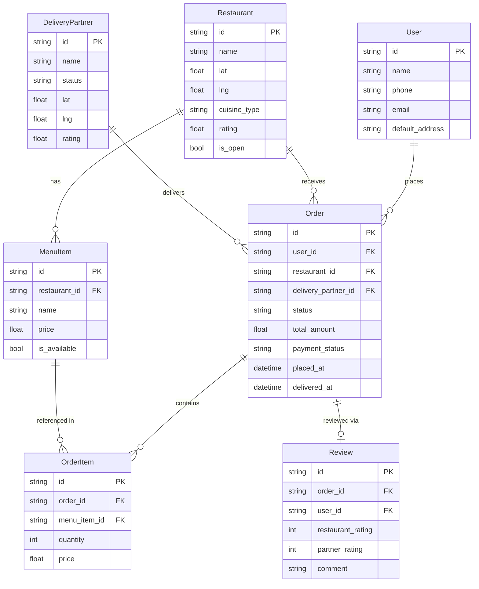

---

## 🌐 API Design

| Method | Endpoint | Purpose |
|---|---|---|
| GET | `/restaurants?lat=&lng=&radius=&cuisine=` | Search nearby restaurants |
| GET | `/restaurants/{id}/menu` | Get full menu of a restaurant |
| POST | `/orders` | Place a new order |
| GET | `/orders/{id}` | Get order status + delivery partner info |
| POST | `/orders/{id}/cancel` | Cancel an order (rules depend on state) |
| PUT | `/orders/{id}/status` | Restaurant/partner updates order state |
| GET | `/orders/{id}/track` | Live delivery partner location (WebSocket) |
| POST | `/payments` | Initiate payment for an order |
| POST | `/reviews` | Submit rating after delivery |
| PUT | `/delivery-partners/{id}/location` | Partner sends GPS update |

---

## 🏗️ High-Level Architecture

### 1. Restaurant Search & Discovery

User opens the app → needs to see nearby restaurants fast.

**The Problem:** 500,000 restaurants across the country. We can't scan all of them for every search. We need a spatial index (same idea as Uber's driver search) plus full-text search for cuisine/name.

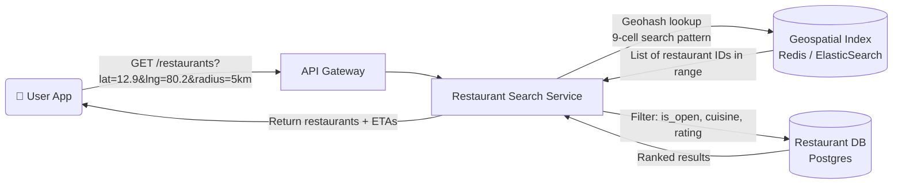

**How ranking works:**
- Distance from user (closest first)
- Restaurant rating
- Estimated delivery time (based on distance + current partner availability)
- Promoted restaurants (paid placement — separated from organic results)

---

### 2. Order Placement

User selects items → adds to cart → confirms order → pays.

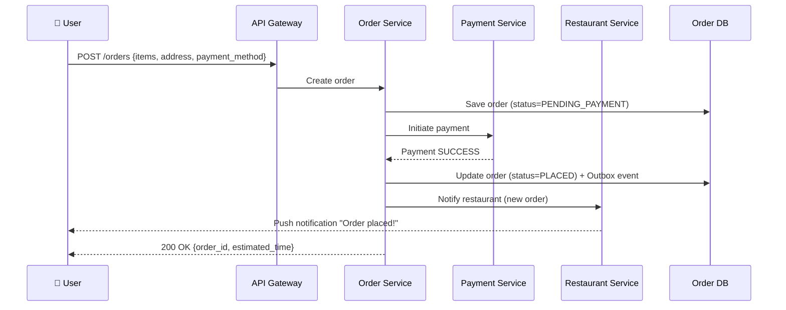

> **Why save PENDING_PAYMENT first?** If payment succeeds but the order write fails, we'd charge the user without creating an order. Saving the order first (with PENDING state) and only confirming after payment ensures we can reconcile and refund safely.

---

### 3. Delivery Partner Assignment

After the restaurant accepts the order, the system finds the nearest available delivery partner — same geospatial approach as Uber driver matching.

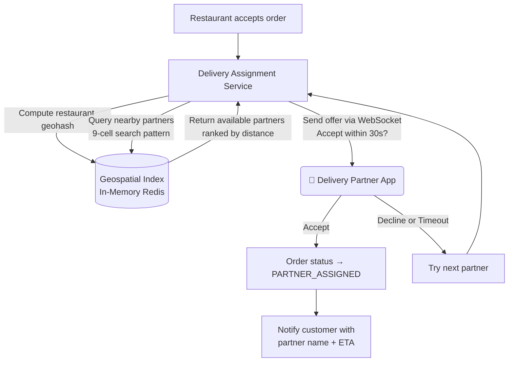

**Partner availability states:**

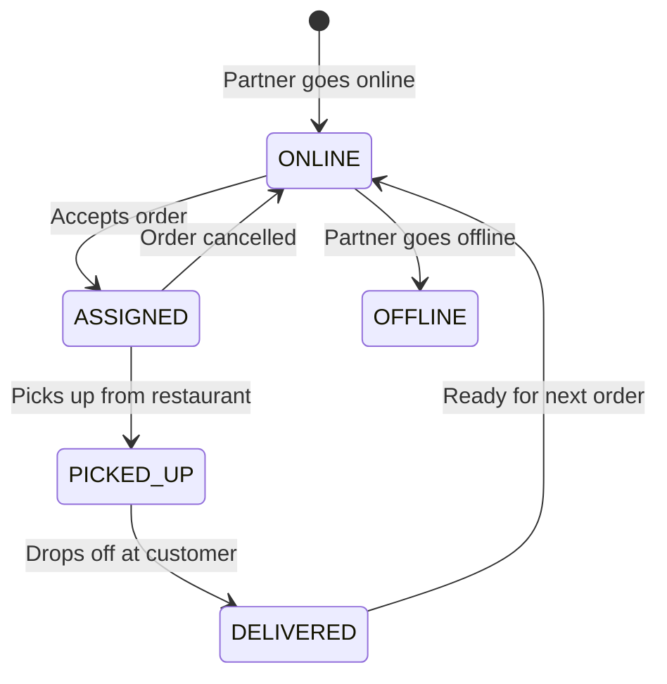

---

### 4. Order Lifecycle (State Machine)

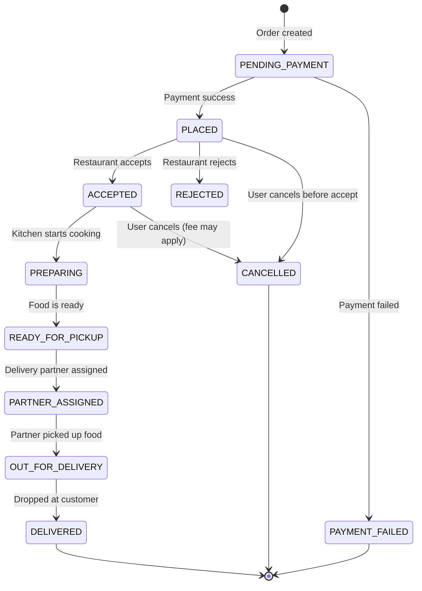

#### Side Effects at Each Transition

| Transition | Side Effects |
|---|---|
| PENDING_PAYMENT → PLACED | Confirm payment; notify restaurant; start assignment timer |
| PLACED → ACCEPTED | Notify user; begin delivery partner search |
| PLACED → REJECTED | Notify user; trigger auto-refund |
| ACCEPTED → PREPARING | Start estimated prep time countdown |
| PREPARING → READY_FOR_PICKUP | Alert nearby delivery partners |
| PARTNER_ASSIGNED → OUT_FOR_DELIVERY | Start real-time location streaming to user |
| OUT_FOR_DELIVERY → DELIVERED | Trigger payment settlement to restaurant; prompt review |
| Any → CANCELLED | Evaluate refund eligibility; notify all parties |

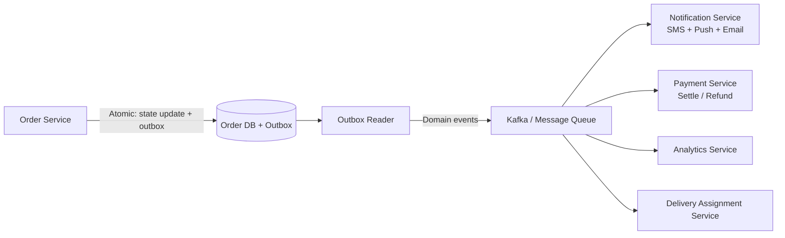

---

### 5. Real-Time Order Tracking

User watches the delivery partner move on the map — same pattern as Uber's location relay.

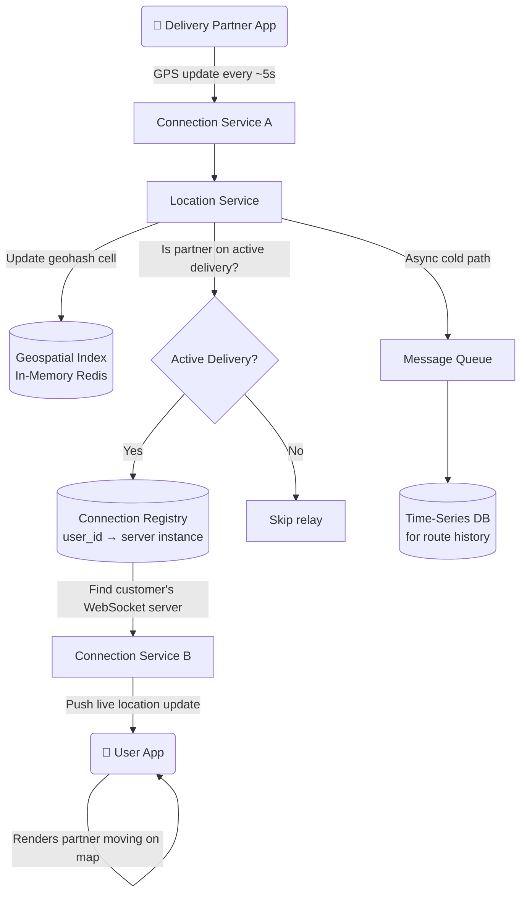

**Hot vs Cold path:**

| Path | Purpose | Latency |
|---|---|---|
| Hot | Live location relay to customer | ~milliseconds (in-memory) |
| Cold | Store route history for disputes, analytics | Seconds (async batch write) |

---

### 6. Payment Flow

Food delivery needs to handle multiple payment methods and a split settlement (platform takes a cut, rest goes to restaurant).

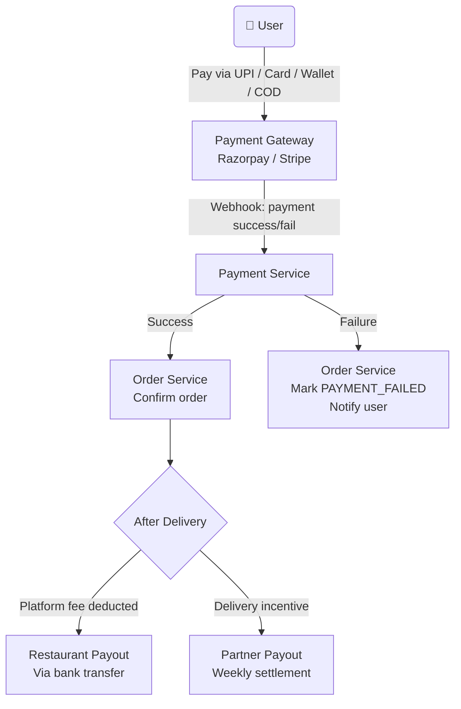

> **Idempotency is critical here.** Payment webhooks can arrive multiple times. The Payment Service uses an idempotency key (order ID) to ensure the order is confirmed exactly once, never double-charged or double-settled.

---

## 🔍 Deep Dive: Restaurant Search at Scale

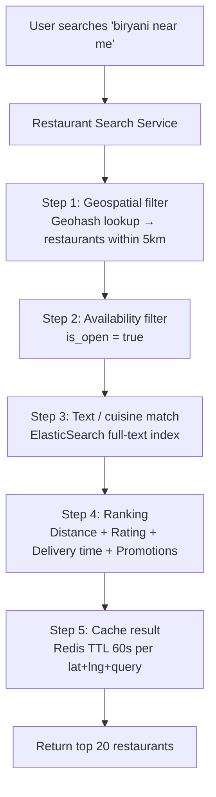

**Caching strategy:**
- Cache search results by `geohash_prefix + cuisine` with 60s TTL
- Restaurant menu pages cached with longer TTL (5 min) — menus don't change every second
- Invalidate cache when restaurant updates menu or toggles open/closed status

---

## 🔄 Full System Architecture

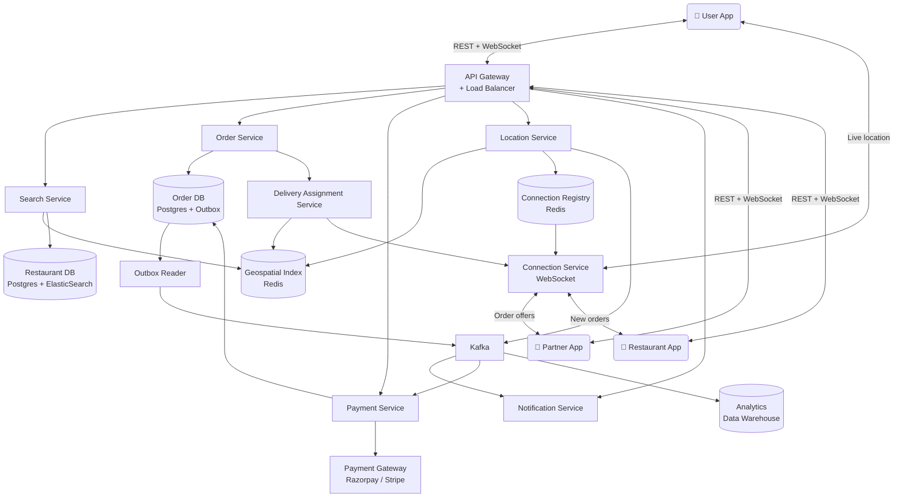

---

## 📊 Interview Level Expectations

| Topic | Mid-Level (L4) | Senior (L5) | Staff (L6) |
|---|---|---|---|
| **Restaurant Search** | Geospatial filter + basic ranking | Geohash vs quadtree; ElasticSearch integration; caching | Personalized ranking ML model; real-time availability index |
| **Order State Machine** | Define states and transitions | Outbox pattern for reliable side effects; idempotency | Saga pattern for distributed rollback across payment + order + restaurant |
| **Delivery Assignment** | Nearest partner search | Geohash 9-cell pattern; offer/accept flow with timeout | Batched assignment, surge zones, partner incentive logic |
| **Real-Time Tracking** | WebSocket for live updates | Connection registry for multi-instance routing | Reconnect handling, event replay, hot-path sharding |
| **Payment** | Capture payment before confirming | Idempotent webhook handling; refund flows | Split settlement, escrow, fraud detection integration |
| **Scale** | Identify bottlenecks | Horizontal scaling of stateless services; Redis for counters | Multi-region active-active, CDN for menus, read replicas |

---

## 🛠️ Tech Stack Summary

| Component | Technology |
|---|---|
| Main Databases | PostgreSQL (orders, users, restaurants) |
| Search Index | ElasticSearch (restaurant name, cuisine, menu) |
| Geospatial Index | Redis with geospatial commands |
| Cache | Redis (search results, menus, sessions) |
| Message Queue | Kafka (order events, location stream) |
| Real-Time Comms | WebSocket via Connection Service |
| Connection Registry | Redis (user_id → WebSocket server) |
| Payment Gateway | Razorpay / Stripe / PayU |
| Notification Service | Firebase (push) + Twilio (SMS) |
| Time-Series Store | InfluxDB / Cassandra (location history) |
| Object Storage | S3 (restaurant images, menu photos) |
| CDN | CloudFront / Akamai (images, static assets) |

---

> 📖 Inspired by system design patterns from Swiggy, Zomato, DoorDash, and Uber Eats engineering blogs.
