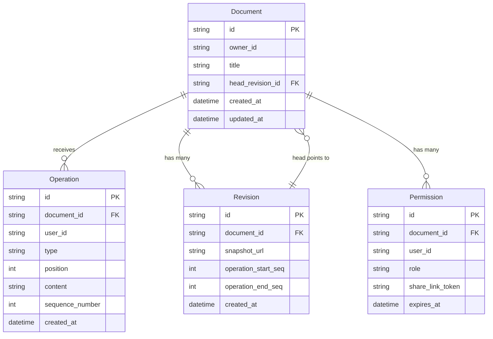
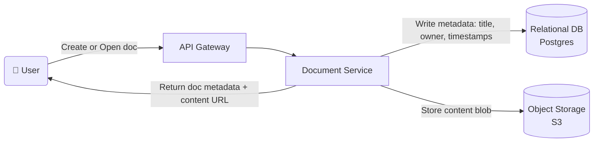
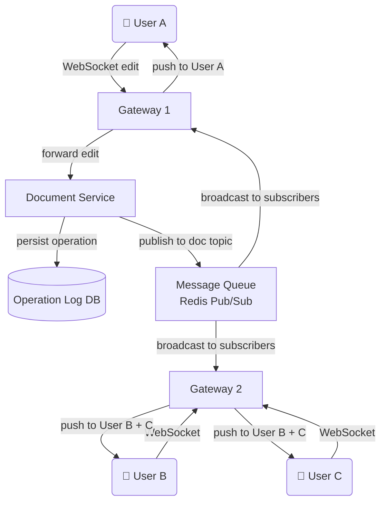
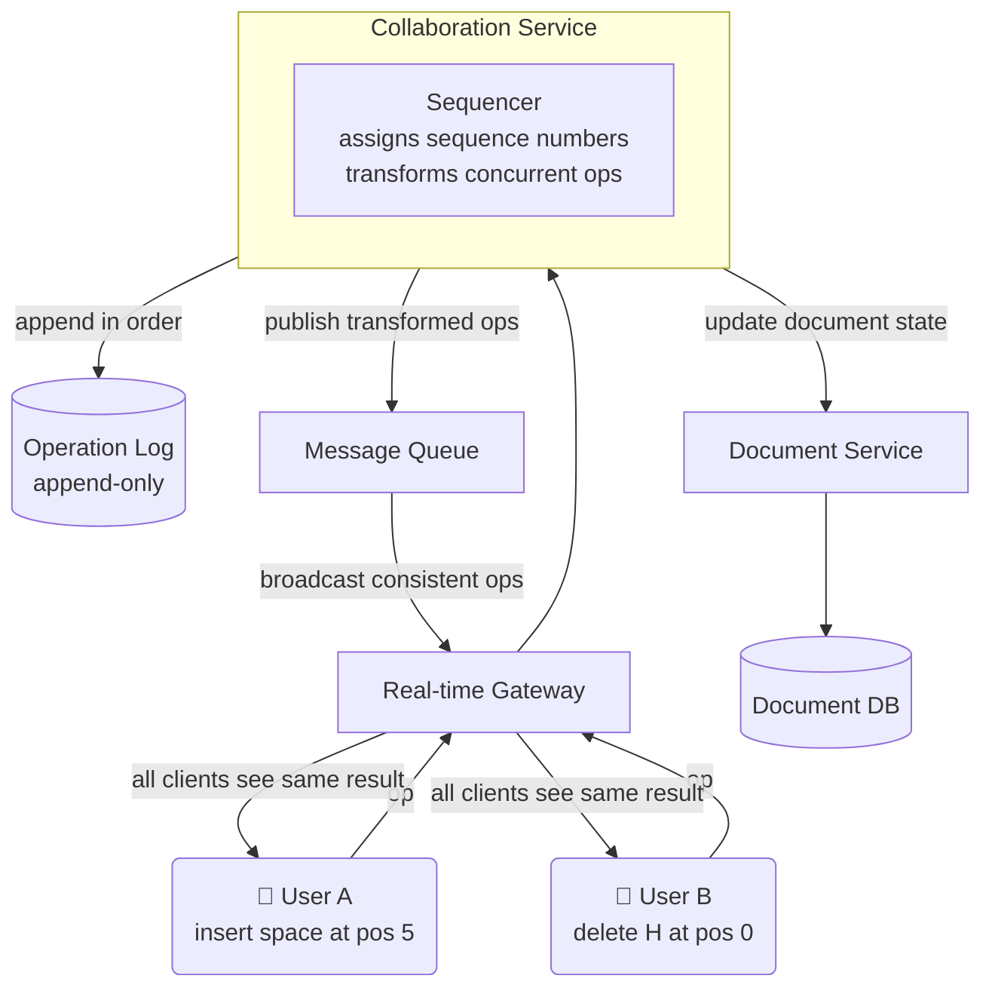
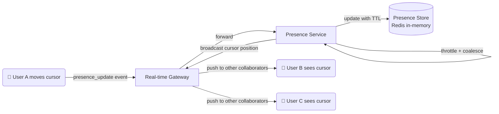
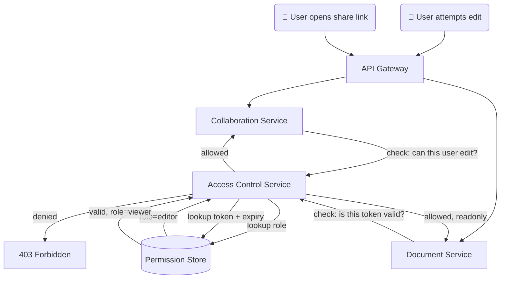
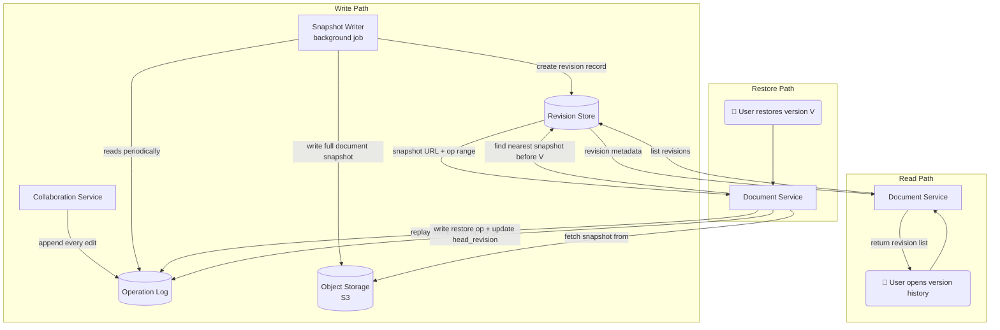
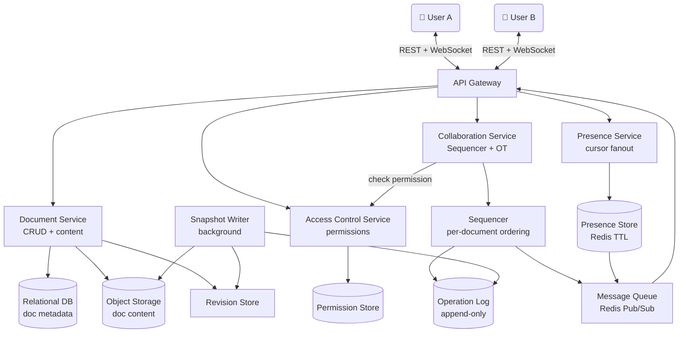

# 📝 Google Docs – Collaborative Editing System Design

> Covers: **theoretical explanation of every component**, architecture diagrams, interview questions an interviewer will actually ask, and tradeoffs behind every major decision.

---

## 📌 What Is This System?

Google Docs is a real-time collaborative editor where multiple users can type in the same document simultaneously, see each other's cursors, share access with different permission levels, and restore the document to any previous revision. The hardest part is not building a text editor — it is making concurrent edits from different users **converge to the same final state** for everyone.

---

## ✅ Functional Requirements

| # | Requirement | Verb that drives it |
|---|---|---|
| 1 | Users can create, open, update, and delete documents | **creates**, **edits** |
| 2 | Edits from one user appear to collaborators in near real time | **streams** |
| 3 | Simultaneous edits from different users converge to the same state | **merges** |
| 4 | Users see each other's live cursors and text selections | **shows** |
| 5 | Users can share documents and control access levels (view/comment/edit) | **shares** |
| 6 | Users can view and restore previous versions | **restores** |

### Scale
| Parameter | Value |
|---|---|
| Daily Active Users | 1M |
| Traffic spike | 5× during peak hours |
| Read : Write ratio | 10 : 1 |
| Average document size | 100KB |
| Documents per user | ~10 |
| Edit frequency | 1 edit/sec per active document |
| Max concurrent users per document | 100 |

---

## ⚙️ Non-Functional Requirements

| Requirement | Target | Why It Matters |
|---|---|---|
| Low Latency | Edits feel immediate to all collaborators | Lag breaks the sense of shared presence |
| Convergence | All users reach the same final document state | Without this, different users see different documents |
| Read-Your-Writes | User sees their own edits instantly | User must never see their own typing disappear |
| High Durability | Edits and revisions must survive failures | Data loss in a document is unforgivable |
| High Availability | Editor stays usable during spikes and partial outages | 5× traffic spikes at peak hours |
| Security | Only authorized users can read or modify documents | Shared docs must respect permission levels |

---

## 🗃️ Data Model

> **Cursor/selection state** is NOT stored in the database. It lives in an ephemeral in-memory presence store with a short TTL. It doesn't need durability — if you reconnect, your cursor position resets and that's fine.

---

## 🌐 API Design

| Method | Endpoint | Purpose |
|---|---|---|
| POST | `/api/documents` | Create a new document |
| GET | `/api/documents/{docId}` | Fetch document metadata + current content |
| POST | `/api/documents/{docId}/operations` | Submit a batch of edit operations |
| GET | `/api/documents/{docId}/history` | List revisions for version history UI |
| POST | `/api/documents/{docId}/permissions` | Grant or update access for a user |
| WS | `/api/documents/{docId}/collaborate` | Real-time channel — operations + cursor presence |

---

## 🏗️ High-Level Design — Theoretical Explanation

> This section explains **what each component does, why it exists, and how it connects** to the rest of the system. Read this before looking at the diagrams.

---

### 1. Single User Editing — How a Document Is Created and Stored

**What happens theoretically:**

The simplest case is one user creating a document and expecting it to be there after a page refresh. This requires two decisions: how to identify documents, and where to store the content.

**Document IDs should be random and opaque** — not sequential integers. Sequential IDs are guessable (someone could enumerate `doc/1`, `doc/2`, `doc/3` and access other users' documents). Random IDs like UUIDs make enumeration impossible. They also work without a central counter, which matters when scaling across multiple servers.

**Content and metadata should be stored separately.** Metadata (title, owner, last modified time, permissions) is structured, queried frequently, and small — it belongs in a relational database like PostgreSQL. Document content (the actual text, formatting) can be large (up to 100KB) and is only needed when a user opens the document. It belongs in object storage (like S3). Keeping them separate means the database stays fast for queries without the overhead of fetching large blobs on every metadata operation.

When a user saves or the autosave triggers, the Document Service writes metadata to the database and uploads the content blob to object storage under the document's ID.

---

### 2. Live Edit Streaming — How Edits Reach Other Collaborators in Real Time

**What happens theoretically:**

Once a document exists, multiple users need to see each other's changes as they type — not after a 5-second poll. This requires a persistent channel where the server can **push** updates to clients without the client asking.

**WebSocket is chosen over polling or SSE** for a specific reason: the channel must be bidirectional. Clients send edits *to* the server, and the server pushes edits *to* clients. SSE is server-to-client only — it can't receive edits. Polling works but requires the client to keep asking "anything new?" which wastes resources and adds latency.

**Fanout across multiple gateways is the second problem.** If the system runs 10 gateway instances and users on document A are spread across 3 of them, an edit from one user's gateway must reach all other gateways so they can push to their clients. A message queue (like Redis Pub/Sub or Kafka) solves this: when gateway 1 receives an edit, it publishes to the document's topic. All other gateways are subscribed and instantly receive the broadcast. This is called **pub/sub fanout**.

The flow: Client types → WebSocket to Gateway → Gateway forwards to Document Service → Document Service persists → publishes to message queue → all gateways subscribed to this document receive it → each gateway pushes to its connected clients.

---

### 3. Concurrent Edit Convergence — How Two Simultaneous Edits Don't Corrupt the Document

**What happens theoretically:**

This is the hardest problem in collaborative editing and what separates Google Docs from a naive shared textarea. Imagine User A and User B both have the document `"Hello"` open. User A types a space after "Hello" → document becomes `"Hello "`. At the exact same millisecond, User B deletes the "H" → intended result is `"ello"`. Without any coordination, each client applies their own edit and ends up with a different document. The two states have **diverged**.

**The solution is Operational Transformation (OT).** OT is an algorithm that transforms an incoming operation *against* all concurrent operations that were applied before it, adjusting positions and intent. In the example: User B's "delete position 0" operation arrives at the server after User A's "insert space at position 5" was already committed. OT transforms User B's operation: the insert at position 5 shifted all positions by 1, so the delete must be adjusted to still target the original "H" at its new position. Both operations are applied and all clients converge to the same result.

**The key architectural insight is the Sequencer.** Every document has a single sequencer component that is the **ordering authority**. All operations flow through it. The sequencer assigns a monotonically increasing sequence number to each operation, ensuring a single globally agreed-upon order. This is why concurrent edits can be deterministically transformed — there is one canonical order, and OT rules applied in that order always produce the same result on all clients.

The operation log is an append-only record of every operation in sequence order. It is the source of truth. The current document state can always be reconstructed by replaying the log from the beginning (or from a snapshot).

---

### 4. Cursor & Selection Presence — How You See Other People's Cursors

**What happens theoretically:**

Cursor positions and text selections are updated many times per second as users type and move around. If we stored every cursor update in the database, we'd be doing thousands of writes per second per active document — entirely unnecessary since nobody cares where your cursor was 30 seconds ago.

**Cursor state is ephemeral** — it only matters right now. So it lives in an **in-memory presence store** (Redis), not the database. Each user's cursor position is stored under a key like `presence:{docId}:{userId}` with a short TTL (e.g., 5 seconds). If a user closes their tab without disconnecting cleanly, their cursor automatically disappears when the TTL expires. No garbage collection needed.

**Throttling and coalescing** prevent the system from being overwhelmed by cursor updates. If a user moves their mouse 50 times per second, there's no value in broadcasting all 50 updates — only the latest position matters. The Presence Service coalesces rapid updates before broadcasting, reducing fanout significantly.

The cursor pipeline is completely separate from the edit pipeline. Cursor updates never go through the Sequencer or touch the Operation Log. This means cursor failures or slowness never affect the edit pipeline.

---

### 5. Sharing & Permissions — How Access Control Works on Every Read and Write

**What happens theoretically:**

Every read and write must be gated by a permission check. The naive approach — store permissions inside the document record — works at small scale but creates problems when sharing patterns become complex. A document can be shared with thousands of users, have time-limited links, and have different roles (viewer, commenter, editor). Storing all of this in the document table bloats every document fetch with permission lookups.

**A dedicated Access Control Service** handles all permission checks. It maintains its own Permission Store — a table of `(document_id, user_id, role)` records plus share link tokens. Both the Document Service (for reads) and Collaboration Service (for edits) call the Access Control Service before doing anything. The permission check is a simple key lookup — fast, cacheable, and isolated from document content.

**Share links** work by generating a unique token that maps to a permission record with a role and optional expiry timestamp. When a user opens a link, the system looks up the token in the Permission Store, finds the role and expiry, and either grants or denies access. Revoking a link just deletes the token record.

**Caching** is important here — permissions are checked on every operation but change rarely. A short TTL cache (60 seconds) in the Access Control Service dramatically reduces load. If a permission is revoked, the worst case is the user retains access for up to 60 seconds — acceptable for most sharing scenarios.

---

### 6. Version History — How Revisions Are Stored and Restored

**What happens theoretically:**

Users make mistakes. They accidentally delete a section, paste the wrong content, or simply want to see what the document looked like yesterday. Version history needs to be cheap to store (documents have thousands of edits), fast to retrieve (users shouldn't wait 10 seconds to see a list of versions), and fast to restore (going back to an old version should feel instant).

**A hybrid snapshot + delta approach** solves this optimally. The **Operation Log** already stores every individual edit as a delta (what changed). Replaying the entire log from the beginning to reconstruct an old version would be correct but extremely slow for a document with millions of operations. **Snapshots** are periodic full copies of the document state stored in object storage — think of them as checkpoints. To restore to a version, you find the nearest snapshot before that version and replay only the deltas between the snapshot and the target version. This is much faster than replaying everything from the beginning.

**The Snapshot Writer** is a background job (not on the critical path) that runs periodically. It reads from the Operation Log, computes the current document state at regular intervals (e.g., every 100 operations or every hour), writes the full document blob to object storage, and creates a Revision record in the Revision Store pointing to that snapshot and the range of operations it covers.

**Restoring** a version: the system writes a new operation that sets the document content to the restored state, appends it to the log, and updates the `head_revision_id` pointer. Restoration is just another operation — the history of even the restore event is preserved. You can undo a restore.

---

### 7. Full System — How All Pieces Connect

**What happens theoretically:**

All services are stateless and scale horizontally. State lives in the databases, Redis, and object storage — never in service memory. The API Gateway handles all incoming connections: REST for document management and permissions, WebSocket for real-time collaboration. The Collaboration Service is the most critical component — it is the gatekeeper for all edits, the home of the Sequencer, and the bridge between real-time gateways and durable storage.

---

## ⚖️ Key Tradeoffs

### Conflict Resolution: OT vs CRDTs

| Approach | How It Works | Pros | Cons | Choose When |
|---|---|---|---|---|
| **OT (Operational Transformation)** ✅ | Server sequencer orders all ops; clients transform against sequence | Simpler client; predictable convergence; works with existing server-side ordering | Server is a bottleneck; complex OT rules for rich text | Online-first with a centralized server — Google Docs, this system |
| **CRDTs** | Data structures designed to merge automatically without coordination | Works offline-first; no central server needed; simpler merge | Complex data structure implementation; larger state; hard to apply to rich text semantics | Offline-first collaborative tools — Notion, Figma (partially) |

> **Why OT wins here:** We already have a Collaboration Service in the middle of every edit acting as a sequencer. OT just adds transformation logic to something that already exists. CRDTs would require redesigning the entire data model and would add complexity without benefit since offline editing is out of scope.

---

### Document ID: Sequential vs Random

| Approach | Pros | Cons | Choose When |
|---|---|---|---|
| Sequential integers | Simple, sortable | Enumerable — attacker can scan all doc IDs | Internal systems only |
| **Random UUID** ✅ | Non-enumerable, globally unique, no central counter | Not sortable by creation time | Shared documents — always |
| Time-ordered (ULID) | Sortable + non-enumerable | Slightly more complex to generate | When you need sorted listing by creation time |

---

### Document Storage: Single DB vs Metadata/Content Split

| Approach | Pros | Cons | Choose When |
|---|---|---|---|
| Everything in DB | Simple | DB bloated with large blobs; slow metadata queries | Tiny documents only |
| **Split metadata + object storage** ✅ | DB stays fast; content scales cheaply in S3 | Two writes per save; slightly more complex | Any production document system |

---

### Version Storage: Full Snapshots vs Deltas vs Hybrid

| Approach | Storage Cost | Restore Speed | Choose When |
|---|---|---|---|
| Full snapshots only | Very high (duplicate content) | Instant | Tiny docs with rare edits |
| Deltas only | Very low | Slow (replay entire log) | Logs/audit trails only |
| **Hybrid snapshots + deltas** ✅ | Low (snapshots at intervals, deltas in between) | Fast (nearest snapshot + small delta replay) | All production document editors |

---

### Presence: Persisted vs Ephemeral

| Approach | Pros | Cons | Choose When |
|---|---|---|---|
| **Ephemeral (Redis TTL)** ✅ | Zero DB writes; auto-cleanup on disconnect; low latency | Lost on Redis restart | Cursor positions — always ephemeral |
| Persisted in DB | Survives restarts | Wasteful; nobody needs cursor history | Never — cursor state has no value after the session |

---

### Real-Time Channel: WebSocket vs SSE vs Polling

| Approach | Latency | Direction | Overhead | Choose When |
|---|---|---|---|---|
| **WebSocket** ✅ | Very low | Bidirectional | Low (persistent) | Need to both receive broadcasts AND send edits |
| SSE | Low | Server → Client only | Medium | Read-only real-time feeds (news, notifications) |
| Long Polling | Medium | Server → Client | High (reconnect each time) | Fallback when WebSocket is blocked |

---

## ❓ Interview Questions & Model Answers

---

**Q1: "What is the hardest problem in collaborative editing and how do you solve it?"**

> The hardest problem is **concurrent edit convergence** — two users editing the same position simultaneously producing different results on each client. The solution is **Operational Transformation**. Every edit is modeled as an operation (insert character at position X, delete character at position Y). A central Sequencer assigns a canonical order to all operations. When an operation arrives that was created concurrently with a previously committed operation, OT transforms its position parameters to account for what already happened — so the intended effect is preserved regardless of arrival order. All clients applying the same sequence of transformed operations always reach the same final state.

---

**Q2: "Why WebSocket and not SSE or polling?"**

> Collaboration is bidirectional — clients send edits to the server and receive broadcasts from other users. SSE is server-to-client only; you'd need a separate HTTP connection to send edits, which is wasteful. Polling adds artificial latency between typing and seeing the result. WebSocket maintains one persistent connection for both sending and receiving — lower latency, lower overhead, and simpler client logic.

---

**Q3: "How do you handle fanout when users are on different gateway instances?"**

> Each gateway instance only knows about clients directly connected to it. When an edit arrives at gateway 1 and users on the same document are connected to gateways 2 and 3, gateway 1 can't push directly to them. The solution is **pub/sub**: after the Collaboration Service processes an edit, it publishes the transformed operation to a message queue topic keyed by document ID. All gateway instances subscribe to topics for documents their clients have open. Any edit published to a topic is instantly received by all subscribed gateways, which then push to their local clients.

---

**Q4: "What happens when two users type in the exact same position at the same time?"**

> Both operations arrive at the Sequencer. The Sequencer assigns sequence numbers — say User A's operation gets sequence 42 and User B's gets sequence 43. User B's operation was created against a document state without User A's edit, so when it's applied, the Sequencer's OT algorithm transforms User B's position to account for User A's insert. For example, if User A inserted at position 5 and User B also tried to insert at position 5, OT shifts User B's insertion to position 6. Both edits are preserved, neither is lost, and all clients apply the same transformation in the same order and converge to the same result.

---

**Q5: "Why is cursor state not stored in the database?"**

> Because it has no lasting value. A cursor position is only meaningful right now — nobody needs to know where your cursor was 10 seconds ago. Storing it in a database would generate thousands of writes per second per active document with zero long-term benefit. Instead it lives in Redis with a short TTL. If you close your tab without a clean disconnect, your cursor entry expires automatically in a few seconds. The system gets the behavior it needs (live cursors for collaborators) without any of the overhead of durable writes.

---

**Q6: "How does version history work and how do you restore efficiently?"**

> We use a **hybrid snapshot + delta approach**. Every operation is already stored in an append-only Operation Log — that's the delta history. A background Snapshot Writer periodically reads the log, computes the full document state at that point, and stores it as a snapshot in object storage with a Revision record pointing to it. To restore, you find the nearest snapshot before the target version, fetch it, and replay only the deltas between that snapshot and the target — instead of replaying the entire history. Restoration writes a new operation to the log setting the content to the restored state, so even the restore action is part of history and can be undone.

---

**Q7: "What happens if the Sequencer goes down? Isn't it a single point of failure?"**

> Yes — this is a real concern with OT. The Sequencer is per-document, so one Sequencer failure only affects documents routed to that instance, not the whole system. Recovery options: first, the Operation Log is append-only and durable — a new Sequencer instance can read the log and resume from the last sequence number. Second, clients buffer unacknowledged operations locally and retransmit on reconnect. For a Senior interview, mention that this is why CRDTs are attractive at companies like Notion — they eliminate the central sequencer entirely at the cost of more complex client-side merge logic.

---

**Q8: "How would you handle a user who goes offline and comes back with local edits?"**

> The client buffers all edits made while offline with their local sequence number. On reconnect, it sends the buffered operations to the Collaboration Service tagged with the sequence number they were created against. The Sequencer transforms each buffered operation against all operations that were committed during the offline period — the same OT transformation used for real-time concurrent edits. From the server's perspective, offline reconciliation is just catching up on a burst of pending operations. The client may need to rebase its local state after the server returns the transformed versions.

---

**Q9: "How do you scale a single hot document with 100 concurrent editors?"**

> At 100 editors, 100 WebSocket connections fan out to every edit — that's 100 broadcasts per operation. The bottleneck is the Sequencer which is per-document and single-threaded by design (for ordering). Mitigation strategies: batch operations within short windows (e.g., 50ms) and apply them together; use a dedicated Sequencer shard for high-traffic documents with consistent hashing to route a document always to the same Sequencer instance; throttle presence updates aggressively (cursor moves don't need per-keystroke broadcast). For Staff-level: discuss how Google internally uses per-document state machines with leader election for exactly this reason.

---

**Q10: "How do you enforce permissions when someone has a share link?"**

> Share links contain a unique random token. The Permission Store has a record mapping each token to `(document_id, role, expires_at)`. When a request comes in with a share link token, the Access Control Service looks up the token, checks expiry, and returns the role. The requesting service (Document or Collaboration) proceeds with that role — viewer can only read, editor can write. Revoking access means deleting the token record. Since the Access Control Service caches permissions for ~60 seconds, there's a brief window after revocation where the link might still work — acceptable for most cases, but for high-security scenarios the TTL can be reduced to zero (synchronous check, no cache).

---

## 📊 Interview Level Expectations

| Topic | Mid-Level (L4) | Senior (L5) | Staff (L6) |
|---|---|---|---|
| **Conflict Resolution** | Know OT exists, explain basic idea | Compare OT vs CRDTs with tradeoffs, explain Sequencer role | Handle offline reconciliation, CRDT data structures, rich text semantics |
| **Real-Time Streaming** | WebSocket for bidirectional | Pub/sub fanout across gateway instances | Backpressure, message ordering guarantees, reconnect and replay |
| **Presence** | Ephemeral Redis store, TTL cleanup | Throttle + coalesce, separate pipeline from edit flow | Multi-region presence, clock skew handling |
| **Permissions** | Basic role check before operations | Dedicated ACS, share link token model, caching TTL | Attribute-based access control, audit logging, fine-grained per-section permissions |
| **Version History** | Understand snapshot vs delta | Hybrid approach, Snapshot Writer as background job | Efficient delta compression, branch/merge version trees |
| **Sequencer Scaling** | Know it's the bottleneck | Per-document routing with consistent hashing | Leader election, multi-region sequencing, CRDT as alternative |

---

## 🛠️ Tech Stack

| Component | Technology | Why |
|---|---|---|
| Document Metadata DB | PostgreSQL | Structured queries, ACID for permission checks |
| Document Content | S3 / Object Storage | Cheap, durable, scales to any size |
| Operation Log | PostgreSQL (append-only table) / Cassandra | Ordered, immutable, high write throughput |
| Revision Store | PostgreSQL | Structured metadata for version history UI |
| Presence Store | Redis (TTL keys) | Ephemeral, sub-ms reads, auto-cleanup |
| Message Queue (fanout) | Redis Pub/Sub / Kafka | Low-latency broadcast across gateway instances |
| Real-Time Comms | WebSocket | Bidirectional persistent connection |
| Permission Store | PostgreSQL | Relational joins for role lookups |
| Snapshots | S3 | Cheap storage for periodic full-document checkpoints |
| Background Jobs | Cron / Kubernetes CronJob | Snapshot Writer, revision cleanup |

---

> 📖 Reference: [systemdesignschool.io – Design Google Docs](https://systemdesignschool.io/problems/google-doc/solution)
