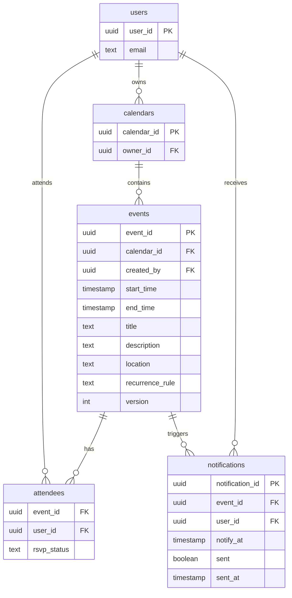
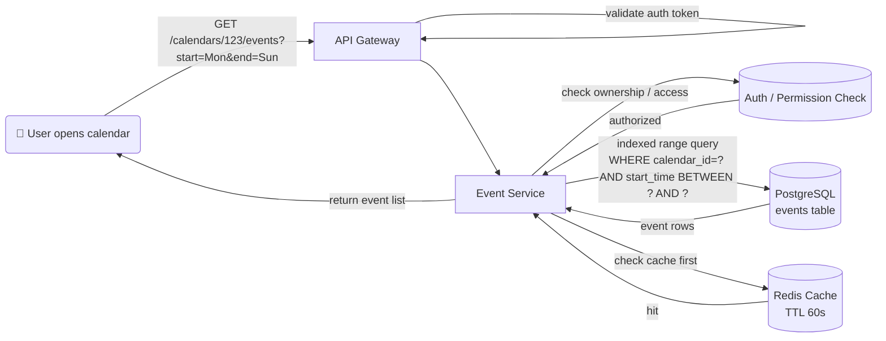
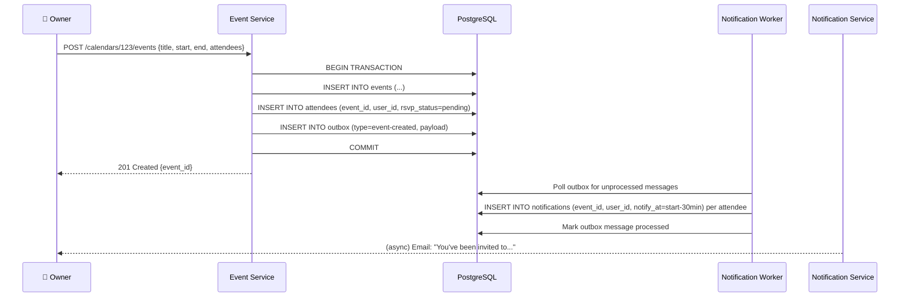
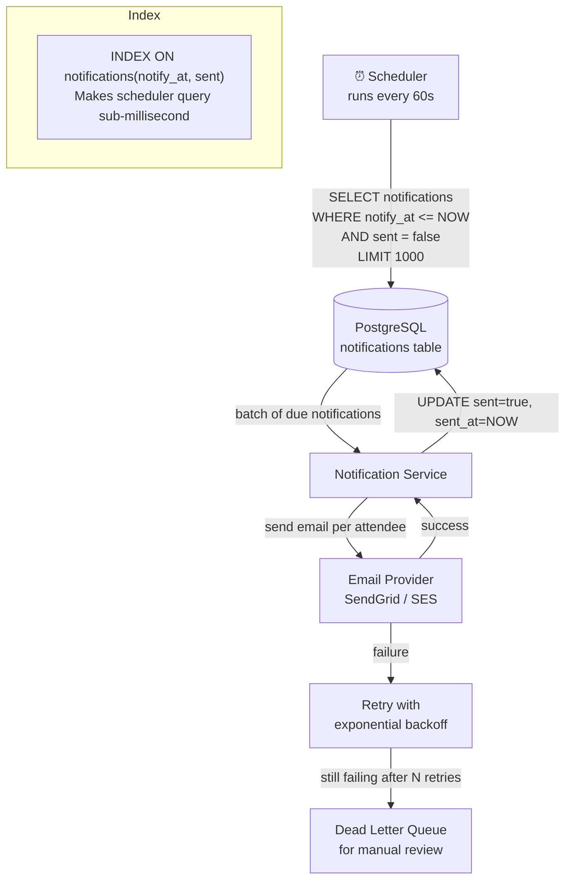
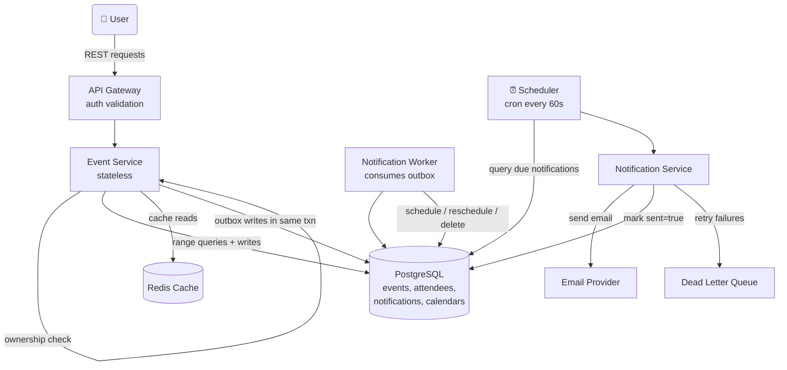
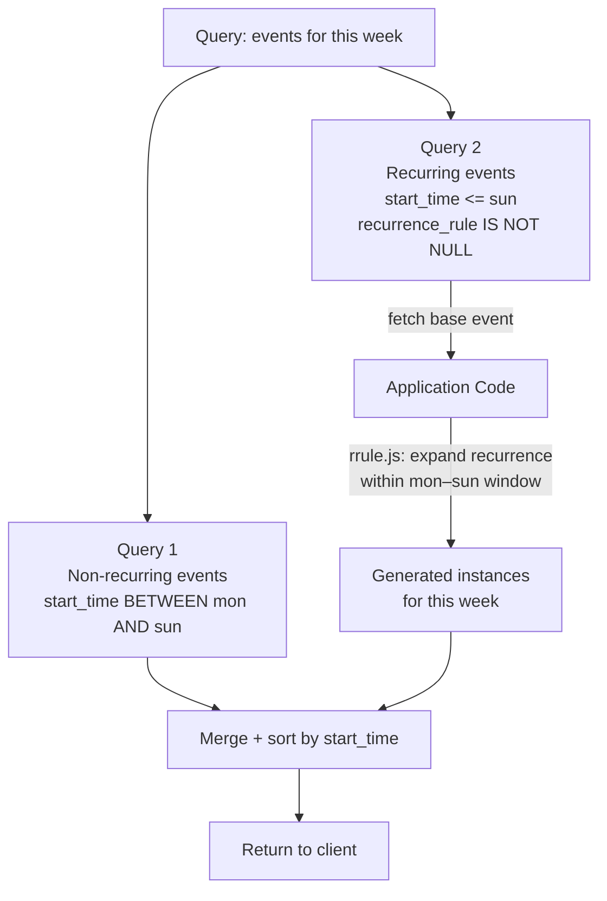
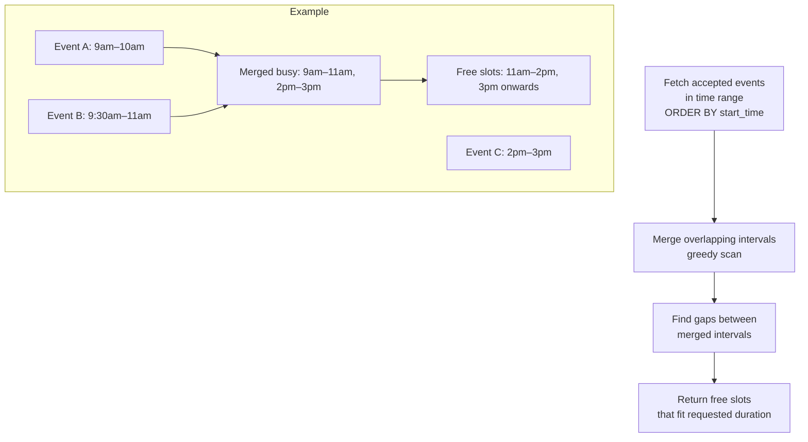
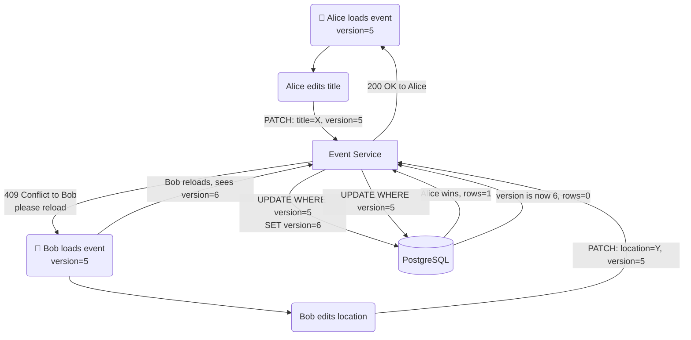

# 📅 Google Calendar – System Design

> Covers: **theoretical explanation of every component**, architecture diagrams, interview questions an interviewer will actually ask, and tradeoffs behind every major decision.

---

## 📌 What Is This System?

Google Calendar is a calendar management system where users create events, invite attendees, RSVP to invites, and receive automated email reminders before events start. Unlike social media platforms driven by high-frequency lightweight writes (likes, comments), Calendar prioritizes **data correctness, consistency, and relationship modeling** — every event involves users, time constraints, access rules, and notification schedules that must all stay in sync.

---

## ✅ Functional Requirements

| # | Requirement |
|---|---|
| 1 | Users can retrieve their calendar events for a specific time range |
| 2 | Calendar owners can create, update, and delete events |
| 3 | When events change, attendees are notified and the notification schedule is updated |
| 4 | Attendees can RSVP (accept / decline / pending) to events they're invited to |
| 5 | System automatically sends email reminders 30 minutes before each event |

### Scale
| Parameter | Value |
|---|---|
| Daily Active Users | 10M |
| Events created/day | ~30M (3 per user) |
| Write QPS | ~347 |
| Read QPS | ~3,472 (10:1 read/write) |
| Attendees per event | ~5 |
| Data retention | Indefinitely |

> **Note:** This system is relatively low QPS compared to social media. The design challenge is **correctness and relationship modeling**, not raw throughput.

---

## ⚙️ Non-Functional Requirements

| Requirement | Target | Why It Matters |
|---|---|---|
| Consistency | Event data consistent across all users | Prevent double-booking, stale attendee lists |
| Security | Only authorized users can view or modify events | Owner vs attendee permissions are distinct |
| Scalability | Handle millions of users and events | Even at low QPS, data volume grows indefinitely |
| Reliable Notifications | Every attendee gets the 30-min reminder | Missed notification = user misses meeting |
| Availability | System stays up during traffic spikes | Users check calendar most right before meetings |

---

## 🗃️ Data Model



**Key design decisions in the schema:**

| Decision | Why |
|---|---|
| `attendees` is a join table | Models the many-to-many between users and events; `rsvp_status` lives here because it's a property of the *relationship*, not the user or event alone |
| `notifications` is a separate table | Allows the scheduler to query `WHERE notify_at <= now() AND sent = false` efficiently without touching event or attendee tables |
| `version` field on events | Enables optimistic locking — prevents concurrent edits from silently overwriting each other |
| `recurrence_rule` as TEXT | Stores iCalendar RRULE standard strings — works with existing open-source libraries |

---

## 🌐 API Design

| Method | Endpoint | Purpose |
|---|---|---|
| GET | `/calendars/{calendarId}/events?start=&end=` | Retrieve events in a time range |
| POST | `/calendars/{calendarId}/events` | Create a new event |
| PATCH | `/calendars/{calendarId}/events/{eventId}` | Update an existing event |
| DELETE | `/calendars/{calendarId}/events/{eventId}` | Delete an event |
| POST | `/calendars/{calendarId}/events/{eventId}/rsvp` | RSVP to an event |

---

## 🏗️ High-Level Design — Theoretical Explanation

> This section explains **what each component does, why it exists, and how it connects** to the rest of the system. Read this before looking at the diagrams.

---

### 1. Event Retrieval — How a User Sees Their Calendar

**What happens theoretically:**

When a user opens Google Calendar and views a week or month, the app sends a query like "give me all events in this calendar between Monday and Sunday." This is a **range query** — fetch all events where `start_time` falls within the requested window.

The critical detail is the **index**. Without an index, this query would scan every event in the database to find those in the time range. With a composite index on `(calendar_id, start_time)`, the database can jump directly to the right calendar's events sorted by time and scan only the relevant window. This is why the schema specifically calls out indexing on `calendar_id` and `start_time` — it's not optional at scale.

**Authorization happens first.** The Event Service checks that the authenticated user owns the calendar (or has been granted read access) before executing the query. Attendees can see events they're invited to but cannot see the full calendar of someone else.

**Caching** is worthwhile here because calendar views are read frequently. After loading the week view once, the same user scrolling back to the same week shouldn't hit the database again. Results can be cached per `(calendar_id, time_range)` with a short TTL (e.g., 60 seconds) or invalidated explicitly when events change.



---

### 2. Event Creation and Modification — How Events Are Written Safely

**What happens theoretically:**

Creating or modifying an event is not just a database write — it has **two downstream consequences** that must happen reliably: attendees need to be notified, and the notification schedule needs to be updated. If the DB write succeeds but the notification update fails, attendees won't get their reminder. This is a classic **dual-write problem**.

The solution is the **Outbox pattern** (same as Uber and Food Delivery). The Event Service writes the event change AND an `event-changed` message to an outbox table inside the **same database transaction**. This guarantees both succeed or both fail together — there's no window where the event is saved but the notification update isn't scheduled. A separate Notification Worker reads from the outbox and processes downstream effects.

**What the Notification Worker does on each event change:**
- On `CREATE`: inserts a `notifications` row for every attendee with `notify_at = start_time - 30 minutes`
- On `UPDATE` (time changed): deletes old notification rows and inserts new ones with recalculated `notify_at`
- On `DELETE`: deletes all associated notification rows

**Ownership validation** happens before any write. Only the calendar owner can create, update, or delete events. This is checked by joining the event's `calendar_id` to the `calendars` table and confirming `owner_id` matches the authenticated user.

**Transaction scope**: The event write and outbox write happen in one transaction. The actual notification table updates happen asynchronously via the worker. This keeps the API response fast — the user gets a `201 Created` immediately without waiting for notification scheduling to complete.



---

### 3. RSVP Management — How Attendees Accept or Decline

**What happens theoretically:**

When an attendee responds to an event invite, two things happen: the `rsvp_status` in the `attendees` table updates, and the event organizer gets notified of the response. The challenge is **validation** — you must ensure the user submitting the RSVP is actually an attendee of that event. Without this check, any user could RSVP to any event they know the ID of.

**Validation flow:**
1. Look up the `attendees` table for the row where `(event_id, user_id)` matches the current user
2. If the row exists → update `rsvp_status`
3. If not → return `403 Forbidden`

The composite primary key `(event_id, user_id)` on the attendees table makes this lookup a fast, indexed point query — no table scan.

After the RSVP update, an `rsvp-changed` event is published (via the same outbox or message queue). The Notification Service consumes this and sends confirmation emails — to the attendee (confirming their response) and optionally to the organizer (to show updated headcount).

**What happens to notification scheduling on decline?** If a user RSVPs `denied`, the system should remove their notification row — they don't need a reminder for an event they're not attending. The Notification Worker handles this cleanup when it processes the `rsvp-changed` event.

```mermaid
flowchart TD
    A(👤 Attendee) -->|POST /events/456/rsvp {status: accepted}| B[API Gateway]
    B --> C[Event Service]
    C -->|SELECT from attendees\nWHERE event_id=? AND user_id=?| D[(PostgreSQL)]
    D -- row found --> C
    D -- not found --> DENY[403 Forbidden\nnot an attendee]
    C -->|UPDATE attendees SET rsvp_status=accepted| D
    C -->|publish rsvp-changed event| MQ[Message Queue]
    MQ --> NW[Notification Worker]
    NW -->|if denied: DELETE notification row| D
    NW -->|emit email to organizer| NS[Notification Service]
    NS -->|send email| EM[Email Provider]
```

---

### 4. Automated Notifications — How Every Attendee Gets the 30-Minute Reminder

**What happens theoretically:**

Every event in the system has a row in the `notifications` table for each attendee with `notify_at = start_time - 30 minutes` and `sent = false`. The notification system's job is simple: find all rows where `notify_at <= NOW()` and `sent = false`, send the emails, and mark them `sent = true`.

**The Scheduler** is a periodic background job (cron or equivalent) that runs every minute and executes:

```sql
SELECT * FROM notifications
WHERE notify_at <= NOW() AND sent = false
LIMIT 1000
```

It batches the results, passes them to the Notification Service, and marks each row `sent = true` after confirmed delivery.

**Why a dedicated `notifications` table instead of querying `events` directly?**
Because querying events directly would require computing `start_time - 30 minutes` for every event on every scheduler tick, joining with attendees, and filtering for unprocessed ones. The notifications table pre-computes `notify_at` at event creation time — the scheduler query is a simple range scan on an indexed timestamp column.

**Reliability** is critical — a missed notification means a user misses their meeting. Two failure modes need handling:
- **Email provider failure:** Retry with exponential backoff. Keep `sent = false` until confirmed delivered.
- **Repeated failures:** After N retries, move to a **Dead Letter Queue** for manual review. Don't retry forever — an undeliverable email shouldn't block other notifications.

**At scale (10M DAUs, 3 events/day, 5 attendees):** ~150M notification rows/day. The scheduler query at peak (8–9am when most meetings start) processes thousands of rows per minute. Index on `(notify_at, sent)` makes the query fast. The batch limit (e.g., 1000 rows per tick) prevents the scheduler from overwhelming the email provider.



---

### 5. Full System — How All Pieces Connect

**What happens theoretically:**

The system is intentionally simple in structure — a single Event Service handles all calendar operations. Complexity lives in the **data model** and **consistency guarantees**, not in distributed service mesh. The Event Service is stateless and horizontally scalable. The database is the source of truth. The Notification Worker and Scheduler are background processes that never block user-facing requests.



---

## 🔍 Deep Dives

### Recurring Events — How "Every Monday at 10am" Works

**What happens theoretically:**

Recurring events are not stored as thousands of individual event rows — that would create millions of rows for "daily standup." Instead, a single event row stores a `recurrence_rule` field using the **iCalendar RFC 5545 RRULE standard** — a well-defined text format for recurrence patterns supported by libraries in every language.

```
FREQ=WEEKLY;BYDAY=MO,WE,FR      → Every Monday, Wednesday, Friday
FREQ=MONTHLY;BYMONTHDAY=15      → 15th of every month
FREQ=DAILY;INTERVAL=2           → Every 2 days
```

When querying events for a time range, the system runs two queries and merges:
1. **Non-recurring events:** normal range query with `recurrence_rule IS NULL`
2. **Recurring events:** fetch all recurring events that *started before* the query end date, then expand them in application code using the RRULE library to generate instances within the window



**Why expand in application code and not the database?**

SQL has no native understanding of RRULE strings. Storing and expanding recurrence in the database would require custom functions or storing pre-expanded rows. Application-level expansion using a standard library is simpler, more flexible, and keeps the DB schema clean. The only trade-off is that very large date ranges (e.g., "show all events for the next 10 years") could generate many instances — but calendar views are typically day/week/month, so instance counts are small.

---

### Conflict Detection — How to Find Free Time Slots

**What happens theoretically:**

When a user wants to schedule a meeting, you need to know when everyone is free. Two sub-problems: detecting if a proposed time overlaps with existing events, and finding all available slots in a range.

**Overlap detection** is a single SQL query. Two time intervals overlap if one starts before the other ends AND ends after the other starts:

```sql
SELECT COUNT(*) FROM events e
JOIN attendees a ON e.event_id = a.event_id
WHERE a.user_id = ?
  AND a.rsvp_status = 'accepted'
  AND e.start_time < proposed_end_time
  AND e.end_time > proposed_start_time
```

**Finding free slots** uses the classic **Merge Intervals** algorithm:



**Important business rule:** Google Calendar allows double-booking — it warns you but doesn't block it. So conflict detection is advisory, not enforced. Show a warning on overlap; never silently reject.

---

### Concurrent Modifications — How Two Simultaneous Edits Are Handled

**What happens theoretically:**

If Alice and Bob both open the same event at the same time and both try to save changes, the last one to save could silently overwrite the first. Without any coordination, Alice's title change and Bob's location change might both save, but if they both happen to touch the same field (like the description), the second save wins and the first is lost — with no warning to either user.

**Optimistic Locking with a version field** solves this without the cost of pessimistic row locking. A `version` integer is added to the events table. When a user loads an event, they receive the current version number. When they save, the UPDATE includes a `WHERE version = ?` condition:

```sql
UPDATE events
SET title = ?, location = ?, version = version + 1
WHERE event_id = ? AND version = ?  -- version user loaded
```

If another user saved in the meantime, the version will have incremented and this UPDATE affects 0 rows. The application checks the affected row count — if 0, it returns a `409 Conflict` error to the user with a message like "someone else modified this event, please reload."



**Why optimistic over pessimistic locking?**

Pessimistic locking (`SELECT FOR UPDATE`) holds a database lock for the entire duration of a user editing the form — potentially minutes. With 10M users, this would create massive lock contention. Optimistic locking holds no lock during editing; the conflict check happens only at save time, which is instantaneous. Calendar events are rarely edited simultaneously by two people, so conflicts are infrequent — the optimistic assumption (no conflict expected) is correct almost always.

---

## ⚖️ Key Tradeoffs

### Notification Storage: Pre-computed Table vs On-the-fly Query

| Approach | Pros | Cons | Choose When |
|---|---|---|---|
| **Pre-computed notifications table** ✅ | Scheduler query is a fast indexed point-in-time scan | Extra storage; must update on event change | Any production notification system |
| Query events on every scheduler tick | No extra table | Slow: join events + attendees + compute `start-30min` on every run | Never at scale |

---

### Concurrency: Optimistic vs Pessimistic Locking

| Approach | How | Pros | Cons | Choose When |
|---|---|---|---|---|
| **Optimistic (version field)** ✅ | Check version at save time; reject if mismatch | No locks held during editing; scales well | User sees error and must retry | Calendar events — low contention |
| Pessimistic (SELECT FOR UPDATE) | Lock row when user opens event | No conflict at save time | Holds lock for entire edit duration; crushes concurrency | Financial systems where conflicts are frequent |
| Last-Write-Wins | Just overwrite | Simplest | Silent data loss | Never for user-facing content |

---

### Recurring Events: Pre-expand vs On-the-fly Expansion

| Approach | Pros | Cons | Choose When |
|---|---|---|---|
| **On-the-fly with RRULE library** ✅ | Single row per recurring event; edits affect all instances | CPU cost to expand; large ranges = many instances | Calendar views (day/week/month) — bounded output |
| Pre-expand into individual rows | Simple queries; easy to modify one instance | Millions of rows per recurring event; delete is expensive | Never — combinatorial explosion |

---

### Dual-Write: Outbox Pattern vs Direct Message Publish

| Approach | Pros | Cons |
|---|---|---|
| **Outbox pattern** ✅ | DB write + downstream effects always consistent; survives message queue downtime | Extra outbox table + worker process |
| Direct publish after DB write | Simpler | If message publish fails after DB commit, notification schedule is never updated — attendees miss reminders |

---

## ❓ Interview Questions & Model Answers

---

**Q1: "How does the notification system work? How do you ensure every attendee gets their reminder?"**

> When an event is created, the Event Service inserts one `notifications` row per attendee with `notify_at = start_time - 30 minutes` and `sent = false`. A scheduler job runs every minute and queries `WHERE notify_at <= NOW() AND sent = false`. It batches results, sends emails via a provider like SendGrid, and marks rows `sent = true` only after confirmed delivery. Failures retry with exponential backoff; persistent failures go to a dead-letter queue. The `notifications` table has an index on `(notify_at, sent)` so the scheduler query is a fast range scan even with hundreds of millions of rows.

---

**Q2: "What happens to notifications when an event is rescheduled?"**

> An `event-changed` message is published via the outbox when the event updates. The Notification Worker consumes this message and does three things: deletes the old notification rows for all attendees, inserts new rows with the recalculated `notify_at = new_start_time - 30 minutes`. This is done as a transaction — delete + insert together — so there's no window where an attendee has no notification row and might miss their reminder.

---

**Q3: "How do you handle concurrent edits to the same event?"**

> Optimistic locking with a `version` field on the events table. When a user loads an event they get the current version. Their PATCH includes that version in the `WHERE` clause: `UPDATE events SET ... WHERE event_id = ? AND version = ?`. If someone else saved in the meantime, the version incremented and this UPDATE affects 0 rows. The service detects this and returns a `409 Conflict` — the user is prompted to reload and try again. We chose optimistic over pessimistic locking because calendar edits are infrequent and rarely concurrent, so the optimistic assumption is correct almost always. Holding a DB lock for the entire duration a user is editing a form would kill concurrency.

---

**Q4: "How do you store and query recurring events?"**

> A single event row stores the recurrence pattern as an RRULE string (iCalendar RFC 5545 standard) — for example `FREQ=WEEKLY;BYDAY=MO,WE,FR`. When querying a time range, we run two queries: one for non-recurring events with a normal range filter, and one for recurring events that started before the query end date. We expand recurring events into instances in application code using an RRULE library, filter to those within the query window, and merge with the non-recurring results. We never pre-expand into individual rows — that would be millions of rows per recurring event.

---

**Q5: "How do you find free time slots for scheduling across multiple attendees?"**

> Fetch all accepted events for each attendee in the requested window, ordered by `start_time`. Run the Merge Intervals algorithm to collapse overlapping busy periods into a minimal set of busy ranges. Find gaps between merged intervals that are large enough for the requested meeting duration. Return those gaps as available slots. The conflict detection SQL uses the interval overlap condition: `start_time < proposed_end AND end_time > proposed_start` — two intervals overlap if and only if neither ends before the other starts. Index on `(user_id, start_time)` makes the per-user fetch fast.

---

**Q6: "How do you validate that a user can only RSVP to events they're invited to?"**

> The `attendees` table has a composite primary key `(event_id, user_id)`. Before updating `rsvp_status`, the Event Service does a point lookup: `SELECT 1 FROM attendees WHERE event_id = ? AND user_id = ?`. If the row doesn't exist, return `403 Forbidden`. If it does, update the row. This is a fast indexed lookup — no table scan. The composite PK also enforces uniqueness: one RSVP row per `(event, user)` pair — a user can't RSVP twice.

---

**Q7: "Why use a relational database here instead of a NoSQL store?"**

> Calendar data is highly relational — events belong to calendars, attendees join users and events, notifications reference both events and users. These relationships need enforced foreign keys and joins. The access pattern is primarily time-range queries with filters — well-suited to indexed SQL. Write QPS is only ~347 — no need for a distributed NoSQL store's write throughput. Consistency is critical (no double-booking, correct notification schedules) — ACID transactions in PostgreSQL make this straightforward. NoSQL would give up joins, transactions, and foreign key enforcement for write throughput we don't need.

---

**Q8: "How do you scale the notifications table as it grows to hundreds of millions of rows?"**

> Several strategies work together. First, partition the notifications table by `notify_at` month — the scheduler only queries the current partition, never touching historical data. Second, archive or delete `sent = true` rows older than 90 days — they have no operational value. Third, shard by `calendar_id` if write throughput becomes a bottleneck — notification rows can be co-located with their event's calendar shard. The scheduler itself can be parallelized — multiple workers each claim a batch of rows using `SELECT FOR UPDATE SKIP LOCKED` to avoid processing the same notification twice.

---

## 📊 Interview Level Expectations

| Topic | Mid-Level (L4) | Senior (L5) | Staff (L6) |
|---|---|---|---|
| **Schema Design** | Define entities and relationships | Justify join table for attendees, index choices, notification pre-compute | Partitioning strategy, sharding by calendar_id |
| **Notifications** | Pre-computed table + scheduler | Outbox pattern for consistency, retry + DLQ | Exactly-once delivery, multi-region notification queues |
| **Recurring Events** | Know RRULE concept | On-the-fly expansion vs pre-expand tradeoffs | Exception handling (modify/delete one instance), timezone edge cases |
| **Concurrency** | Know optimistic vs pessimistic | Implement version field correctly, 409 handling | Distributed locking at scale, OCC vs 2PC tradeoffs |
| **Conflict Detection** | Overlap SQL query | Merge intervals algorithm, free slot algorithm | Caching availability data, multi-timezone scheduling |
| **Consistency** | Know ACID transactions help | Outbox pattern for dual-write | Saga pattern if multiple services needed |

---

## 🛠️ Tech Stack

| Component | Technology | Why |
|---|---|---|
| Database | PostgreSQL | Relational model, ACID transactions, range queries |
| Cache | Redis (TTL) | Calendar view caching, short TTL |
| Message Queue | Redis Pub/Sub / Kafka | Outbox event delivery to Notification Worker |
| Notification Scheduler | Cron / Kubernetes CronJob | Periodic scan of due notifications |
| Email Provider | SendGrid / AWS SES | Reliable delivery, retry handling |
| Dead Letter Queue | SQS / Kafka DLQ topic | Undeliverable notifications for manual review |
| RRULE Processing | rrule.js / python-dateutil | iCalendar RFC 5545 standard library |
| API Gateway | Kong / AWS API Gateway | Auth, routing, rate limiting |

---

> 📖 Reference: [systemdesignschool.io – Design Google Calendar](https://systemdesignschool.io/problems/google-calendar/solution)
