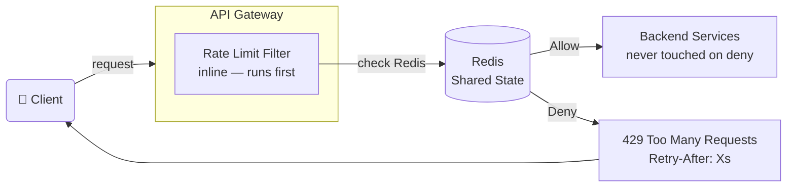
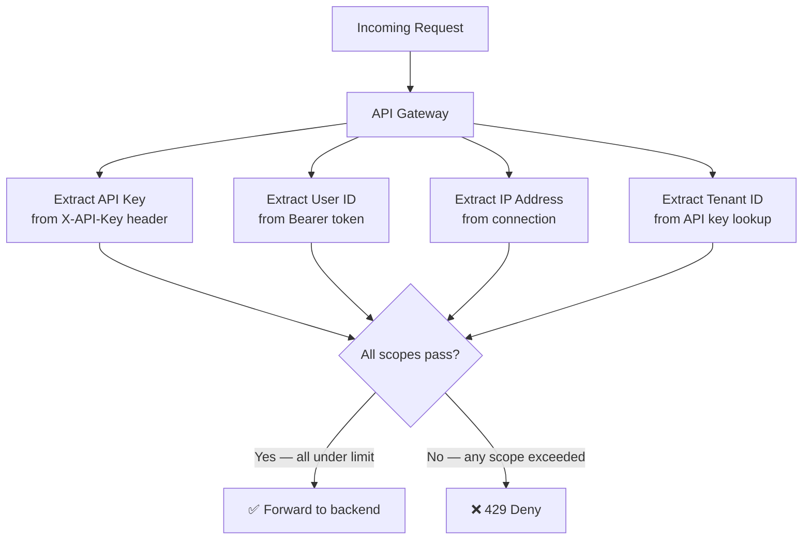
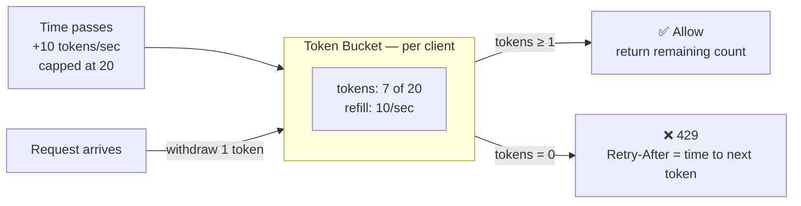
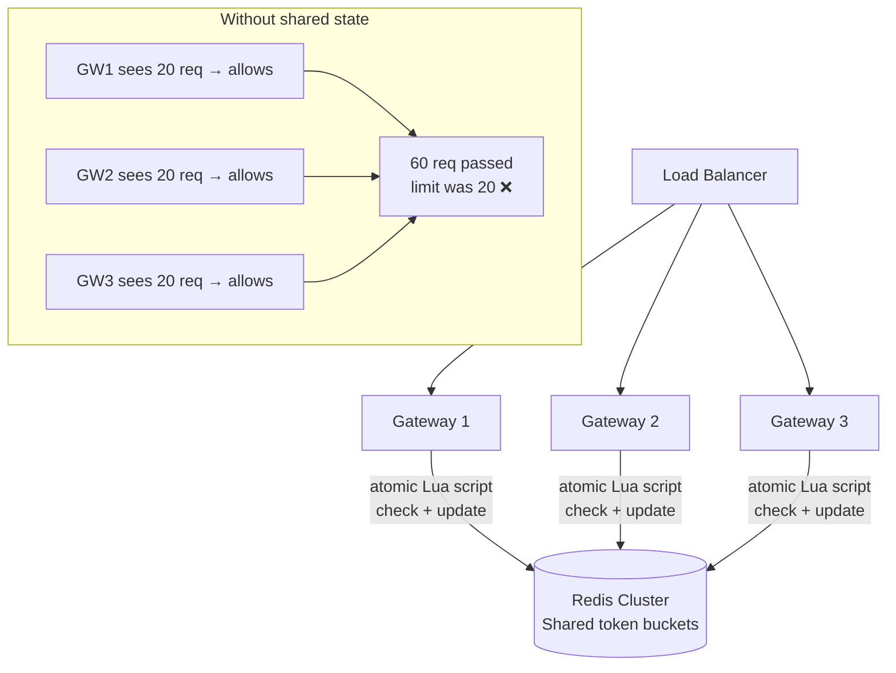
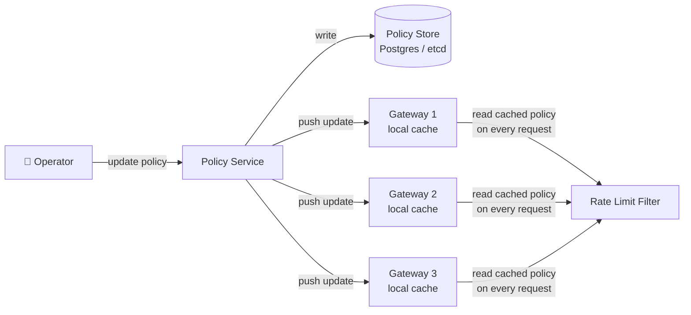
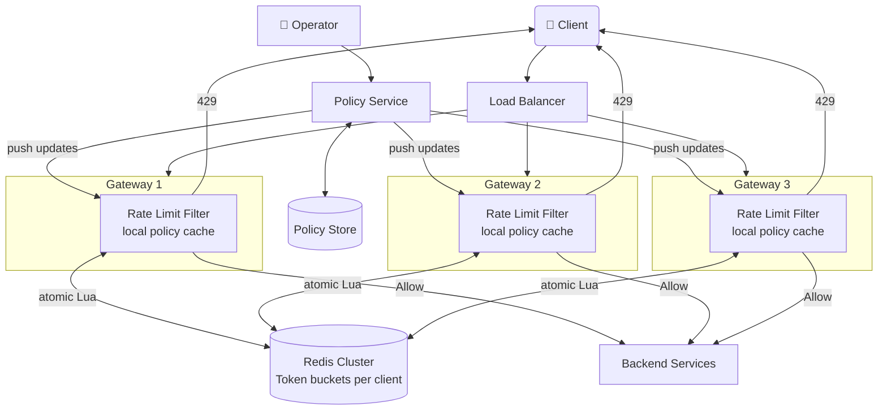

# 🚦 Rate Limiter – System Design

> Covers: **theoretical explanation of every component**, architecture diagrams, interview questions an interviewer will actually ask, and tradeoffs behind every major decision.

---

## 📌 What Is This System?

A rate limiter controls how many requests a client (user, API key, IP address) can make in a given time window. When the limit is exceeded, the system rejects the request with `429 Too Many Requests` instead of forwarding it to the backend. The goal is to protect backend services from overload, prevent abuse, and ensure fair resource sharing among all clients.

---

## ✅ Functional Requirements

| # | Requirement |
|---|---|
| 1 | Rate limiter runs inline at the API gateway — blocks excess traffic before it reaches the backend |
| 2 | Return `429 Too Many Requests` + `Retry-After` header when limit is exceeded |
| 3 | Identify each client (API key, user ID, IP) and track usage per identity |
| 4 | Allow short bursts while enforcing a long-term average rate |
| 5 | Enforce limits correctly across multiple gateway instances |
| 6 | Operators can update rate limit policies without restarting gateways |

### Scale
| Parameter | Value |
|---|---|
| Requests/sec | 1 million |
| Unique identities | 100 million users / API keys |
| Latency overhead | < 10ms per request |
| Auto-cleanup | Inactive keys expire automatically |

---

## ⚙️ Non-Functional Requirements

| Requirement | Target | Why It Matters |
|---|---|---|
| Low Latency | < 10ms added overhead | Rate limiter is on the critical path of every request |
| High Availability | API keeps working even if limiter has issues | Limiter failure must not take down the entire API |
| Correctness | No race conditions across gateways | Two simultaneous requests must not both pass a limit of 1 |
| Security | Clients can't fake identity to reset their counter | API key must be validated, not just trusted |

---

## 🏗️ High-Level Design — Theoretical Explanation

> This section explains **what each component does, why it exists, and how it connects** to the rest of the system. Read this before looking at the diagrams.

---

### 1. Where the Limiter Lives — Gateway Placement

**What happens theoretically:**

The most important architectural decision is *where* to enforce rate limits. There are three options: inside each backend service, in a dedicated microservice that every gateway calls, or as an inline filter inside the API gateway itself.

**Inline gateway filter wins** for this reason: the whole point of rate limiting is to stop expensive work from happening. If we check limits inside a backend service, we've already done the work of routing the request, authenticating it, and potentially hitting a database before we reject it. That defeats the purpose. If we use a dedicated microservice, we add a mandatory network hop (1–5ms) on every single request — that's half our entire 10ms latency budget gone.

An inline filter inside the API gateway intercepts the request *before* it goes anywhere. A rejected request costs only a Redis call (~1ms). The request never touches a backend service. This is the pattern used by Stripe, Twilio, and AWS API Gateway.

---

### 2. Identifying the Client — Who Is Making This Request?

**What happens theoretically:**

Before enforcing "10 requests per second," we need to define *who* gets 10 requests per second. A single request can be identified at multiple levels simultaneously: by API key, by user ID extracted from the auth token, by IP address, and by tenant (organization the user belongs to).

The system enforces limits at **all levels simultaneously**. A request must pass every check. This isn't over-engineering — each scope catches a different class of abuse:

- **Per API key** ensures each customer gets a fair share of capacity. Two customers cannot share a quota by using the same key.
- **Per IP address** blocks Sybil attacks. An attacker who registers 100 free accounts to multiply their quota still comes from the same IP and hits the per-IP limit.
- **Per tenant** prevents a single runaway script from one user exhausting the entire organization's quota.

The identity is extracted from the existing authentication context — the gateway already parsed the `X-API-Key` header or decoded the `Authorization: Bearer` token. Rate limiting reuses that work.

Redis keys encode both the scope and the identity: `ratelimit:apikey:abc123:/api/search` for API key scope, `ratelimit:ip:1.2.3.4` for IP scope.

---

### 3. The Token Bucket Algorithm — How Bursts Are Handled Fairly

**What happens theoretically:**

The algorithm decides whether to allow or deny each request. The naive approach — "count requests in the last second" — has a fatal flaw called the boundary burst problem. If the limit is 10/second and a client sends 10 requests at 11:59.99 and 10 more at 12:00.01, they've sent 20 requests in a 20ms window but technically stayed within two separate 1-second windows.

**Token Bucket** solves this cleanly. Think of it like a savings account for requests. Each client has a bucket with a maximum capacity (say, 20 tokens). Tokens are added continuously at the refill rate (say, 10 tokens/second). Each request withdraws one token. If the bucket is empty, the request is denied. If the client was idle, tokens accumulate up to the capacity cap — that's what allows bursts.

Real example: a user loads a dashboard page that fires 20 API calls in parallel. With a strict "10/second" window they'd get half their page broken. With token bucket, if they were idle for 2 seconds they've accumulated 20 tokens — all 20 calls pass. Their long-term average is still well under the limit. This is fair behavior.

The state stored per user is just two values: `current_token_count` and `last_refill_timestamp`. On each request: compute elapsed time, add `elapsed × refill_rate` tokens (capped at capacity), check if ≥ 1 token available, decrement if so. That's 16 bytes of state and constant-time arithmetic — far cheaper than sliding window approaches that store a log of every request timestamp.

When denying, calculate exactly how long until 1 token refills: `(1 - current_tokens) / refill_rate`. Return this as the `Retry-After` header so clients back off precisely.

---

### 4. Distributed Enforcement — Why All Gateways Must Share State

**What happens theoretically:**

In production the system runs 10–100 gateway instances behind a load balancer. If each gateway tracks limits in its own memory, a client's requests get split across instances and each instance sees only a fraction of the total traffic. A limit of "100 requests/second" becomes "100 per second *per gateway*" — effectively 10× the intended limit if requests hit 10 gateways evenly.

The solution is **shared state in Redis**. All gateway instances read and write the same token buckets. When gateway A decrements a token, gateway B immediately sees the updated count on its next check. Redis is chosen specifically because it supports **Lua scripts** — small programs that execute as a single atomic operation. The check-and-update of a token bucket runs as a Lua script: read current tokens, compute new value, check availability, write back. No other Redis command can run between those steps. This eliminates the race condition where two gateways both read "1 token remaining," both think they can allow the request, and both decrement — allowing 2 requests when only 1 was available.

Redis TTL handles cleanup automatically. Each token bucket key is set to expire after a period of inactivity (e.g., 1 hour). Clients who stop making requests don't accumulate memory forever.

---

### 5. Policy Management — Updating Limits Without Restarting Gateways

**What happens theoretically:**

An attacker starts hammering the login endpoint. You need to tighten the limit from 100/minute to 10/minute right now. If rate limit policies are baked into gateway config files, you're looking at a rolling restart across all instances — that takes minutes and creates a window of vulnerability.

The solution is to separate **policy storage** from **policy enforcement**. Policies (which endpoint, which scope, what limit) live in a central **Policy Store** (database or config service). Gateways cache policies locally in memory and refresh them periodically or when notified by the **Policy Service**. The hot path (checking limits on every request) always reads from the local cache — zero network hops. When a policy changes, the Policy Service pushes an update and gateways refresh their cache within seconds, with no restart needed.

This also enables **dry-run mode**: a new policy can be set to "log would-deny but still allow." Operators can validate that the policy behaves correctly on live traffic before fully enforcing it.

---

### 6. Full System — How All Pieces Connect

**What happens theoretically:**

Every request flows: Client → Load Balancer → Gateway Instance → Rate Limit Filter. The filter extracts identity, reads the cached policy, runs the Lua script on Redis, and makes an allow/deny decision — all in under 10ms. Allowed requests continue to backend services. Denied requests get a `429` response immediately. The backend never sees denied traffic.

---

## ⚖️ Key Tradeoffs

### Algorithm: Token Bucket vs Alternatives

| Algorithm | Burst Friendly | Memory per Client | Accuracy | Choose When |
|---|---|---|---|---|
| **Token Bucket** ✅ | ✅ Yes | Very low (2 values) | Good | Most APIs — industry standard |
| Fixed Window | ❌ Boundary bursts | Very low (1 counter) | Poor | Simple coarse limits |
| Sliding Window | ✅ Yes | High (log of timestamps) | Exact | When precision is critical |
| Leaky Bucket | ❌ Queues requests | Low | Exact | Smooth constant output rate |

> **Why not sliding window?** It stores a timestamp for every request in the window. At 1M req/sec with 100M users, the memory cost becomes enormous. Token bucket stores 2 numbers per user regardless of traffic volume.

---

### Placement: Gateway vs Dedicated Service vs In-Process

| Option | Latency overhead | Coordination | Choose When |
|---|---|---|---|
| **Gateway (inline)** ✅ | ~1ms (Redis only) | Single point | Most systems — efficient and consistent |
| Dedicated service | 2–6ms (extra hop) | Easy to update | Need complex logic decoupled from gateway |
| In-process (per service) | ~0ms | Hard — each service tracks independently | Acceptable imprecision in limits |

---

### Failure Mode: Fail-Open vs Fail-Closed

| Mode | What Happens When Redis is Down | Choose When |
|---|---|---|
| **Fail-Open** ✅ | Allow all requests — API stays up | Public APIs where availability > precision |
| Fail-Closed | Deny all requests — API goes down | Security-critical endpoints (login, payments) |
| Local fallback | Use per-instance in-memory limit as rough guard | Best of both — most production systems |

> **Trade-off:** Fail-open risks brief overconsumption during Redis outages. Fail-closed risks complete API unavailability for unrelated infrastructure issues. Local fallback adds complexity but is the safest production choice.

---

## ❓ Interview Questions & Model Answers

---

**Q1: "Where would you put the rate limiter in the architecture and why?"**

> Inline at the API gateway, as a filter that runs before any backend work. The core goal is to stop expensive work from happening — checking limits after reaching a backend service defeats the purpose. A dedicated service adds 1–5ms per request (up to half the latency budget). An inline filter costs only a Redis call (~1ms) and rejected requests never touch the backend.

---

**Q2: "Why token bucket over a simple counter?"**

> A simple counter causes the boundary burst problem — a client can burst 2× the limit by straddling a window boundary. Token bucket allows the same average rate but gives clients a "savings account" of request capacity. If they're idle for 2 seconds they can fire a burst of 20 requests, which is legitimate behavior for apps loading multiple resources in parallel. Long-term average is still enforced.

---

**Q3: "Two requests arrive simultaneously for the same user who has exactly 1 token. How do you ensure only one passes?"**

> This is a race condition. Without protection both requests read "1 token available," both allow themselves, and both decrement — user gets 2 requests for the price of 1. We use a **Redis Lua script** that reads, computes, and writes the token count as a single atomic operation. Redis executes Lua scripts single-threaded — no interleaving. Exactly one request gets the token; the second sees 0 and gets a 429.

---

**Q4: "What happens if Redis goes down?"**

> Three layers of response: First, the Redis client has an aggressive timeout (10ms) so a slow Redis doesn't cascade into slow API responses. Second, a circuit breaker detects repeated Redis failures and trips — the gateway switches to local in-memory token buckets as a rough fallback (limits are approximate but the API stays up). Third, after Redis recovers the circuit breaker resets and shared state resumes. The trade-off: during the outage, limits are per-instance rather than global, so savvy clients could slightly exceed global limits by distributing requests.

---

**Q5: "How do you update policies without restarting gateways?"**

> Separate policy storage from enforcement. Policies live in a central store (Postgres or etcd). Gateways cache them locally. When an operator updates a policy, the Policy Service pushes a notification and gateways refresh their cache within seconds — no restart. The hot path always reads from the local cache, so there's zero latency impact from the policy store being slow or temporarily down.

---

**Q6: "How does the Retry-After header work and why is it important?"**

> When denying a request, we compute exactly how many seconds until the client has enough tokens: `(1 - current_tokens) / refill_rate`. That value goes in the `Retry-After` header. Without it, 10,000 throttled clients all retry at random intervals — some too early (denied again), some too late (wasted time). With `Retry-After`, each client knows exactly when to retry. This prevents the thundering herd that would otherwise spike load the moment the rate limit window resets.

---

**Q7: "How do you handle a user who has multiple API keys to bypass per-key limits?"**

> Enforce limits at multiple scopes simultaneously. A request must pass per-API-key AND per-user-ID AND per-IP checks. Even if a user creates 10 API keys, their user ID is the same across all of them. The per-user limit catches this. Per-IP is a second layer — 100 fake accounts from the same IP still hit the per-IP limit.

---

## 📊 Interview Level Expectations

| Topic | Mid-Level (L4) | Senior (L5) | Staff (L6) |
|---|---|---|---|
| **Placement** | Know gateway vs in-process tradeoffs | Justify with latency reasoning | Multi-region placement, CDN edge enforcement |
| **Algorithm** | Explain token bucket, know fixed window | Compare all 4 with tradeoffs | Multi-resource limits (CPU + memory + requests) |
| **Distributed State** | Know shared Redis is needed | Design atomic Lua script, explain race condition | Sharding hot keys, local sync fallback patterns |
| **Failure Handling** | Mention fail-open vs fail-closed | Circuit breaker + local fallback design | SLO impact analysis, graceful degradation |
| **Policy Updates** | Know policies should be dynamic | Push vs pull propagation, cache invalidation | Dry-run mode, per-tenant overrides, audit logging |

---

## 🛠️ Tech Stack

| Component | Technology | Why |
|---|---|---|
| API Gateway | Kong / Nginx / AWS API Gateway | Inline filter support |
| Shared State | Redis (Lua scripts + TTL) | Atomic ops, sub-ms, auto-expiry |
| Policy Store | PostgreSQL / etcd | Durable config with versioning |
| Policy Service | Internal pub/sub service | Push updates without gateway restart |
| Identity Source | API key from header / JWT claims | Reuse existing auth context |

---

> 📖 Reference: [systemdesignschool.io – Design Rate Limiter](https://systemdesignschool.io/problems/rate-limiter/solution)
