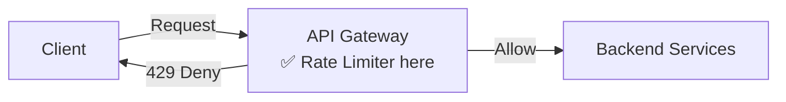
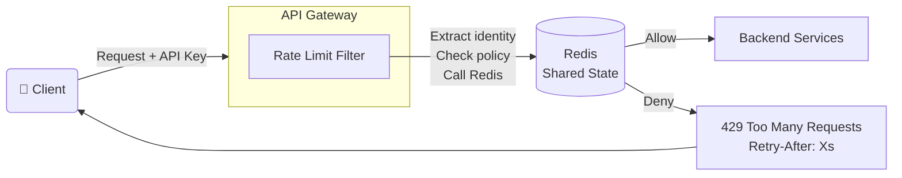
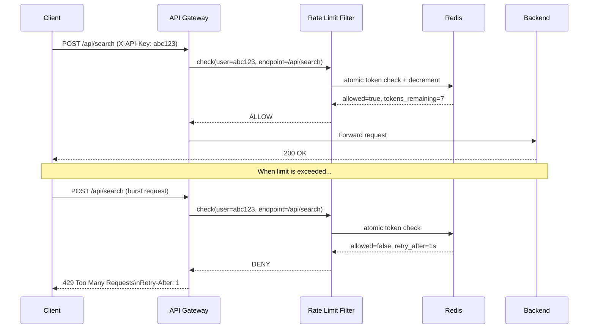
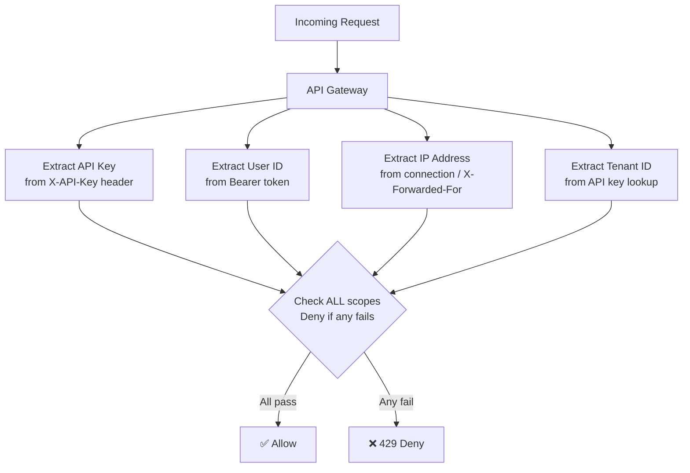
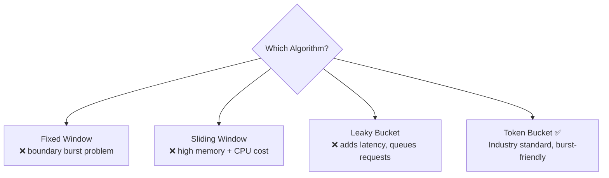
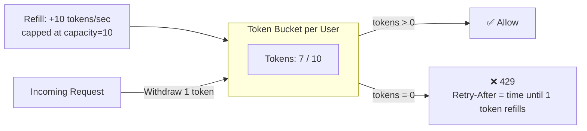
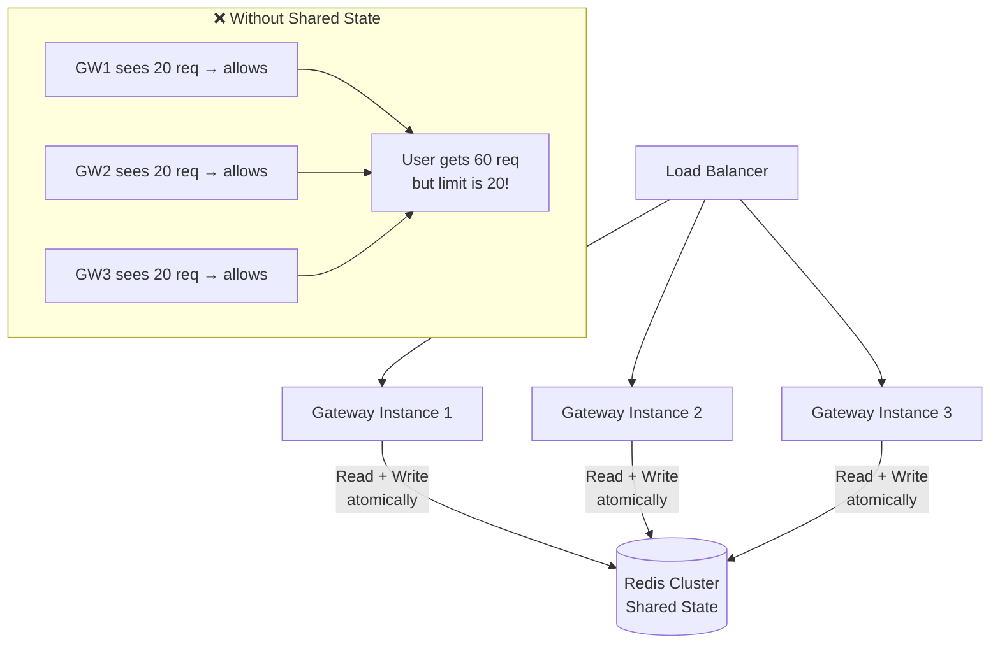
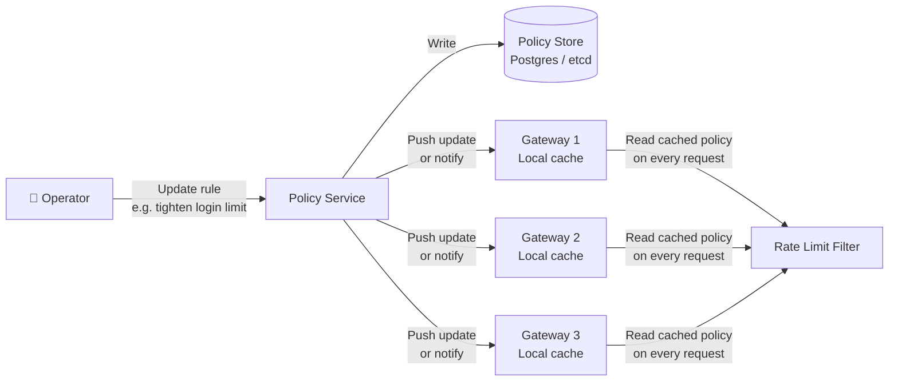
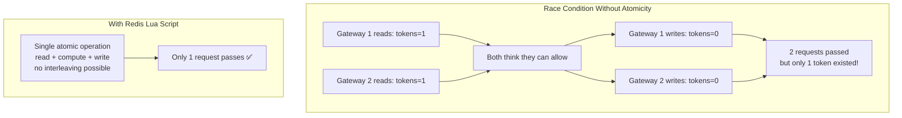
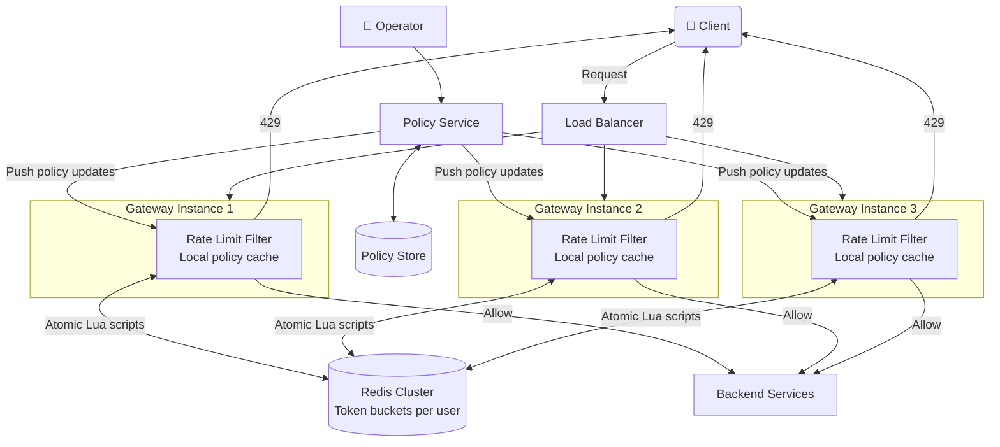

# 🚦 Rate Limiter – System Design Notes

> My own understanding of how a rate limiter works — from gateway placement to distributed enforcement across multiple instances.

---

## 📌 What Is a Rate Limiter?

A rate limiter controls how many requests a user, API key, or IP address can make in a given time window. For example, Stripe allows "100 requests per second per API key." If a client sends 150 requests in one second, the first 100 pass through and the remaining 50 get `429 Too Many Requests`. This protects the backend from overload while giving every customer a fair share of capacity.

You'll find rate limiters in every public API — Twitter, GitHub, AWS — and any system that needs to prevent abuse or ensure fair resource sharing.

---

## 🗺️ Where Should the Limiter Sit?

This is the first question to answer because it shapes every other design decision.



| Option | How It Works | Tradeoff |
|---|---|---|
| **Gateway / Edge** ✅ | Filter runs inline inside the API gateway | Single enforcement point, zero extra hops |
| Dedicated Service | Separate microservice the gateway calls | Adds 1–5ms per request; more flexible |
| In-Process / Sidecar | Each backend service enforces its own limits | No single point of failure but hard to coordinate |

**Why Gateway wins:** The problem needs *consistent global limits* across a distributed system. Gateway placement is the only option that gives a single enforcement point without adding extra network hops. Denied requests never touch the backend — they cost only a single Redis call (~1–2ms).

---

## ✅ Functional Requirements

| # | Requirement |
|---|---|
| 1 | Rate limiter runs inline at the API gateway — blocks excess traffic before it reaches the backend |
| 2 | Gateway returns proper HTTP responses (`429 Too Many Requests` + `Retry-After` header) on denial |
| 3 | System determines a stable identity per request (API key, user ID, IP) to track usage fairly |
| 4 | Limiter allows short bursts while enforcing a long-term average rate |
| 5 | Limits enforced correctly across multiple gateway instances — users can't bypass by hitting different instances |
| 6 | Operators can update rate limit policies without redeploying or restarting gateways |

---

## ⚙️ Non-Functional Requirements

| Requirement | Target |
|---|---|
| Throughput | 1 million requests per second |
| Unique identities | 100 million users / API keys |
| Latency overhead | Less than 10ms added per request |
| Auto-cleanup | Inactive user keys expire automatically |
| Availability | API keeps running even if rate limiter has issues |
| Correctness | No double-counting or race conditions across gateways |

---

## 🏗️ High-Level Design

### 1. Gateway Placement — Inline Filter



**Two components inside the rate limiter:**

| Component | Role |
|---|---|
| **RateLimit Filter** | Runs in the gateway; extracts identity, looks up policy, calls Redis, decides allow/deny |
| **State Store (Redis)** | Holds token counters per user; shared across all gateway instances |

---

### 2. Gateway–Limiter Interface (The 429 Response)



> **Why `Retry-After` matters:** Without it, 1000 throttled clients retry immediately and create a thundering herd. With `Retry-After: 5`, they spread retries over time — a natural backoff.

---

### 3. Identity Extraction

Before enforcing "10 requests/sec", we need to know *who* is making the request.



**Why layer multiple scopes?**

| Scope | What It Prevents |
|---|---|
| Per API Key | Ensures each customer gets a fair share |
| Per IP | Blocks Sybil attacks — 100 fake accounts still share one IP |
| Per Tenant | Stops a runaway script from exhausting an entire org's quota |

Redis key format: `ratelimit:{scope}:{identity}:{endpoint}`
Example: `ratelimit:apikey:abc123:/api/search`

---

### 4. Burst-Tolerant Algorithm — Token Bucket

**Why not other algorithms?**



**How Token Bucket works:**



**State stored per user in Redis:**
```
ratelimit:user:123 → { tokens: 7.0, last_refill_ts: 1716652800 }
```

**On each request:**
1. Calculate elapsed time since `last_refill_ts`
2. Add `elapsed × refill_rate` tokens (capped at capacity)
3. If `tokens >= 1` → decrement and allow
4. If `tokens < 1` → deny, return `Retry-After = (1 - tokens) / refill_rate`

> **Real example:** User was idle 2 seconds → accumulated 20 tokens (10/sec × 2s). Page fires 20 parallel requests → all pass. Long-term average stays well under limit. ✅

---

### 5. Consistent Enforcement Across Multiple Gateways



**Why Redis for shared state?**

| Property | Why It Matters |
|---|---|
| Sub-millisecond reads/writes | We have a 10ms total latency budget |
| Lua scripts for atomicity | Prevents race conditions — read + update as one operation |
| TTL / auto-expiry | Inactive user keys vanish automatically — no memory leak |

**Atomic check with Lua script (simplified):**
```lua
local tokens = tonumber(redis.call('HGET', key, 'tokens'))
local now = tonumber(ARGV[1])
local last = tonumber(redis.call('HGET', key, 'last_refill'))
local refill = (now - last) * rate
tokens = math.min(capacity, tokens + refill)
if tokens >= 1 then
    redis.call('HSET', key, 'tokens', tokens - 1, 'last_refill', now)
    return 1  -- allow
else
    return 0  -- deny
end
```

> **Why Lua?** Redis executes it as a single atomic operation — no other command can run in between. No race condition possible.

---

### 6. Policy / Config Management



**Key design decisions:**

| Decision | Choice | Why |
|---|---|---|
| Hot path policy lookup | Local in-memory cache on each gateway | Zero latency — never call policy service per request |
| Policy update propagation | Push (pub/sub) or periodic pull (every 30s) | Push = faster; pull = simpler and more resilient |
| Emergency tightening | Update policy store → gateways refresh within seconds | No restart or redeployment needed |
| Testing new policies | Dry-run mode — log would-deny but still allow | Validate before enforcing in production |

---

## 🔍 Deep Dive: Distributed Correctness



**Handling Redis failure:**

| Scenario | Strategy |
|---|---|
| Redis slow (>10ms) | Timeout aggressively; don't block the API |
| Redis down (fail-open) | Allow all requests; use local in-memory limits as coarse fallback |
| Redis down (fail-closed) | Deny all requests; only for high-security APIs |
| Partial outage | Circuit breaker stops calling Redis; switches to local mode |

---

## 🔄 Full System Architecture



---

## 📊 Algorithm Comparison

| Algorithm | Burst Friendly | Memory | Accuracy | Use Case |
|---|---|---|---|---|
| Fixed Window | ❌ boundary bursts | Low | Approximate | Simple coarse limits |
| Sliding Window | ✅ smooth | High (log per request) | Exact | When accuracy is critical |
| Leaky Bucket | ❌ queues requests | Low | Exact | Smooth output rate |
| **Token Bucket** ✅ | ✅ savings account | Very low (2 values) | Good | Most APIs — industry standard |

---

## 📊 Interview Level Expectations

| Topic | Mid-Level (L4) | Senior (L5) | Staff (L6) |
|---|---|---|---|
| **Placement** | Know gateway vs in-process tradeoffs | Justify gateway choice with latency reasoning | Multi-region placement, CDN edge enforcement |
| **Algorithm** | Explain token bucket; know fixed vs sliding window | Compare all 4 algorithms with tradeoffs | Handle multi-resource limits (CPU + memory + requests) |
| **Distributed State** | Know shared Redis is needed | Design atomic Lua script; explain race condition | Sharding hot keys, local sync fallback patterns |
| **Failure Handling** | Mention fail-open vs fail-closed | Circuit breaker + local fallback design | SLO impact analysis, graceful degradation strategy |
| **Policy Updates** | Know policies should be dynamic | Push vs pull propagation; cache invalidation | Dry-run mode, per-tenant overrides, audit logging |

---

## 🛠️ Tech Stack Summary

| Component | Technology |
|---|---|
| API Gateway | Kong / Nginx / AWS API Gateway |
| Rate Limit Filter | Inline middleware / plugin in the gateway |
| Shared State Store | Redis (in-memory, Lua scripts, TTL) |
| Policy Store | PostgreSQL / etcd / Consul |
| Policy Service | Internal config service with pub/sub |
| Identity Source | API key from header / JWT token claims |

---

> 📖 Reference: [systemdesignschool.io – Design Rate Limiter](https://systemdesignschool.io/problems/rate-limiter/solution)
