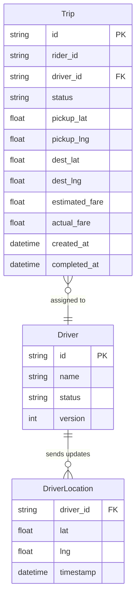
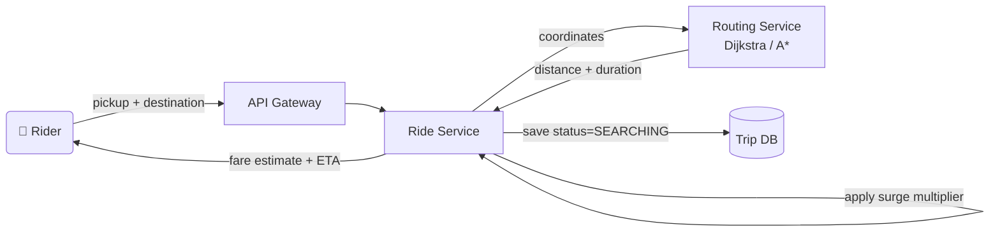
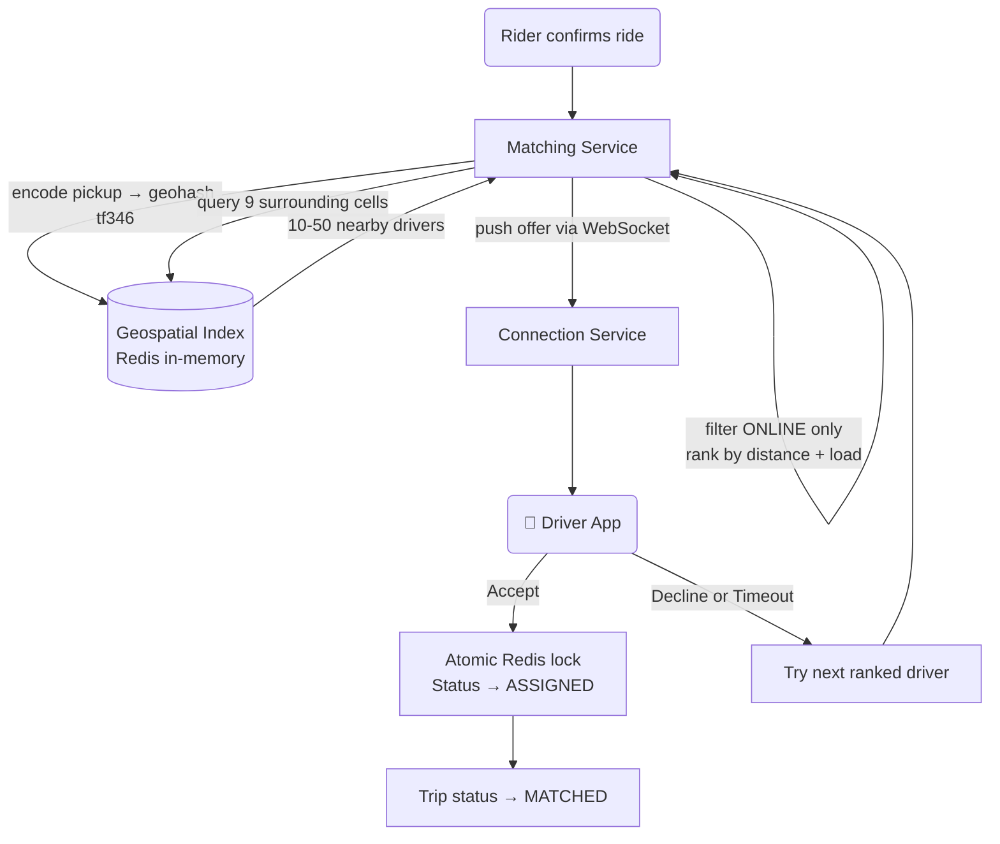
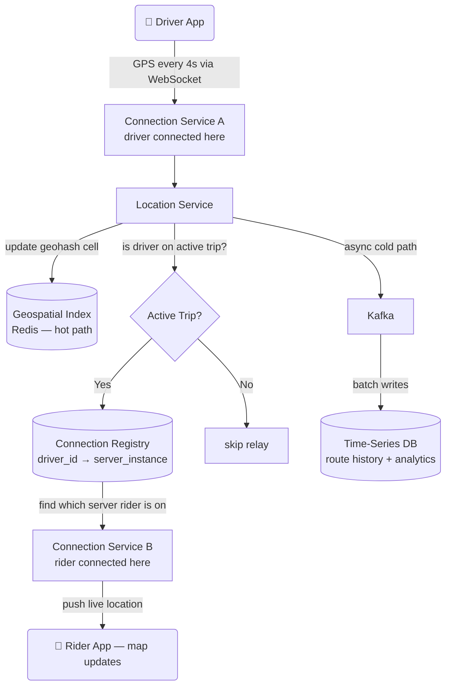
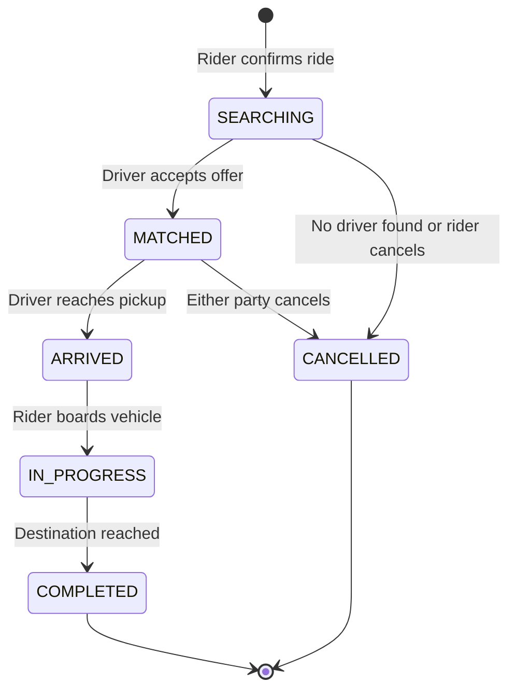
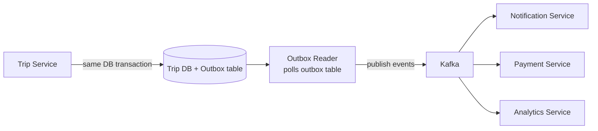
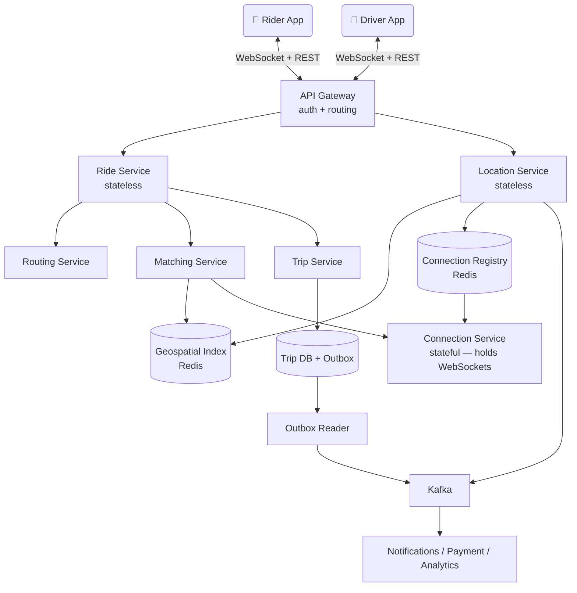

# 🚗 Uber – System Design

> Covers: **theoretical explanation of every component**, architecture diagrams, interview questions an interviewer will actually ask, and tradeoffs behind every major decision.

---

## 📌 What Is This System?

A ride-hailing platform that coordinates three parties — **rider**, **driver**, and **system** — through real-time matching, live location tracking, dynamic pricing, and a state machine that drives the trip from request to payment.

---

## ✅ Functional Requirements

| # | Requirement |
|---|---|
| 1 | Rider enters pickup + destination → get fare estimate + ETA |
| 2 | Rider confirms → system finds nearby drivers and assigns one |
| 3 | Driver sends GPS every ~4s → rider sees live position on map |
| 4 | Trip moves through defined states with side effects at each step |

### Scale
| Parameter | Value |
|---|---|
| Daily Active Riders | ~50M |
| Online Drivers (peak) | ~2M |
| Trips/day | ~20M |
| Driver location updates/sec | ~500K |
| Matching SLA | < 5 seconds end-to-end |

---

## ⚙️ Non-Functional Requirements

| Requirement | Target | Why It Matters |
|---|---|---|
| Low Latency | Sub-second geo lookup; <5s matching | Riders abandon if wait feels long |
| High Throughput | 500K location writes/sec | 2M drivers × update every 4s |
| Strong Consistency | No double-assignment | Driver assigned to two riders = disaster |
| High Availability | 99.99% for ride requests | Downtime = direct revenue loss |
| Eventual Consistency OK | Ratings, analytics, history | These can lag; nobody notices |

---

## 🗃️ Data Model



---

## 🏗️ High-Level Design — Theoretical Explanation

> This section explains **what each component does, why it exists, and how it connects** to the rest of the system. Read this before looking at the diagrams.

---

### 1. Ride Pricing — How the Fare is Calculated Before You Confirm

**What happens theoretically:**

When a rider opens the app and enters their destination, the app sends the pickup and drop coordinates to the **Ride Service**. The Ride Service doesn't know roads — it's just a coordinator. So it calls the **Routing Service**, which is a specialized component that knows the road network of every city. The Routing Service runs a shortest-path algorithm (like Dijkstra or A*) on a graph where roads are edges and intersections are nodes. It returns the distance in km and estimated travel time in minutes.

With those numbers, the Ride Service applies the fare formula:

```
fare = base_fare + (distance × per_km_rate) + (duration × per_min_rate)
```

If there's surge pricing active in that pickup zone, it multiplies the result by a surge factor (e.g. 1.8×). Surge is computed separately by a background job that monitors the demand/supply ratio per geohash zone every 60 seconds.

The trip is saved to the **Trip Database** with status `SEARCHING` and the estimated fare. At this point nothing is confirmed — this is just the quote stage.

**Why save to DB before the rider confirms?** Because if the rider confirms and then the system crashes between saving and responding, we'd have no record of the fare shown. By saving early with `SEARCHING` status, we can always reconstruct what happened.



---

### 2. Driver Matching — How the System Finds a Driver Near You

**What happens theoretically:**

Once the rider confirms the ride, the system needs to find a nearby available driver fast — the SLA is under 5 seconds end-to-end. The naive approach of scanning all 2 million online drivers in a database would be too slow. Instead the system uses a **Geospatial Index** stored entirely in memory (Redis).

Every time a driver sends a GPS update, the Location Service encodes their coordinates into a **Geohash** — a short string like `tf346` where nearby locations share a common prefix. The driver's ID is stored under that geohash key in Redis. This means looking up "who is near this restaurant?" is just a key lookup in memory — not a database scan.

When a rider confirms, the Matching Service encodes the rider's pickup point into a geohash, then queries that cell **plus its 8 surrounding cells** (9 total). This 9-cell pattern ensures no driver is missed due to being right on a cell boundary. The result is typically 10–50 candidate drivers, not 2 million.

From those candidates, the system filters out anyone not in `ONLINE` status, then ranks the rest by a weighted score combining distance and how many active orders they already have (so the system doesn't overload one driver).

The top-ranked driver gets an **offer** pushed to their phone via WebSocket — a persistent connection the driver app maintains with the system. They have 30 seconds to accept. If they decline or don't respond, the system moves to the next candidate. This loop continues until someone accepts or the pool is exhausted.

**The atomic lock problem:** What if two riders request rides at the exact same millisecond and both see the same driver as available? Both would try to assign that driver. To prevent this, the assignment runs as a **Redis Lua script** — a small piece of code that Redis executes atomically. It checks the driver's status and marks them as `ASSIGNED` in a single indivisible operation. No other command can run in between. Exactly one request wins; the other gets a "driver unavailable" response and moves to the next candidate.



---

### 3. Real-Time Location Tracking — How Your Map Shows the Driver Moving

**What happens theoretically:**

Every 4 seconds, the driver's phone sends a GPS coordinate to the **Location Service** over a persistent WebSocket connection. The Location Service does two things with every update:

**Hot path (real-time):** It updates the driver's position in the in-memory Geospatial Index in Redis. This keeps the matching system's data fresh. If the driver is currently on an active trip, the Location Service also needs to relay the position to the rider's phone so the map updates.

But here's the challenge — the system runs on many server instances, not one. The driver might be connected to server instance A in Singapore, and the rider might be connected to server instance B in Mumbai. Server A has no direct way to push to a client on Server B.

This is solved with a **Connection Registry** — another Redis hash that maps `user_id → server_instance`. When the Location Service wants to push to the rider, it looks up the registry to find which server the rider is connected to, then sends the location update to that specific server, which then pushes it down to the rider's WebSocket.

**Cold path (history):** In parallel, the Location Service also publishes every update to **Kafka**. A separate consumer reads from Kafka and batch-writes to a Time-Series Database. This data is used for route history (useful for disputes: "the driver took a longer route"), analytics, and machine learning to improve ETA predictions. The cold path deliberately does not block the hot path — if the Time-Series DB is slow, location relay to the rider is unaffected.



---

### 4. Trip State Machine — How the Trip Moves from Request to Payment

**What happens theoretically:**

A trip is not a single action — it's a sequence of states, each with its own side effects. The **Trip Service** owns this state machine. Every state transition is written to the Trip Database along with an **outbox event** in the same database transaction.

The outbox pattern is critical here. The naive approach would be: update the trip state, then publish an event to Kafka. But what if the system crashes between those two steps? The trip state updates but the event never fires — the Payment Service never gets notified, the rider is never charged. This is called a dual-write problem.

The outbox pattern fixes this: the event is written to a special `outbox` table inside the same database transaction as the state change. A separate **Outbox Reader** process polls this table and publishes events to Kafka. If Kafka is down, the events stay in the outbox table until Kafka recovers. The trip state and its downstream effects are always consistent.

Kafka then fans out events to downstream consumers: the **Notification Service** sends push notifications, the **Payment Service** triggers the charge, and the **Analytics Service** records metrics.



**Side effects at each transition:**

| Transition | What fires |
|---|---|
| SEARCHING → MATCHED | Notify rider: driver name, photo, ETA. Start location relay |
| MATCHED → ARRIVED | Notify rider: driver is here. Start wait timer |
| ARRIVED → IN_PROGRESS | Start fare metering — track distance and time |
| IN_PROGRESS → COMPLETED | Compute final fare. Trigger payment. Prompt ratings |
| Any → CANCELLED | Evaluate cancellation fee. Notify both parties. Trigger refund if charged |



---

### 5. Full System — How All Pieces Connect

**What happens theoretically:**

The **API Gateway** is the single entry point for all traffic. It routes REST requests (fare estimates, trip history) to the appropriate services and maintains WebSocket connections for real-time communication. It also handles authentication — every request carries a token that the gateway validates before forwarding.

All the services are **stateless** — they don't store anything in memory between requests. This means they can be scaled horizontally by just adding more instances behind a load balancer. State lives in databases and Redis, not in the services themselves.

The **Connection Service** is the only component that is stateful (it holds open WebSocket connections). This is why the Connection Registry in Redis is critical — it's the map that tells the rest of the system where each client is connected.



---

## ⚖️ Key Tradeoffs

### Geospatial: Geohash vs Quadtree vs R-Tree

| Approach | Pros | Cons | Choose When |
|---|---|---|---|
| **Geohash** ✅ | Simple string prefix, Redis native, easy to shard | Cell boundary edge cases | Most ride-hailing use cases |
| Quadtree | Adapts to driver density dynamically | Complex to implement | High-density city with uneven distribution |
| R-Tree | Handles arbitrary polygons | Complex, slower writes | Need service zone polygon queries |

> **Boundary problem:** A driver 50m away but across a cell boundary won't appear. Fix: always query 9 cells, not just center.

---

### Communication: WebSocket vs Long Polling vs SSE

| Approach | Latency | Direction | Choose When |
|---|---|---|---|
| **WebSocket** ✅ | Very low | Bidirectional | Need real-time both ways — offers AND location |
| Long Polling | Medium | Server → Client | Fallback when WebSocket is blocked by network |
| SSE | Low | Server → Client only | One-way push, no need to send offers to driver |

> **Tradeoff:** WebSocket is stateful — drivers pin to a server instance. Requires a Connection Registry to route messages across instances.

---

### Location Storage: Hot Path vs Cold Path

| Path | Storage | Latency | Durability | Purpose |
|---|---|---|---|---|
| **Hot** ✅ | Redis in-memory | ~0.5ms | None — ephemeral | Live matching and location relay |
| **Cold** ✅ | Kafka → Time-Series DB | Seconds | Permanent | History, disputes, analytics, ML |

> **Why two paths?** If you try to serve both needs from one store, you either make matching slow (durable DB) or lose history (pure in-memory). Splitting them lets each be optimized for its actual use case.

---

### Outbox vs Direct Kafka Publish

| Approach | Pros | Cons |
|---|---|---|
| **Outbox** ✅ | DB write + event always consistent | Extra complexity — needs outbox reader process |
| Direct publish | Simpler code | Dual-write risk — crash between DB write and Kafka publish leaves system inconsistent |

> **Real failure scenario without outbox:** Trip completes, DB writes COMPLETED, Kafka publish crashes → Payment Service never notified → rider never charged.

---

## ❓ Interview Questions & Model Answers

---

**Q1: "How do you find nearby drivers efficiently? Why not just query the database?"**

> A SQL scan across 2M drivers with a distance filter is O(n) and too slow at 1000+ ride requests/sec. We use a **Geohash-based in-memory index in Redis**. Each driver's coordinates are encoded into a short prefix string. Nearby drivers share a prefix. We query only 9 geohash cells covering ~5km radius — typically returns 10–50 candidates, not 2M.

---

**Q2: "Two riders request the same driver at the same millisecond. What happens?"**

> Classic race condition. Without protection, both requests read the driver as AVAILABLE and both assign — driver gets two trips. We handle it with a **Redis Lua script** that checks and sets the driver's status in one atomic operation. Redis executes Lua scripts single-threaded — no interleaving possible. Exactly one request wins; the other sees driver already ASSIGNED and moves to the next candidate.

---

**Q3: "How does location push work when driver and rider are on different server instances?"**

> Each service instance maintains WebSocket connections to a set of clients. We keep a **Connection Registry** in Redis mapping `user_id → server_instance_id`. When the Location Service wants to push to a rider, it looks up the registry, finds which instance the rider is on, and routes the message there. That instance then pushes down the WebSocket to the rider's phone.

---

**Q4: "Your location write volume is 500K/sec. How do you handle it?"**

> We split into two paths. The **hot path** writes directly to an in-memory Redis geospatial index sharded by city. Sub-millisecond, no disk I/O. The **cold path** publishes to Kafka asynchronously, and a consumer batch-writes to a Time-Series DB. The hot path doesn't need durability — if Redis goes down, drivers re-report within 4 seconds and the index rebuilds. The cold path doesn't need speed — it just needs to eventually land every point for analytics.

---

**Q5: "What happens if a driver goes offline mid-trip?"**

> The system detects a missing heartbeat (no GPS update for ~15s). The trip stays IN_PROGRESS — the driver's last known position is shown to the rider. A background job monitors for stale trips and escalates after a configurable timeout. In practice the driver's phone reconnects quickly due to WebSocket auto-reconnect. The more critical problem is preventing the rider from being charged for time when the driver was offline — fare metering pauses on stale heartbeat.

---

**Q6: "How do you handle the state machine safely across distributed services?"**

> Every state transition writes the new state AND an outbox event in the **same database transaction**. A separate Outbox Reader polls the outbox table and publishes to Kafka. Downstream consumers (payment, notifications) process these events. If Kafka is temporarily down, events accumulate in the outbox table and drain when Kafka recovers. The state and its side effects can never diverge.

---

**Q7: "How would you scale this to multiple cities?"**

> Partition by geography. Each city or region gets its own geospatial index shard, matching service instance, and location service pod. The shard key is the coarse geohash prefix — `tf` = Chennai, `w3g` = London. A rider in Chennai never touches London's index. Adding a new city means spinning up a new partition — no changes to existing infrastructure.

---

**Q8: "What happens if the matching service can't find any driver?"**

> After exhausting all candidates in the 9-cell search, the system can optionally expand to a coarser geohash precision (larger area) and retry once. If still no drivers, the trip transitions to CANCELLED with reason `NO_DRIVERS_AVAILABLE`. The rider is notified with an option to retry. On the backend, this event feeds into the surge pricing system — persistent no-driver events in a zone are a signal to raise the multiplier to attract more drivers.

---

## 📊 Interview Level Expectations

| Topic | Mid-Level (L4) | Senior (L5) | Staff (L6) |
|---|---|---|---|
| **Geo Search** | Geohash concept, 9-cell search | Compare geohash vs quadtree vs R-tree | Multi-region sharding, precision tuning, boundary edge cases |
| **Real-Time Comms** | WebSocket for bidirectional | Connection registry + multi-instance routing | Reconnect handling, backpressure, event replay |
| **Location Scale** | In-memory store | Hot/cold split, shard by region | Adaptive frequency, failure recovery, replay strategy |
| **Assignment** | Avoid double-dispatch | Atomic Lua + version field | Saga pattern, multi-region consistency |
| **State Machine** | Define states + transitions | Outbox pattern for side effects | Idempotent consumers, distributed rollback |
| **Failure Handling** | Mention replicas | Circuit breaker + fallback | SLO impact analysis, graceful degradation |

---

## 🛠️ Tech Stack

| Component | Technology | Why |
|---|---|---|
| Trip DB | PostgreSQL / CockroachDB | ACID for payments + trip state |
| Geospatial Index | Redis (GEOADD / GEORADIUS) | Sub-ms in-memory geo queries |
| Location History | Cassandra / InfluxDB | High write throughput, time-series queries |
| Message Queue | Kafka | Durable, replayable event stream |
| Real-Time Comms | WebSocket | Bidirectional, persistent, low overhead |
| Connection Registry | Redis | Fast lookup of driver → server instance |
| Routing Engine | Custom graph (Dijkstra / A*) or Google Maps API | ETA + distance calculation |

---

> 📖 Reference: [systemdesignschool.io – Design Uber](https://systemdesignschool.io/problems/uber/solution)
