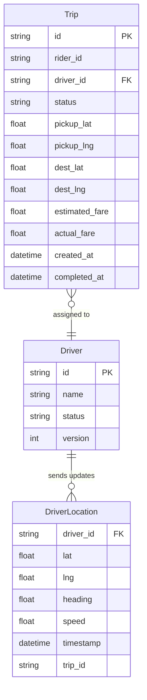
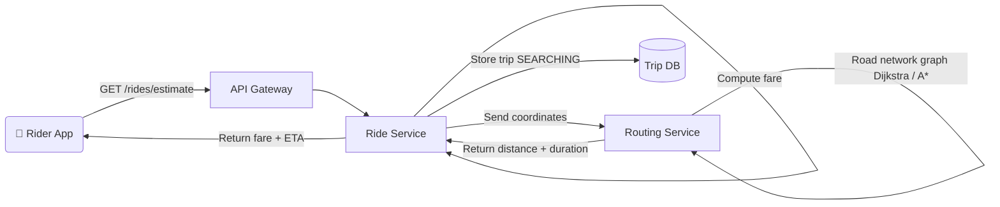
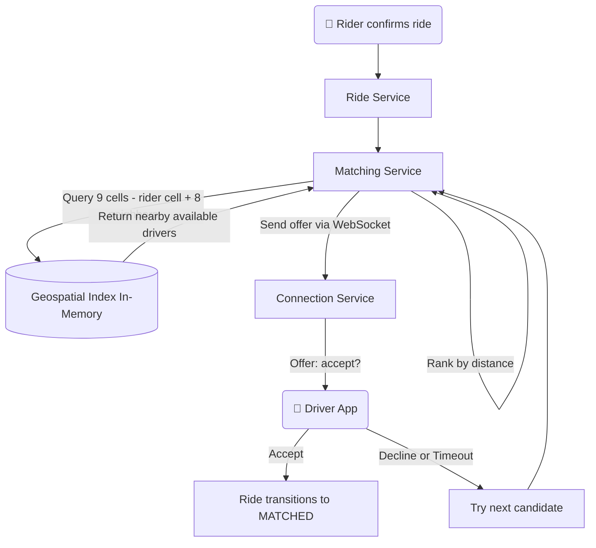
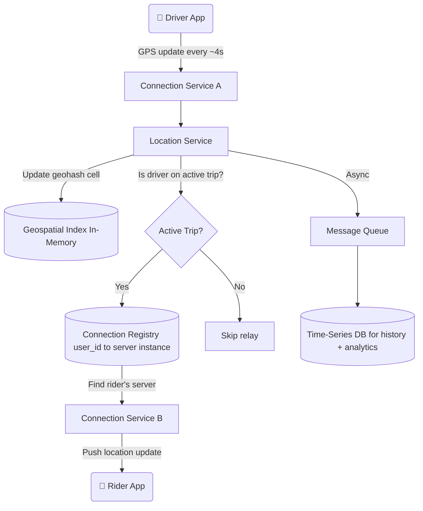
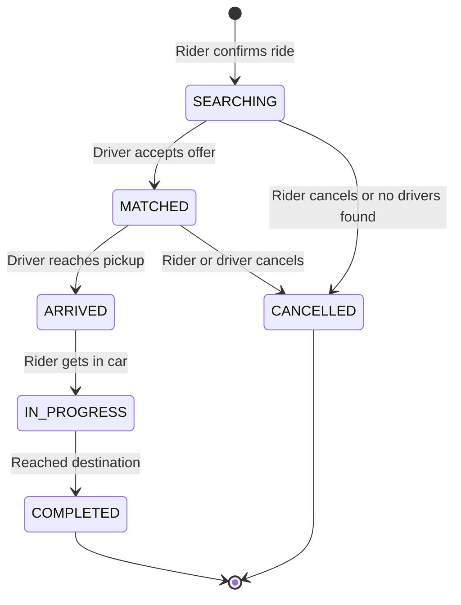
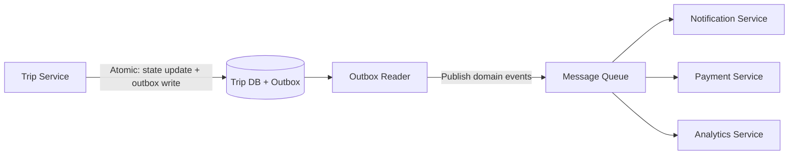
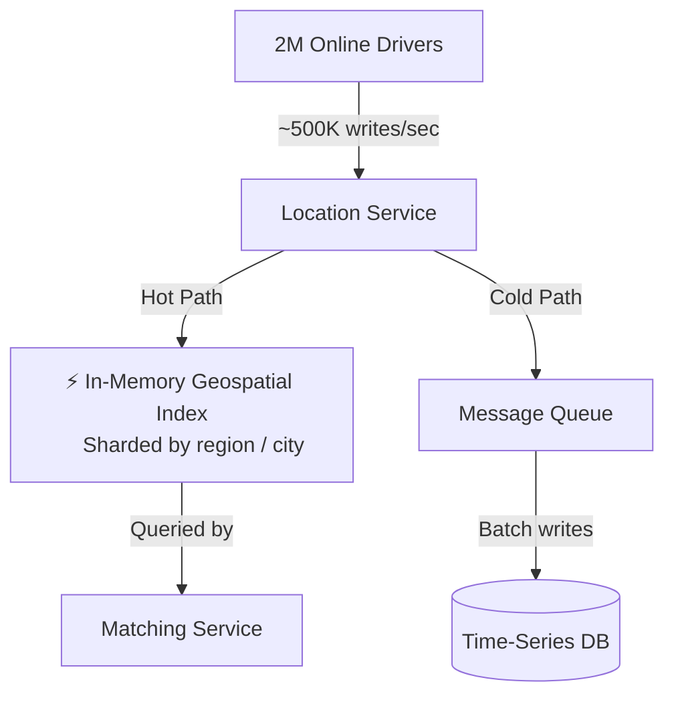
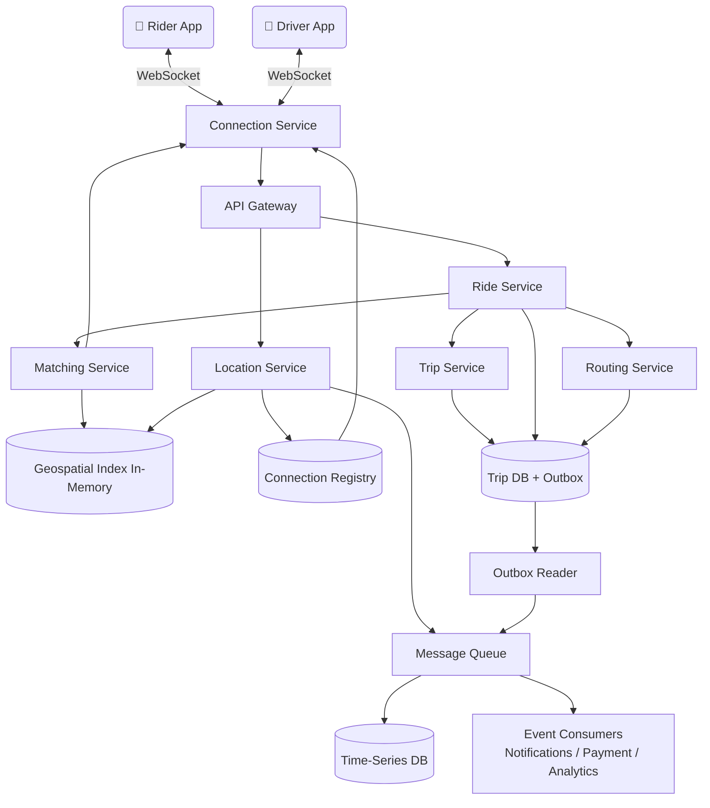

# 🚗 Uber – System Design Notes

> My own understanding of how Uber works under the hood — from ride pricing to real-time tracking.

---

## 📌 What Is Uber?

Uber is a ride-hailing service where a rider requests a ride, the system estimates the fare, finds nearby available drivers, and matches one to the rider. During the trip, the system tracks the driver's real-time location and streams updates to the rider's map. The trip moves through a lifecycle of states — searching, matched, in progress, completed — with each transition triggering side effects like notifications, fare metering, and payment.

---

## ✅ Functional Requirements

| # | Requirement | Core Operation |
|---|---|---|
| 1 | Rider enters pickup + destination → system returns fare estimate and ETA | COMPUTE (Ride Pricing) |
| 2 | After rider confirms → system finds nearby drivers and assigns one via offer/accept | SEARCH + ASSIGN (Driver Matching) |
| 3 | Online drivers send GPS every few seconds → rider sees live driver position on map | INGEST + PUSH (Real-Time Tracking) |
| 4 | Trip moves through well-defined states with side effects at each transition | STATE MACHINE (Trip Lifecycle) |

### Scale Assumptions

| Parameter | Value |
|---|---|
| Daily Active Riders | ~50 Million |
| Registered Drivers | ~5 Million |
| Drivers Online at Peak | ~2 Million |
| Trips Per Day | ~20 Million |
| Driver Location Update Frequency | Every ~4 seconds |
| Peak Location Writes | ~500,000 writes/sec |
| Ride Matching Target | Under 5 seconds end-to-end |

---

## ⚙️ Non-Functional Requirements

| Requirement | Description |
|---|---|
| Low Latency | Sub-second geospatial lookup; under 5s end-to-end matching |
| High Throughput | ~500K location writes/sec at peak |
| Strong Consistency | Driver must never be double-assigned; trip state transitions must be atomic |
| High Availability | Ride requests and tracking must stay up during peak; brief location staleness is tolerable |

---

## 🗃️ Data Model



---

## 🌐 API Design

| Method | Endpoint | Purpose |
|---|---|---|
| GET | `/rides/estimate?pickup_lat=&pickup_lng=&dest_lat=&dest_lng=` | Get fare estimate + ETA before confirming |
| POST | `/rides` | Confirm and request a ride — triggers matching |
| GET | `/rides/{id}` | Get ride status + driver info (live updates via WebSocket) |
| POST | `/rides/{id}/cancel` | Cancel a ride |
| PUT | `/drivers/{id}/location` | Driver sends GPS update (WebSocket; REST as fallback) |
| POST | `/rides/{id}/offer/accept` | Driver accepts a ride offer |
| POST | `/rides/{id}/offer/decline` | Driver declines — system tries next candidate |
| POST | `/rides/{id}/rating` | Rate the ride after completion |

---

## 🏗️ High-Level Architecture

### 1. Ride Pricing Flow

Before a rider confirms, the system calculates the route and estimates the fare.

**Fare Formula:**
```
fare = base_fare + (distance_km × per_km_rate) + (duration_min × per_min_rate)
```
If surge is active in the pickup zone → multiply by surge factor.



---

### 2. Find and Match a Driver

After the rider confirms, the system finds nearby available drivers using a **geospatial index** and sends them an offer.

#### Why not query the database directly?
A raw SQL scan across 2M drivers with a distance filter is too slow at 1000+ ride requests/sec. Instead we use **Geohash-based spatial indexing** — encode each driver's coordinates into a string where nearby locations share a common prefix.



#### Geospatial Index Options

| Method | How It Works | Best For |
|---|---|---|
| **Geohash** ✅ | Encodes lat/lng into prefix string; nearby = shared prefix | Simple, widely used |
| Quadtree | Recursively divides space into 4 quadrants | Dynamic density areas |
| R-Tree | Tree of bounding rectangles | Complex polygon queries |

> If too few drivers are found → expand to a coarser geohash precision (larger area) and retry.

---

### 3. Real-Time Driver Tracking

2 million drivers × 1 update / 4s = **~500,000 writes/sec** at peak.

#### Communication Options

| Method | Pros | Cons |
|---|---|---|
| **WebSocket** ✅ | Bidirectional, persistent, low overhead | Stateful — harder to scale horizontally |
| Long Polling | Works everywhere | High overhead, higher latency |
| SSE | Simple server push | One direction only (server → client) |



**Hot vs Cold Path:**

| Path | Purpose | Storage | Latency |
|---|---|---|---|
| Hot | Real-time matching + relay to rider | In-memory (Redis / geospatial store) | ~milliseconds |
| Cold | Historical records, analytics, disputes | Time-series DB (batched writes) | Seconds to minutes |

---

### 4. Trip Lifecycle (State Machine)



#### Side Effects at Each Transition

| Transition | Side Effects Triggered |
|---|---|
| SEARCHING → MATCHED | Notify rider with driver details + ETA; start streaming driver location |
| MATCHED → ARRIVED | Notify rider "Driver has arrived"; start wait timer |
| ARRIVED → IN_PROGRESS | Start fare metering (distance + time tracking) |
| IN_PROGRESS → COMPLETED | Calculate final fare; trigger payment; prompt ratings |
| Any → CANCELLED | Determine cancellation fee based on state; notify both parties |



> **Why outbox pattern?** If the DB saves but the event publish fails, trip state and side effects go out of sync. Writing the event in the same DB transaction guarantees they always move together — no dual-write problem.

---

## 🔍 Deep Dive: Handling 500K Location Writes/Second



**Key strategies:**

| Strategy | Why |
|---|---|
| Separate hot and cold paths | Real-time index doesn't need durability; it rebuilds in seconds from driver re-reports |
| Shard by geography | Partition index by region/city using coarse geohash prefix (first 2–3 chars) |
| Adaptive update frequency | Stationary drivers report less often; active trips report more often |
| Stale driver handling | No update for ~30s → mark driver stale and exclude from matching |
| Failure recovery | Promote replica shard OR replay last 30s from message queue |

---

## 🔄 Full System Architecture



---

## 📊 Interview Level Expectations

| Topic | Mid-Level (L4) | Senior (L5) | Staff (L6) |
|---|---|---|---|
| **Geospatial Search** | Explain why DB scan is slow; suggest geohash | Compare geohash vs quadtree vs R-tree with tradeoffs | Handle boundary cases, precision tuning, multi-region sharding |
| **Real-Time Communication** | Use WebSocket; understand persistent connection | Explain connection registry + multi-instance routing | Handle reconnects, backpressure, event replay at scale |
| **Location Scale** | Mention in-memory store for speed | Design hot/cold path split; shard by region | Adaptive frequency, failure recovery, replay strategy |
| **Driver Assignment** | Avoid double-dispatch; mention locking | Optimistic concurrency with version field | Multi-region consistency, partition tolerance tradeoffs |
| **Trip State Machine** | Define states and transitions | Atomic transitions + outbox pattern for side effects | Idempotent consumers, saga pattern for distributed rollback |

---

## 🛠️ Tech Stack Summary

| Component | Technology |
|---|---|
| Main Database | PostgreSQL / CockroachDB (trip records) |
| Geospatial Index | Redis with geospatial commands (in-memory) |
| Time-Series Store | InfluxDB / Cassandra (location history) |
| Message Queue | Kafka (location stream + domain events) |
| Real-Time Comms | WebSocket via Connection Service |
| Connection Registry | Redis (user_id → server instance mapping) |
| Routing Service | Custom graph engine or Google Maps API |
| API Gateway | Routes REST + WebSocket traffic |

---

> 📖 Reference: [systemdesignschool.io – Design Uber](https://systemdesignschool.io/problems/uber/solution)
