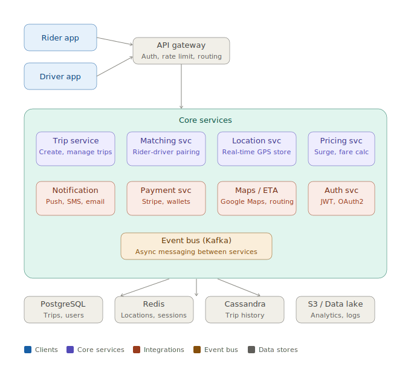
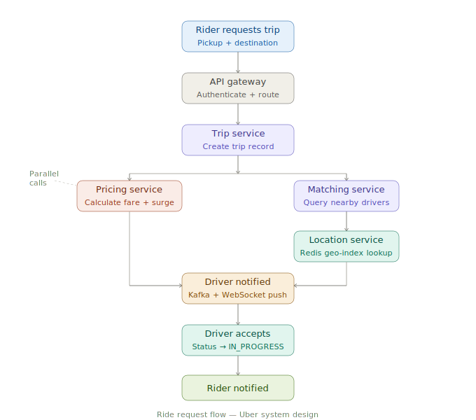

# Uber System Design

A complete system design reference covering requirements, estimation, API, architecture, payment service, and deep dive into scaling and tradeoffs.

---

## Step 1 — Requirements

### Functional Requirements

#### Rider
- Request a ride by entering pickup and destination
- See nearby available drivers on the map in real time
- Track driver location live during the trip
- View fare estimate before confirming the ride
- Rate driver after trip completion
- Cancel a trip before driver arrives

#### Driver
- Go online or offline to start or stop receiving requests
- Accept or reject incoming ride requests
- Navigate to rider pickup and then to destination
- View earnings summary and full trip history

#### System
- Match rider to the nearest available driver automatically
- Calculate dynamic pricing including surge multiplier
- Process payments and issue receipts to riders
- Send real-time push notifications to both parties

---

### Non-Functional Requirements

| Attribute | Target |
|---|---|
| Availability | 99.99% uptime — max ~52 minutes downtime per year |
| Matching latency | Driver matched to rider in under 1 second |
| Location update latency | GPS update reflected in under 200ms |
| Scalability | Support 10M+ concurrent users globally |
| Consistency | Eventual consistency for locations; strong consistency for payments |
| Durability | Trip history and payment records must never be lost |
| Geo-distribution | Multi-region deployment with under 50ms regional latency |
| Fault tolerance | No single point of failure in any core service |

---

## Step 2 — Estimation

### Load

| Metric | Value |
|---|---|
| Daily active riders | 20 million |
| Active drivers | 5 million |
| Peak ride requests | ~50,000 requests/sec during surge hours |
| Location updates | 5M drivers × 1 update per 4s = **1.25M writes/sec** |
| Matching geo queries | ~50,000 GEORADIUS queries/sec |
| Read:Write ratio | 10:1 (trips read far more than created) |

### Storage

| Data | Estimate |
|---|---|
| Trip record size | ~1 KB per trip |
| Trips per day | ~15M trips → 15 GB/day |
| 5-year trip history | ~27 TB (Cassandra) |
| Driver locations in Redis | ~200 bytes × 5M drivers = 1 GB hot memory |
| User profiles | ~2 KB × 50M users = 100 GB (PostgreSQL) |
| Logs and analytics | ~10 TB/day → S3 + Spark |

### Bandwidth & Latency Targets

| Metric | Target |
|---|---|
| Inbound (location writes) | ~1.25M × 200 bytes = **250 MB/s** |
| Outbound (rider map updates) | ~20M × 200 bytes = **4 GB/s** |
| API gateway throughput | ~100,000 req/sec sustained |
| P99 ride matching latency | < 1 second end-to-end |
| Payment processing | < 3 seconds |
| WebSocket message delay | < 100ms |

---

## Step 3 — API Design

### Core Endpoints

```
POST   /trips                  → Create trip request
                                 Body: { pickup_lat, pickup_lng, dest_lat, dest_lng }
                                 Returns: { trip_id, fare_estimate, eta }

GET    /trips/:id               → Poll trip status
                                 Returns: { status, driver, eta, fare }

POST   /trips/:id/accept        → Driver accepts trip
                                 Updates status to MATCHED

POST   /trips/:id/complete      → End trip, trigger payment
                                 Updates status to COMPLETED

GET    /drivers/nearby          → Find available drivers
                                 Query: ?lat=&lng=&radius=2000
                                 Returns: [{ driver_id, eta, rating }]

PATCH  /drivers/location        → Driver GPS heartbeat (every 4s)
                                 Body: { lat, lng, timestamp }

POST   /payments                → Charge rider after trip
                                 Body: { trip_id, rider_id, amount }
                                 Returns: { payment_id, status }

WS     /stream/trip/:id         → Real-time location stream pushed to rider
```

---

## Step 4 — Data Model

### Trip — PostgreSQL

```sql
trip_id         UUID        PRIMARY KEY
rider_id        UUID        FOREIGN KEY → users
driver_id       UUID        FOREIGN KEY → users
status          ENUM        (REQUESTED, MATCHED, IN_PROGRESS, COMPLETED, CANCELLED)
pickup_lat      FLOAT
pickup_lng      FLOAT
dest_lat        FLOAT
dest_lng        FLOAT
fare            DECIMAL(10,2)
surge_multiplier FLOAT
created_at      TIMESTAMP
completed_at    TIMESTAMP
```

### User — PostgreSQL

```sql
user_id         UUID        PRIMARY KEY
name            VARCHAR
email           VARCHAR     UNIQUE
phone           VARCHAR
rating          FLOAT
role            ENUM        (RIDER, DRIVER)
created_at      TIMESTAMP
```

### Driver Location — Redis GEO

```
Key:   driver:{driver_id}
Value: GEOADD drivers-index <lng> <lat> <driver_id>
TTL:   30 seconds (auto-expires if driver goes offline)
```

### Trip Waypoints — Cassandra

```sql
trip_id         UUID        PARTITION KEY
timestamp       TIMESTAMP   CLUSTERING KEY (DESC)
lat             FLOAT
lng             FLOAT
speed           FLOAT
```

### Payment — PostgreSQL

```sql
payment_id      UUID        PRIMARY KEY
trip_id         UUID        UNIQUE FOREIGN KEY
rider_id        UUID        FOREIGN KEY
amount          DECIMAL(10,2)
currency        VARCHAR(3)
status          ENUM        (PENDING, SUCCESS, FAILED, REFUNDED)
gateway_txn_id  VARCHAR
idempotency_key VARCHAR     UNIQUE
created_at      TIMESTAMP
```

### Payout — PostgreSQL

```sql
payout_id       UUID        PRIMARY KEY
driver_id       UUID        FOREIGN KEY
amount          DECIMAL(10,2)
platform_fee    DECIMAL(10,2)
status          ENUM        (QUEUED, PROCESSING, SETTLED, FAILED)
settlement_date DATE
batch_id        UUID
```

### Idempotency Cache — Redis

```
Key:   idempotency:{trip_id}
Value: { payment_id, status }
TTL:   86400 seconds (24 hours)
```

---

## Step 5 — High-Level Architecture



```
Clients
  ├── Rider App (iOS / Android)
  ├── Driver App (iOS / Android)
  └── Web Portal

Edge Layer
  ├── CDN (CloudFront) — static assets, map tiles
  ├── API Gateway — authentication, rate limiting, routing
  └── Load Balancer (Nginx / ALB)

Core Services
  ├── Trip Service          — create, manage, complete trips
  ├── Matching Service      — pair rider to nearest driver
  ├── Location Service      — consume GPS updates, write to Redis
  ├── Pricing Service       — base fare + surge calculation
  ├── Payment Service       — charge rider, queue driver payout
  ├── Notification Service  — push, SMS, email
  ├── Auth Service          — JWT issuance, OAuth2
  └── Maps / ETA Service    — routing, distance, ETA via Google Maps

Async Layer (Kafka)
  ├── Topic: location-updates     — driver GPS heartbeats
  ├── Topic: trip-events          — status changes
  └── Topic: payment-events       — payment success / failure / payout

Data Stores
  ├── PostgreSQL   — trips, users, payments (transactional, ACID)
  ├── Redis GEO    — driver locations, sessions, idempotency keys
  ├── Cassandra    — trip waypoint history (append-heavy, time-series)
  └── S3 + Spark   — analytics, logs, ML training data
```

---

### Ride request flow



### Real-time location tracking


---

## Step 6 — Payment Service (Detailed)

### End-to-End Flow

**Step 1 — Trip completes**
Driver taps "End trip" on the app. Trip service sets `status = COMPLETED` in PostgreSQL and publishes a `trip-completed` event to the Kafka `trip-events` topic.

**Step 2 — Fare finalized**
Pricing service consumes the `trip-completed` event. It calculates the final fare using base rate + distance (from Cassandra waypoints) + surge multiplier + any tolls. Final amount is written back to the Trip record.

**Step 3 — Payment service triggered**
Payment service consumes the same `trip-completed` event. Before charging, it checks the idempotency key (`trip_id`) in Redis. If the key already exists, the charge is skipped — this prevents double billing on Kafka redelivery or service restarts.

**Step 4 — Charge rider**
Payment service calls the payment gateway (Stripe/Braintree) using the rider's saved card token. Raw card numbers are never stored — Uber holds only the tokenized reference. This is a PCI DSS requirement.

**Step 5 — Handle gateway response**

- **Success** → Write `Payment` record to PostgreSQL with `status = SUCCESS`, publish `payment-success` event to Kafka.
- **Failure** → Retry up to 3 times with exponential backoff (1s, 2s, 4s). If all retries fail, mark `status = FAILED` and route to the Dead Letter Queue (DLQ) for manual ops review.

**Step 6 — Driver payout queued**
On `payment-success`, the Payout service publishes a `driver-payout` event. Driver earnings are batched and settled to the driver's bank account once per day via ACH (US) or NEFT/IMPS (India). Platform fee is deducted before settlement.

**Step 7 — Receipts and notifications**
Notification service consumes `payment-success` and sends an email receipt to the rider and push notifications to both rider and driver confirming the charge amount.

**Step 8 — Refunds and disputes**
Rider raises a dispute through the app → support agent reviews or auto-refund rule is evaluated → Stripe refund API is called → Trip and Payment records are updated to `status = REFUNDED`.

---

### Reliability Patterns

| Pattern | How it's used |
|---|---|
| **Idempotency key** | `trip_id` stored in Redis for 24h. Duplicate events check key before charging |
| **Outbox pattern** | Payment result written to DB + outbox table atomically. Relay process publishes to Kafka separately — no lost events on crash |
| **Saga pattern** | Trip → Payment → Payout is a distributed transaction. Each step has a compensating rollback (e.g. refund on payout failure) |
| **Dead letter queue** | After 3 failed retries, message routed to DLQ and ops alerted for manual intervention |
| **Nightly reconciliation** | Batch job compares Stripe ledger vs internal DB. Flags any mismatches for investigation |

---

### Security and Compliance

| Control | Detail |
|---|---|
| PCI DSS compliance | Raw card numbers never stored. Stripe vaults the card, Uber stores only the token |
| TLS everywhere | All external payment calls over TLS 1.3. Internal service-to-service calls use mTLS |
| Fraud detection | ML model scores each transaction on velocity, location delta, device fingerprint before charge |
| Rate limiting | Max 3 payment attempts per trip, 10 per hour per user — enforced at API gateway |
| Audit log | Every payment state transition written to append-only audit table in PostgreSQL |

---

## Step 7 — Deep Dive: Scaling, Availability & Tradeoffs

### Scaling Strategies

| Area | Strategy |
|---|---|
| All services | Stateless pods → horizontal scale behind load balancer |
| Location writes | Redis Cluster with geo-sharding by city/region |
| Trip DB reads | Read replicas + PgBouncer connection pooling |
| Driver matching | Geohash grid partitioning — shard matching by geographic cell |
| WebSocket scale | Sticky sessions per WebSocket server node + Redis Pub/Sub for cross-node fan-out |
| Kafka throughput | Partition `location-updates` topic by `driver_id` for ordered, parallel processing |

---

### Availability and Reliability

| Mechanism | Detail |
|---|---|
| Multi-region active-active | Deployed in 3 regions. Route 53 latency-based routing sends users to nearest healthy region |
| Circuit breakers | Hystrix / Resilience4j on all inter-service calls. Open circuit on 50% failure rate |
| Retries with idempotency | All writes use idempotency keys. Clients retry safely without side effects |
| Redis failover | Redis Sentinel for primary failover, or Redis Cluster for sharded HA |
| Kafka replication | Replication factor 3, `min.insync.replicas = 2`. No data loss on single broker failure |
| PostgreSQL failover | Synchronous streaming replication with automated primary promotion |
| Health checks | Kubernetes liveness and readiness probes on every pod. Failed pods replaced automatically |

---

### Key Tradeoffs

| Decision | Pro | Con |
|---|---|---|
| Eventual consistency for locations | Massive write throughput via Redis + Kafka | Rider map may lag by ~4 seconds — acceptable UX |
| Cassandra for trip history | Linear write scale, no single point of failure | No joins — data must be denormalized for read patterns |
| Kafka over direct RPC | Decouples services, enables replay on failure | Adds ~50–100ms async latency vs synchronous calls |
| WebSocket over polling | Real-time push with low server load at scale | Stateful connections complicate horizontal scaling |
| Redis GEO for matching | GEORADIUS in O(N + log M), sub-millisecond response | In-memory only — must re-populate on cluster restart |
| Async payment via Kafka | Trip service not blocked by payment failures | Rider receipt arrives seconds after trip, not instantly |
| Saga over 2PC for payments | No distributed lock, each service stays independent | Compensating transactions add implementation complexity |
| Daily batch driver payouts | Reduces ACH transaction volume and cost significantly | Drivers wait up to 24 hours to see their earnings |

---

*This document covers the complete system design for a ride-hailing platform at Uber scale. The same framework — requirements → estimation → API → architecture → deep dive — applies directly to designing Swiggy, WhatsApp, YouTube, Twitter, or any large-scale distributed system.*
