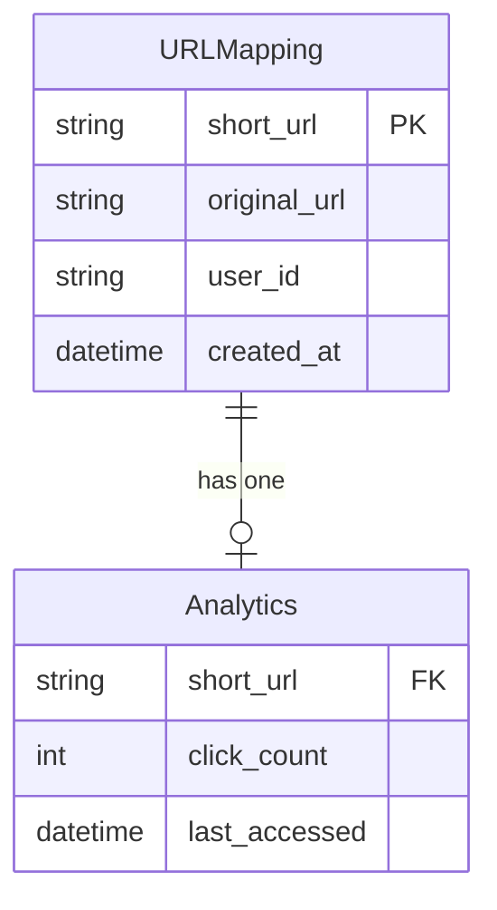
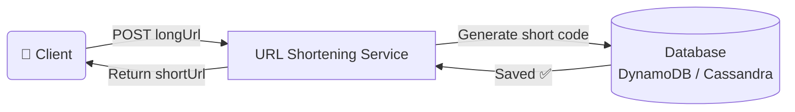
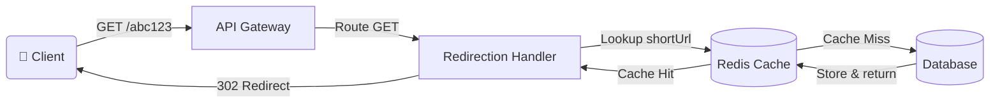
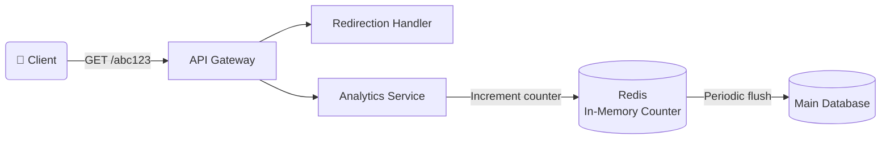
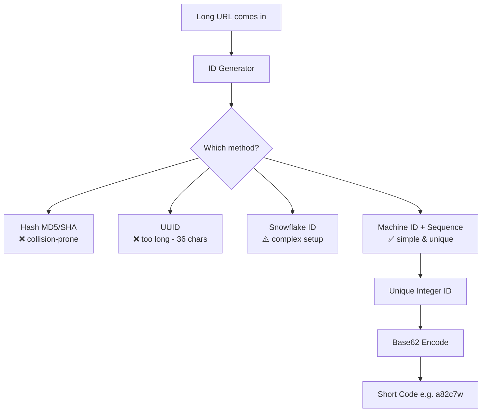
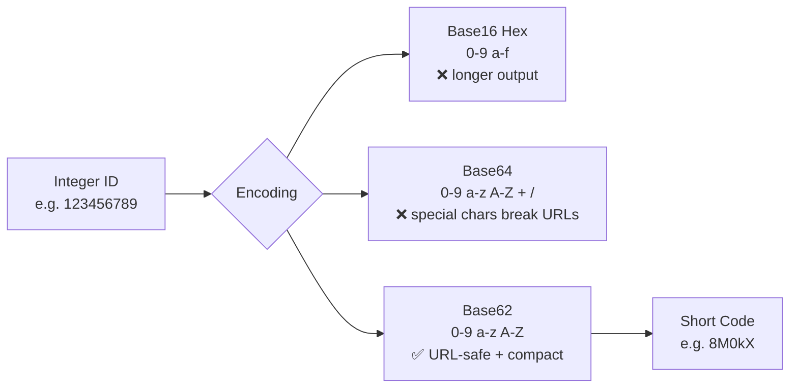
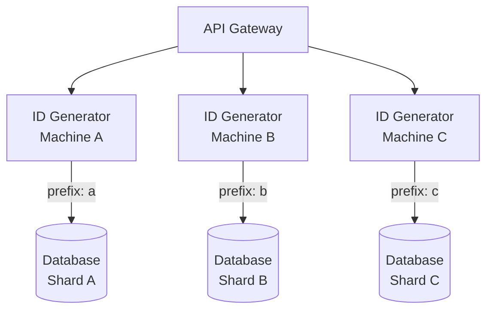
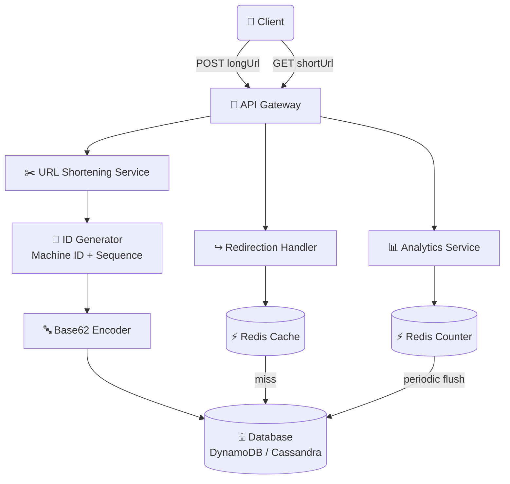

# 🔗 URL Shortener – System Design Notes

> My own understanding of how a URL shortener like bit.ly or TinyURL works under the hood.

---

## 📌 What Is a URL Shortener?

A URL shortener takes a long, ugly URL and gives you a short, clean alias that redirects users to the original link. Think of bit.ly, TinyURL, or Twitter's t.co. The short alias is usually just a few characters (5–8), uses only letters and digits, and needs to be unique and permanent.

---

## ✅ Functional Requirements

Three core operations the system must support:

1. **Shorten a URL** – User gives a long URL, system returns a unique short alias.
2. **Redirect** – When someone visits the short URL, they get instantly sent to the original URL.
3. **Track usage** – Count how many times each short link is clicked (analytics).

### Scale Assumptions
| Parameter | Value |
|---|---|
| Daily Active Users | 100 Million |
| Read : Write Ratio | 100 : 1 |
| New URLs per day | ~1 Million |
| Data Retention | 5 Years |
| Record Size | ~500 bytes |

---

## ⚙️ Non-Functional Requirements

| Requirement | Description |
|---|---|
| High Availability | Links must work 24/7 |
| Low Latency | Redirects in milliseconds |
| Durability | URLs must never disappear |
| Uniqueness | No two URLs share the same code |
| Security | Block spam and malicious links |

---

## 🗃️ Data Model



---

## 🌐 API Design

### POST – Create Short URL
```
POST /api/urls/shorten
Body:     { "longUrl": "https://some-very-long-url.com/with/many/params" }
Response: { "shortUrl": "https://short.ly/abc123" }
```

### GET – Redirect to Original URL
```
GET /api/urls/{shortUrl}
Response: 302 Found → Location: https://original-long-url.com
```

> Analytics tracking happens internally via events — not a public API endpoint.

---

## 🏗️ High-Level Architecture

### 1. URL Shortening Flow



---

### 2. URL Redirection Flow



---

### 3. Link Analytics Flow



---

## 🔑 Deep Dive: ID Generation

Every short URL starts with a unique integer ID. Two things matter:

1. **Global Uniqueness** – No two URLs ever get the same ID
2. **Shortness** – Final URL code should be 5–8 characters



### ID Generation Options Compared

| Method | Pros | Cons |
|---|---|---|
| Hash Functions (MD5/SHA) | Fast | Collision-prone |
| UUID | Universally unique | 36 chars — too long |
| Snowflake ID | Timestamp-based, scalable | Complex coordination |
| **Machine ID + Sequence** ✅ | Simple, fast, no coordination needed | Requires unique machine assignment |

---

## 🔤 Deep Dive: Encoding (Base62)

After generating an integer ID, we encode it into a short readable string.



> **62^6 ≈ 56 billion unique combinations** — more than enough!

---

## 📦 Deep Dive: Sharding for Scale



**How it works:**
- Each machine gets a unique single-character prefix (`a`, `b`, `c`…)
- That prefix becomes the **first character** of every short URL it generates
- Each machine writes **only to its own shard**
- On reads: use the first character of the short URL to find the correct shard

**Example:** `a82c7w` → prefix `a` → look up in **Shard A**

### Benefits of this approach

| Benefit | Why |
|---|---|
| Independent writes | Machines never conflict with each other |
| Easy to scale | Add a machine, assign a prefix, done |
| Trivial read routing | Shard key is embedded in the URL itself |
| Failure isolation | One shard down doesn't affect others |

---

## 🧠 Full System Architecture (Combined)



---

## 📊 Interview Level Expectations

| Topic | Mid-Level (L4) | Senior (L5) | Staff (L6) |
|---|---|---|---|
| **ID Generation** | Explain uniqueness + shortness, suggest one approach | Compare all 4 options with tradeoffs | Multi-region coordination, handle clock skew |
| **Encoding** | Explain Base62, calculate ID space (62^6) | Discuss Base16/62/64 tradeoffs | Encoding implications for analytics/debugging |
| **Scaling** | Understand sharding concept | Design shard key strategy, explain write path independence | Hot shards, consistent hashing alternatives |
| **Caching** | Add cache layer, explain read-through | Calculate hit ratios, design invalidation | Multi-tier caching, prevent cache stampede |

---

## 🛠️ Tech Stack Summary

| Component | Technology |
|---|---|
| Database | DynamoDB or Cassandra |
| Cache | Redis (read-through) |
| API Gateway | Routes GET vs POST |
| ID Generation | Machine ID + Sequence Number |
| Encoding | Base62 |
| Redirect Type | 302 Found |

---

> 📖 Reference: [systemdesignschool.io – URL Shortener Solution](https://systemdesignschool.io/problems/url-shortener/solution)
