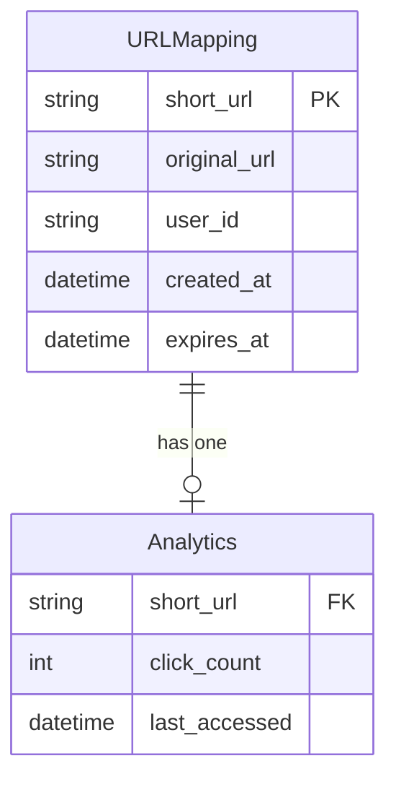
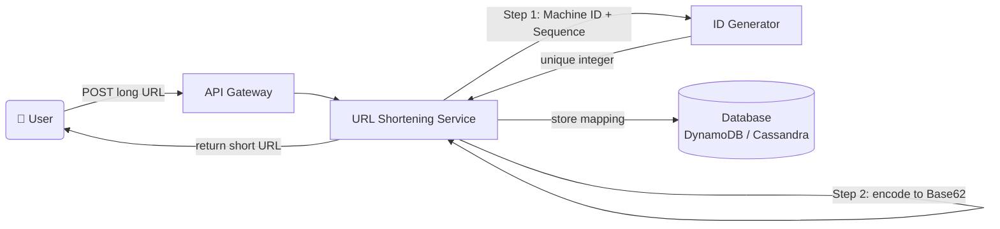
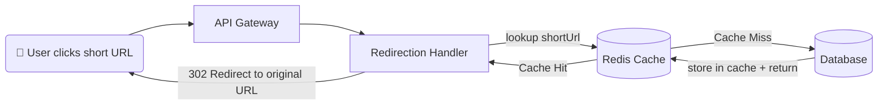
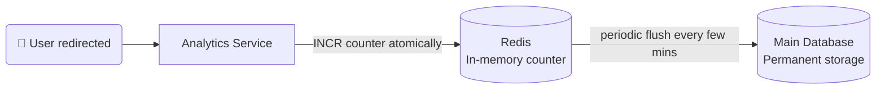
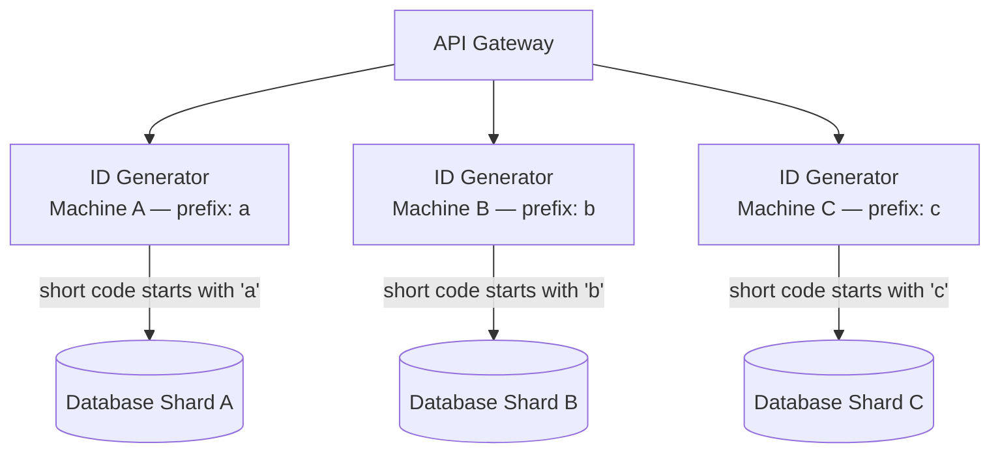
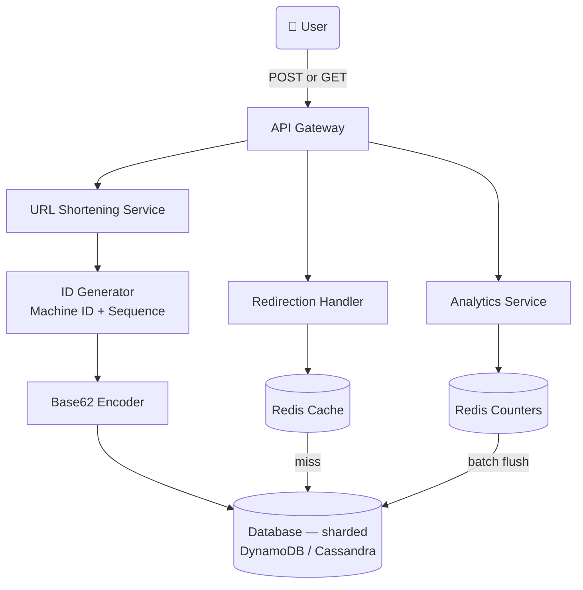

# 🔗 URL Shortener – System Design

> Covers: **theoretical explanation of every component**, architecture diagrams, interview questions an interviewer will actually ask, and tradeoffs behind every major decision.

---

## 📌 What Is This System?

A URL shortener takes a long URL and returns a short alias (5–8 characters) that permanently redirects anyone who visits it to the original URL. Think bit.ly, TinyURL, or Twitter's t.co. Simple on the surface — but at scale it involves careful ID generation, encoding, caching, and sharding.

---

## ✅ Functional Requirements

| # | Requirement |
|---|---|
| 1 | User gives a long URL → system returns a unique short alias |
| 2 | Anyone visits the short URL → instantly redirected to original URL |
| 3 | Track how many times each short URL was clicked (analytics) |

### Scale
| Parameter | Value |
|---|---|
| Daily Active Users | 100M |
| New URLs created/day | 1M |
| Redirects/day | 100M (100:1 read/write ratio) |
| Data retention | 5 years |
| Record size | ~500 bytes |

---

## ⚙️ Non-Functional Requirements

| Requirement | Target | Why It Matters |
|---|---|---|
| Low Latency | Redirect in milliseconds | Feels instant to the user |
| High Availability | 99.99% uptime | A broken short link = broken content everywhere it was shared |
| Durability | URLs never disappear | Once created, must exist forever |
| Uniqueness | No two URLs share a code | Collision = wrong redirect |
| Auto-cleanup | Unused keys expire | Don't store counters for dormant users forever |

---

## 🗃️ Data Model

---

## 🌐 API Design

| Method | Endpoint | Purpose |
|---|---|---|
| POST | `/api/urls/shorten` | Create a short URL |
| GET | `/api/urls/{shortUrl}` | Redirect to original URL |

---

## 🏗️ High-Level Design — Theoretical Explanation

> This section explains **what each component does, why it exists, and how it connects** to the rest of the system. Read this before looking at the diagrams.

---

### 1. URL Shortening — How a Short Code Gets Created

**What happens theoretically:**

When a user submits a long URL, the system needs to generate a short code that is globally unique, short enough to type, and safe to use in a URL. This is a two-step problem: first generate a unique integer ID, then encode it into a short string.

**Step 1 — Unique ID generation.** The system cannot use a single auto-increment counter because in a distributed setup multiple servers would conflict trying to increment the same counter simultaneously. Instead each server is assigned a unique **Machine ID** prefix at startup. Each server then maintains its own local sequence counter. The final ID is `machine_prefix + sequence_number`. Since each machine increments its own counter independently, there is zero coordination needed and zero chance of collision.

**Step 2 — Encoding to Base62.** A raw integer like `123456789` is too long and contains no letters. We encode it using **Base62** — an alphabet of 62 characters: digits 0–9, lowercase a–z, uppercase A–Z. No special characters, so it's safe in URLs. A 6-character Base62 string gives 62^6 ≈ 56 billion unique combinations — far more than we'll ever need. The integer is converted to Base62 the same way you'd convert a decimal number to hexadecimal, just with a 62-character alphabet.

The resulting short code is stored in the database mapping it to the original URL.

---

### 2. URL Redirection — How a Click Becomes a Redirect

**What happens theoretically:**

When someone clicks a short URL, they hit the system with a GET request. The system needs to look up the original URL and return a redirect — ideally in single-digit milliseconds. The challenge is that redirects happen 100× more often than new URLs are created, so the read path is the hot path.

Hitting the database on every redirect would be too slow and too expensive. Instead the system puts a **Redis cache** in front of the database. When a redirect request comes in, the system first checks the cache. If the short code is there (cache hit), it immediately returns the original URL without touching the database. If not (cache miss), it fetches from the database, stores the result in the cache for future hits, and then returns the redirect.

The redirect response is HTTP **302 Found** rather than 301. A 301 is "permanent" — browsers cache it forever and never ask the server again, which means analytics stop working because clicks never reach the server. A 302 is "temporary" — the browser always asks the server, which lets the system count every click.

---

### 3. Analytics — How Click Counts Are Tracked Without Slowing Down Redirects

**What happens theoretically:**

Every redirect needs to increment a click counter for that short URL. The naive approach — write to the database on every single click — would be a huge problem at 100M redirects/day (about 1,200 writes/second). Databases are not optimized for this kind of write pattern on a hot key.

Instead the system uses an **in-memory counter in Redis**. Redis supports atomic increment operations (`INCR`) that are sub-millisecond. Each short URL has a counter key in Redis. Every redirect increments the counter in memory — no disk I/O, no database write.

Periodically (every few minutes), a background job reads the accumulated counts from Redis and flushes them to the main database in a single batch write. This means the database sees one write every few minutes instead of 1,200 writes per second. The counter in Redis resets after each flush.

The trade-off is that if Redis crashes between flushes, a few minutes of click data might be lost. For analytics this is acceptable — you don't need perfect precision to know a URL was clicked ~500,000 times.

---

### 4. Sharding — How the Database Scales as URLs Grow

**What happens theoretically:**

Over 5 years with 1M new URLs per day, the database will hold hundreds of millions of records. A single database node cannot handle the read and write load at that scale. The solution is **sharding** — splitting the data across multiple database nodes.

The key insight is that the shard key is already embedded in the short URL. Remember that the first character of every short code comes from the **Machine ID prefix** of the server that generated it. If we assign each machine a unique character (`a`, `b`, `c`...), then all URLs starting with `a` were created by machine A and live in shard A. All URLs starting with `b` live in shard B. And so on.

This makes routing trivial: to look up `a82c7w`, just read the first character `a` → query shard A. No routing table, no hashing, no coordination. The shard key is self-describing.

Writes are already independent because each machine only writes to its own shard. Failures are isolated — if shard B goes down, all other shards keep working. Adding a new shard means adding a new machine with a new prefix.

---

### 5. Full System — How All Pieces Connect

**What happens theoretically:**

The **API Gateway** is the single entry point. It routes `POST /shorten` requests to the URL Shortening Service and `GET /{code}` requests to the Redirection Handler. Authentication (API keys for users who want to track their own links) is handled at the gateway level so individual services don't need to worry about it.

All services are **stateless** — they hold no data between requests. State lives in the database and Redis. This means any service instance can handle any request, enabling horizontal scaling just by adding more instances.

---

## ⚖️ Key Tradeoffs

### ID Generation: Machine ID+Sequence vs UUID vs Hash vs Snowflake

| Approach | Pros | Cons | Choose When |
|---|---|---|---|
| **Machine ID + Sequence** ✅ | Simple, no coordination, built-in shard key | Requires unique machine assignment upfront | Most URL shorteners — predictable, fast |
| UUID | No coordination, universally unique | 36 chars — too long to be a short URL | When you don't control the namespace |
| Hash (MD5/SHA) | Fast, deterministic for same URL | Collision-prone, need extra handling | Deduplication use cases |
| Snowflake | Timestamp + machine + sequence | Complex, requires clock sync | When you need time-sortable IDs |

---

### Encoding: Base62 vs Base64 vs Base16

| Approach | Characters | 6-char space | URL Safe | Choose When |
|---|---|---|---|---|
| **Base62** ✅ | 0-9 a-z A-Z | ~56 billion | ✅ Yes | Default — clean URLs |
| Base64 | + Base62 + `+` `/` | ~68 billion | ❌ No — breaks URLs | Internal systems only |
| Base16 (Hex) | 0-9 a-f | ~16 million | ✅ Yes | Too small for production |

> **Why not Base64?** The `+` and `/` characters have special meaning in URLs and need to be percent-encoded, making the short URL ugly and longer.

---

### Redirect Type: 301 vs 302

| Type | Browser Caches | Analytics Work | Choose When |
|---|---|---|---|
| 301 Permanent | ✅ Yes — forever | ❌ No — clicks bypass server | SEO optimization, no analytics needed |
| **302 Temporary** ✅ | ❌ No — always asks server | ✅ Yes — every click counted | Analytics, A/B testing, link expiry |

> **The hidden trap:** If you use 301, browsers permanently cache the redirect. Even if you later delete or change the mapping, users with cached redirects still get sent to the old URL.

---

### Cache Strategy: Read-Through vs Cache-Aside

| Approach | How | Pros | Cons |
|---|---|---|---|
| **Read-Through** ✅ | Cache fetches from DB on miss automatically | Simpler code — cache handles misses | Cache library must support it |
| Cache-Aside | App checks cache, fetches DB on miss, writes to cache manually | Full control | More code, risk of inconsistency |

---

## ❓ Interview Questions & Model Answers

---

**Q1: "How do you generate the short code? Walk me through it."**

> Two steps. First, generate a unique integer using Machine ID + Sequence — each server has a unique single-character prefix and maintains its own counter, so no coordination is needed between servers. Second, encode that integer to Base62 — a 62-character alphabet of digits and letters. 6 characters gives 56 billion unique combinations. The first character of every code is the machine prefix, which doubles as the shard key.

---

**Q2: "Why Base62 and not Base64?"**

> Base64 adds `+` and `/` to the alphabet. Those characters have special meaning in URLs — they need to be percent-encoded, which makes the short URL longer and uglier. Base62 uses only alphanumeric characters, so short URLs are always clean and copy-pasteable.

---

**Q3: "The redirect path gets 100× more traffic than writes. How do you optimize it?"**

> Cache-first reads using Redis. Every redirect checks the cache before touching the database. Cache hit rate for popular links approaches 99% — only cold or expired links hit the database. The cache is populated on the first miss (read-through), so the database only ever sees a fraction of total redirect traffic.

---

**Q4: "Why 302 redirect instead of 301?"**

> 301 is permanent — browsers cache it forever. After the first click, all subsequent clicks are served directly from the browser cache and never reach our server. Analytics stop working, link expiry doesn't work, and A/B testing is impossible. 302 is temporary — every click goes through our server, which lets us count, redirect differently, or expire the link.

---

**Q5: "How do you shard the database?"**

> The shard key is the first character of the short code, which is the Machine ID prefix. All codes starting with `a` live in shard A. Looking up `a82c7w` reads the first character and routes directly to shard A — no routing table or hash computation needed. Writes are already isolated per machine. Adding capacity means adding a new machine with a new prefix character.

---

**Q6: "What happens if a machine goes down? Don't you lose its prefix permanently?"**

> The machine's shard of the database still exists — the machine going down doesn't delete the data. The machine is replaced with a new server that inherits the same prefix and continues the sequence from where the old machine left off (the last sequence number is checkpointed to the database periodically). New URLs start generating again. Already-created URLs in that shard are served by a read replica that was promoted to primary.

---

**Q7: "How do you handle analytics at scale without slowing down redirects?"**

> Decouple the counter from the redirect path. Every redirect fires an async increment to a Redis counter — sub-millisecond, non-blocking. A background job batch-flushes these counters to the database every few minutes. The redirect response is never delayed waiting for a database write. The trade-off is up to a few minutes of imprecision in click counts — acceptable for analytics.

---

**Q8: "What if two users shorten the same long URL? Do they get the same short code?"**

> By default, no — they get different codes. Each `POST /shorten` generates a fresh ID regardless of whether that URL was shortened before. If deduplication is a requirement (same long URL → same short code), you'd add a reverse index: a hash of the long URL → short code. On each request, first check if a code already exists for this URL, return it if so. Trade-off: extra write and lookup on every shorten request, and the reverse index table can get large.

---

## 📊 Interview Level Expectations

| Topic | Mid-Level (L4) | Senior (L5) | Staff (L6) |
|---|---|---|---|
| **ID Generation** | Explain uniqueness, suggest one approach | Compare all options with tradeoffs | Multi-region coordination, clock skew |
| **Encoding** | Explain Base62, calculate 62^6 | Discuss Base16/62/64 tradeoffs | Encoding implications for debugging |
| **Sharding** | Understand concept | Design shard key, explain write isolation | Hot shards, consistent hashing alternatives |
| **Caching** | Add cache, explain read-through | Calculate hit ratios, design invalidation | Multi-tier caching, prevent stampede |
| **Analytics** | Decouple counter from redirect | Redis counter + batch flush design | Exactly-once semantics, replay on crash |

---

## 🛠️ Tech Stack

| Component | Technology | Why |
|---|---|---|
| Database | DynamoDB / Cassandra | Easy horizontal scaling, high write throughput |
| Cache | Redis | Sub-ms reads, TTL support, atomic INCR |
| ID Generation | Machine ID + Sequence | Simple, no coordination, built-in shard key |
| Encoding | Base62 | URL-safe, compact, 56B combinations in 6 chars |
| Redirect Type | HTTP 302 | Enables analytics and link expiry |
| API Gateway | Kong / AWS API Gateway | Auth, routing, rate limiting |

---

> 📖 Reference: [systemdesignschool.io – URL Shortener Solution](https://systemdesignschool.io/problems/url-shortener/solution)
